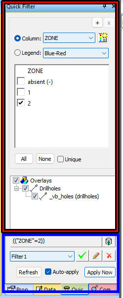
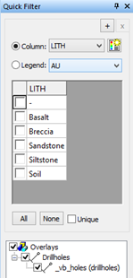
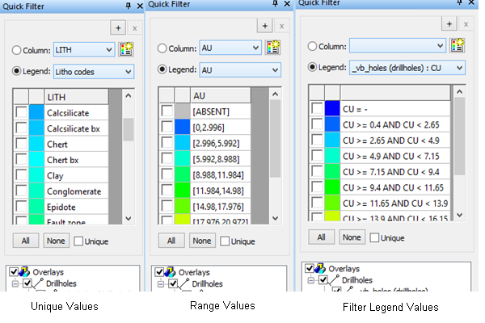
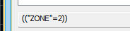

# Quick Filters - More Information

Also see [Quick Filter Control Bar](<Quick%20Filter%20Dialog.md>).

Quick filters can be generated quickly and interactively for multiple objects based on unique values stored in their data, or based on values in preset ranges. It can work directly off of the data values stored in the objects columns, or use values, ranges or full expressions stored in a legend.

As a Datamine _Control Bar_ , it can be docked, floated, resized and positioned wherever you need it within the application frame.

  * Find out more about hiding and showing control bars [here](<Interface_Hide%20and%20Show%20tabs.md>).
  * Find out about other control bars [here](<Studio%203%20Browsers.md>).
  * Find out more about customizing control bars [here](<Customizing.md>).

### Quick Filters Control Bar

The control bar is separated into 2 main areas; an upper section to control the filter to be applied to data objects (shown in red, below) and the lower area that controls the object(s) to which filtering will be applied and a facility for saving and reapplying saved filters.

You can save as many filters as you want and they will be stored within your project. You can then reapply them using either the **Quick Filter** control bar or the **Sheets** control bar.

One or more of these bars may be present at any one time - if only one data column source is being used (for example, you are only interested in a particular ZONE field and wish to filter one or more unique values or 'bins' of data, you will only see one bar. However, if you wish to filter your data according to a particular ZONE and a Cut-off-grade, you will utilize two bars, and so on, depending on how complex you wish to make your filter.  

 |  You can select or deselect multiple concurrent legend items by selecting the first item, holding down <SHIFT> and selecting a second item. All items, including the two clicked, will all become selected or deselected (providing the Unique check box is not selected).  
---|---  
  
### Column Value Filters

To use the values already present in the data columns of the selected objects:

  1. Choose the Column radio button. The column drop down list will contain the names of every column in _any_ of the selected overlay objects.

  2. Select the column of interest from the drop down list, and the value list below it will become populated using the unique values found in any of the selected objects using that column.

In the event that a large number of numeric values are found in the column, a warning will be displayed asking if a legend should be generated to display the choices as ranges, instead of unique values (for example, if the column contained continuous values, like grade).

If appropriate, the choice of a legend can be declined, and the list will attempt to use all available unique values, if system resources allow.

Note that the choices shown in the list are valid for the data present when the column was selected. The list does not automatically update if data changes in the objects after this point. To repopulate the list to accommodate any subsequent data changes, either re-select the **Column** in the drop down list, or use the Refresh button found below the **Overlays** map at the bottom.

### Legend-based Filters

Rather than using choices based on the available data, legends can be used to create a pre-set selection of choices.

Every legend item in the legend forms an option which can be integrated into the required filter. Legends can use unique values, or ranges. In these cases, the values stated in the legend are taken to apply to the column shown in the **Column** drop down list.

Filter legends may also be used, in which case the choice of column in the drop down list is irrelevant, as the attribute will be embedded in the legend filter.

;>)

Note: Right clicking the Legend drop down list provides options to display a separate legend preview, or edit existing legends

### Creating Legends from Column values

Where legends need to be created from current data values, e.g. to create ranges, or store unique choices for later, the button alongside the column drop down list can be used. This will activate a special version of a Quick Legend screen which uses data from all the selected overlay objects to create a legend.

### Changing the filter

Once filter choices have been initiated, the user may change the current filter by selecting the items which should be displayed on screen.

Items may be toggled on and off by clicking on their associated option. All items may be chosen together by using All , and None will clear the current selection.

Where only a single item is required at a time, Unique can be checked, and this will then deselect any previous selection when a new item is selected. (The Unique option will be automatically deselected if the All button is pressed).

In response to the selections, a new filter expression will be generated and applied to any of the selected overlay objects which contain the column of interest. Note that if the filter is being generated from a filter legend, it will be applied to all the selected objects regardless of the columns they contain (as different filter legend entries could refer to different columns).

### Filtering on Multiple Attributes

Although custom filter legends can be used to filter against more than one data column at a time, the quick filter feature may be extended to multiple columns by adding new legend/column panes. Use the + button at the top of any legend/column pane to insert a new one after the chosen pane. Any additional panes which are no longer required may be removed by using their X button. At least one pane must be present at all times, so the last pane will have its X button disabled.

Note: When using multiple columns, the filter expression that is created will only be applied to selected overlay objects which use _all_ of the selected columns.

### Filter Generation (Under the Hood)

The **Quick Filters** control bar auto-generates a [filter expression](<logical%20expressions.md>) to modify the current display. You can see this being constructed as you make edits to the control bar.

Items selected within the same column/legend pane generate a selection of valid values, resulting in an OR expression, for example:

= ( (LITH = "Basalt")OR(LITH = "Siltstone")OR(LITH = "Soil") )

Items selected across multiple panes create a requirement from each pane, resulting in an AND combination of the 2 panes, for example:

= ((LITH = "Basalt")OR(LITH = "Siltstone") OR (LITH = "Soil") ) AND ( (BHID = "VB2675") OR (BHID = "VB2737"))

  * Selected items add together to form a filter expression. No selected items lead to an empty filter expression, and _no filtering_. It does not mean that all items are filtered out. Please use that existing object show/hide functionality to hide an object completely.
  * Any legend/column pane without a current selection does not contribute to the filter expression. As such, a selected object no longer requires that column in order to have the remaining filter expression applied.
  * You can quickly save and reinstate filters using the controls on the **Quick Filter** control bar (see below).

### **Applying a Filter using the Quick Filter Control Bar**

  1. Load the 3D data you wish to filter into the primary 3D window - you may want to adjust the view to ensure you can see important areas.

  2. Filters are based on column data values, so select **Column** in the **Quick Filter** control bar.

  3. Choose whether you want to configure your filter first and then apply it to the view, or update the view with every edit you make to the filter. This is controlled by the **Auto-apply** check box at the bottom of the dialog.

  4. Choose which object(s) you wish to be affected by filtering, using the object selection tree. This will list all selected objects, separated by data type (drillholes, wireframes and so on)

  5. Configure the check boxes displayed below (one will exist for every unique value in the selected Column). Depending on your **Auto-apply** setting, the filter will either be updated automatically in the 3D view, or you will need to apply your filter to the 3D view using **Apply Now**.

### Saving a Filter for Later Use

  1. Configure the filter you want using the **Quick Filter** control bar settings (see above).

  2. Your filter will be represented as a filter expression further below, for example:

  3. Select **Save Filter** to display the **Save Filter** screen.

  4. At this stage, you can use the **Save Filter** screento provide a **Name** for your filter. By default, the filter expression itself is the name, but you can change it to whatever you want.

  5. Click **OK** and a new saved filter and screen settings are created.

### **Reinstating Previously Saved Filter Settings**

You reinstate previously saved screen settings by selecting a saved filter and updating the **Quick Filter** control bar.

  1. In the **Quick Filter** control bar, using the filter drop-down list to pick the filter that represents your filtering settings.

  2. Update the **Quick Filter** control bar with the settings represented by your filter using the green tick. This will update control bar settings to match those previously used to create the expression.

  3. If **Auto-apply** is enabled, the corresponding filter will also be applied to the 3D view. Otherwise, you'll need to **Apply Now** to update the view.

Tip: Apply previously-saved filter expressions to loaded data object overlays using the **[Sheets](<Sheets%20Control%20Bar%20Overview.md>)** control bar.

### Editing a Saved Filter

  1. Define the filter settings you wish to use to overwrite an existing saved filter, using the **Quick Filter** control bar.
  2. Select the filter you wish to edit, using the drop down list
  3. Select **Edit Saved Filter** .
  4. In the Saved Filter dialog, you can edit the **Name** of the filter and/or overwrite the current filter specification with the one currently defined in the control bar, using **Use Current Filter**.

Related topics and activities

  * [Quick Filter Control Bar](<Quick%20Filter%20Dialog.md>)