# Quick Filters: Examples

The **Quick Filters** control bar lets you specify one or more attribute by which you can filter data that is currently loaded.

In the same way that [**Filter Expressions**](<Filtering_Data.md>) allow you to construct different levels of complexity, the [Quick Filters](<Quick%20Filter%20Dialog.md>) control bar permits the same flexibility, but does so interactively.

## Filter a Single Overlay

This example will load the file "_vb_mintr.dm" tutorial data file into the 3D window (all of it). 

**Note** : This tutorial data is installed by default to C:\Database\DmTutorials\Data\VBOP\Datamine.

The **Quick Filters** control bar will then:

  * Filter the volume to show **ZONE** = 1 and **ZONE** = 2 respectively
  * Filter the volume to show the different **SECTION** 'bins', filtering out several of these strips to produce a zebra-like effect
  * Combine the above to show the volume filtered by both **SECTION** and **ZONE** concurrently

This should give you some idea of what you can achieve just by selecting or deselecting the unique values found in each of the select data columns.

  1. Create a new project.
  2. Load the file **_vb_mintr.dm** into the 3D window.
  3. **View** ribbon **> > Zoom Fit >> Zoom East**.

You should see a view similar to the following:

[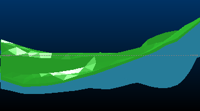](<javascript:void\(0\);>)

  4. Display the Quick Filters control bar:

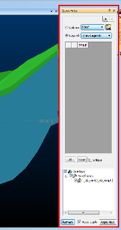

  5. Select **Column** and expand the associated drop-down list. 
  6. Select _ZONE_.
  7. In the list below, 2 options have appeared:

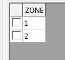

This represents the unique values found in the **ZONE** field for the loaded wireframe (you'll find out what happens when more than one object is loaded shortly).

  8. Check 1.

The screen updates automatically to show the green ZONE 1:

;>)

Select the 2 check box and you're back to where you started:  
  
;>)  

  9. Check Unique perform step (8) again - note how this time, you can only select one filter 'bin' at a time, and the screen updates automatically:

;>)

...then...

[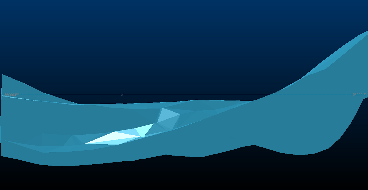](<javascript:void\(0\);>)

**Note** : **Unique** is useful where you want to visualize isolated bins of data, one at a time. It's very handy when you create, say, a filter legend for metallic grade (cut-off intervals) and want to see how these values are represented within the overall deposit.

  10. Select _SECTION_ from the **Column** drop-down list.

10 items appear in the list, numbered 1-10 (although they could be any numeric or text description).

  11. Select **View** ribbon >>Zoom Fit >> Zoom Plan.
  12. Uncheck **Unique**.
  13. Enable sections 1, 3, 5, 7 and 9 only - you should see a striped wireframe like this:

[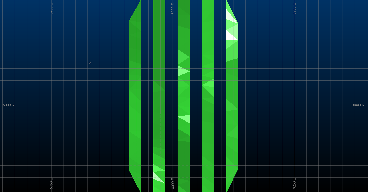](<javascript:void\(0\);>)

  14.   15. Select **View** ribbon >>Zoom Fit >> Zoom North.

[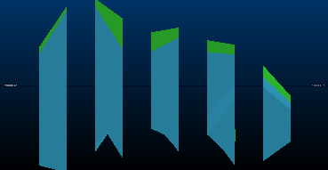](<javascript:void\(0\);>)

  16. In the **Quick Filter** Control Bar, at the top right corner, select the "+" button:

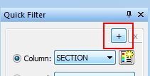

This means you wish to add another element to your filter expression, either another data column or legend-based expression.

  17. The panel splits cleanly down the middle - stretch it out a bit so you can clearly see both sides (only the top half is shown in the image below):

[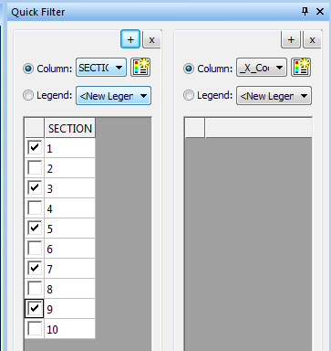](<javascript:void\(0\);>)

  18. In the right-hand panel, select _ZONE_ \- see how the two values from before reappear?

[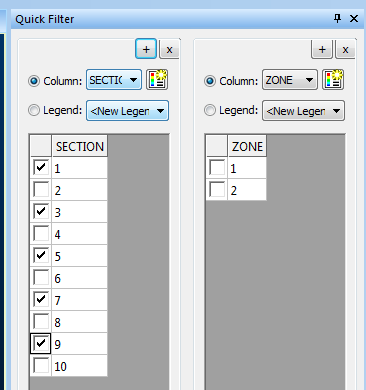](<javascript:void\(0\);>)

  19. Select _1_. You are now filtering your wireframe to show sections 1, 3, 5, 7, and 9 - but only if they fall within ZONE 1:  
  
;>)

...and that's how you build up a filter expression. 

You can use a combination of data column and legend selections (for example, you want to show model grades from 0.08 to 1.12 ppm, but only if they fall within a specific pushback or bench).

For those who like to know what's going on 'under the hood', the **Quick Filters** control bar is a very rapid and visual way to construct filter expressions of the type normally entered manually into, say, a filter-on-load screen, or the **[Data Object Manager](<Data%20Manager%20Dialog.md>)**. If you want to see what expression has been created (maybe you want to add it to a script), you can see it in the **Data Object Manager** 's **Filter** field for as long as the **Quick Filter** settings remain in force.

The Filter Expression for the above exercise is:
         
         ( (SECTION = 1) OR (SECTION = 3) OR (SECTION = 5) OR (SECTION = 7) OR (SECTION = 9) ) AND ( (ZONE = 1) )

## Multiple Overlays

The above example revolves around a single wireframe object (_vb_mintr and it's corresponding points file), with a single 3D overlay.

You may have noticed the lower section of the **Quick Filter** control bar, which is used to control the scope of filtering where more than one overlay exists.

In this example, you will load another file, a strings object and filter both using the Quick Filter Control Bar.

This example assumes you have just completed the first example, above.

  1. Locate and load the tutorial file _vb_minst.dm into the 3D window. You will see that it is added to the view, and the **Quick Filter** 's Overlays panel updates to show multiple overlays which we can play with:

[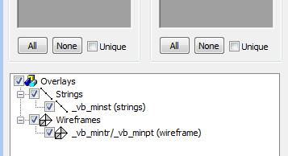](<javascript:void\(0\);>)

  2. To make the changes easier to see, change the String Properties (Lines) so that they have a Scale of 5, using the [String Properties](<../VR_Help/Traces%20Properties%20Dialog%20\(Edge%20Visual\).md>) screen, and also give them a FixedColor yellow.
  3. Ensure all check boxes are enabled in the **Overlays** area (the default) and expand the Column list in either left or right panels - note how they now include all data columns from both wireframe and strings objects.
  4. To reinforce the point, disable the Strings check box and try again - this time only wireframe data columns are shown.
  5. Check **Strings** again.
  6. You should be looking at something like this:

[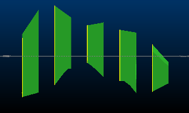](<javascript:void\(0\);>)   

  7. The Quick Filter control bar now looks like, this:

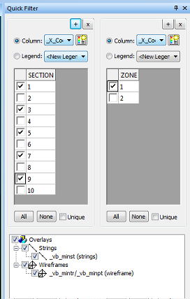   

  8. Click **+** to add another panel split.
  9. In the 3rd column (the new one), select the **COLOUR** data column in the 3rd (new) panel.
  10. Click Filter Legend:

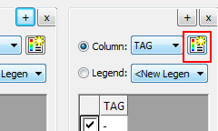   

  11. On the Quick Filter Legend screen, enter the **Number of Bins** as "5" then click **OK**. 

A new legend is created, with two equally-sized (linearly-distributed) bins, plus one default bin for absent data:

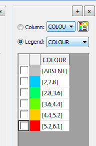

**Note** : This method of filtering is useful where the data column initially selected would not be sensibly represented by bins representing a single, unique value (grades, coordinates, blastability index and so forth).  

  12. Select the _4.4, 5.2_ bin - the green wireframe zone AND string data has disappeared. 

Why? because both objects contain a **COLOUR** field (in fact, the strings were originally used to create the wireframe, copying the **COLOUR** attributes as the linking operation completed) - the selected bin is saying "only show data where the **COLOUR** value is greater than 4.4 and less than or equal to 5.2"....therefore all overlays that support a **COLOUR** field will be update to only show data where **COLOUR** = 5.

[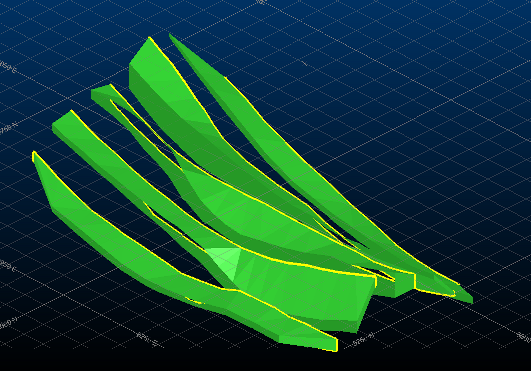](<javascript:void\(0\);>)   

  13. Select the [5.2, 6.1] bin - you're back to where you started:

[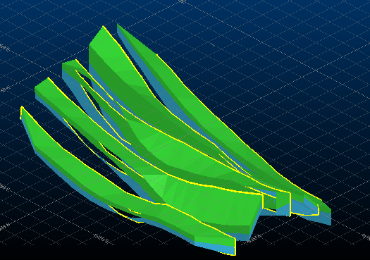](<javascript:void\(0\);>)

But surely, the strings are all the same colour (you set them to yellow) so this filtering is nonsense, right? No, it isn't.

The visual representation is yellow, but the underlying data column for the strings (called **COLOUR**) is what is being used to filter. The "fixed color" setting you applied above (in the String Properties dialog) is just a manual override of this, and is used instead of a legend.

The **Filter Expression** for the example above:
         
         ( (SECTION = 1) OR (SECTION = 3) OR (SECTION = 5) OR (SECTION = 7) OR (SECTION = 9) ) AND ( (ZONE = 1) OR (ZONE = 2) ) AND ( ((COLOUR >= 4.4) AND (COLOUR < 5.2)) OR ((COLOUR >= 5.2) AND (COLOUR < 6.1)) )

**Quick Filters** is a much quicker option than typing all that out!

Related topics and activities

  * [Quick Filter Control Bar](<Quick%20Filter%20Dialog.md>)

  * [Quick Color](<Quick%20Color%20Dialog.md>)

  * [Quick Filter Legend](<Quick_Legend_Dialog.md>)

  * [Saved Filter](<QuickFilterExpressionDialog.md>)

  * [Quick Filters - More Information](<QuickFilterLegendDialog.md>)