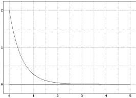
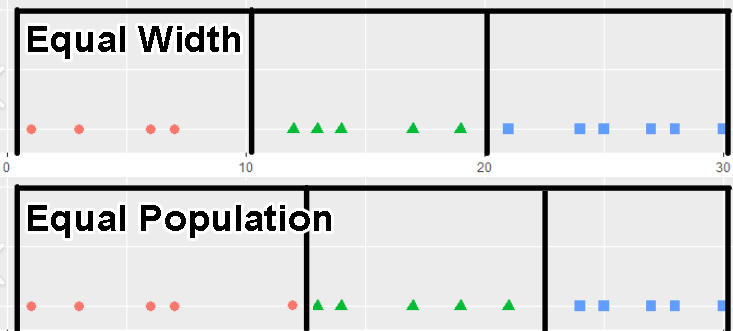
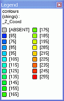

# Quick Filter Legend

To access this screen:

  * Select a **Column** containing over 100 values in the [Quick Filter](<Quick%20Filter%20Dialog.md>) control bar, then click No when asked to continue creating a unique value legend.

Generate a value-ranges legend to use when filtering data in 3D windows via the **Quick Filter** control bar.

There are several ways of generating legends in Studio products:

  * You can define any type of legend using the [Legends Manager](<FormatLegendsDialog.md>).
  * You can create date-based legends using the [Create Date Legend](<Create_Date_Legend.md>) dialog.
  * You can quickly create a visualization legend using the Quick Legend tool.
  * You can generate a filter legend based on one or more attributes values, using the [Multiple Attribute](<MultipleAttributeLegend.md>) Legend tool.
  * Several commands and functions within Studio will automatically create (and possibly assign) legends.

### Legend Value Distribution

There are three ways to distribute values within a ranged legend:

  * **Linear distribution** Values are categorized within ranges that are spread out uniformly throughout the extent of all possible values. In other words, the upper and lower bounds of each bin form legend intervals of the same size throughout the legend.

  * **Log distribution** In a statistical sense, a logarithmic distribution (also known as the logarithmic series distribution) is a discrete probability distribution. This differs from a linear distribution (see above) in that with a linear version, the gaps between interval start points is governed by a standard and fixed amount. This amount can be derived from the value range itself (Equal Width) or by the number of items within a range (Equal Population). With a logarithmic distribution, the ranges are dealt with in a multiplicative fashion, with the ranges being weighted towards smaller values.

  * **Exponential distribution** Define ranges using an exponential basis throughout the total value range. In statistical terms, an exponential distribution is used to model Poisson processes, which are situations in which an object initially in state A can change to state B with constant probability per unit time (often referred to in mathematical equations as lamda or 'λ'). However, from a legends perspective, the exponential distribution is controlled by the number of items in a given category being used to define the end point of that category. The maths sitting behind this calculation is complex, but in practice, this calculation is likely to shift more items into the latter (higher) value categories.

For example, in the graph below, the values of database cells are shown on the vertical axis, and the legend item number along the horizontal axis. This is an example of an exponential distribution of items.

### Legend Value Sorting

If creating a range legend (where multiple values are attributed to the same legend bin), you can choose how to distribute the values throughout the bins, in addition to how the interval boundaries are worked out (see above).

There are two options:

  * **Equal Width** The limits of each interval are determined by taking the minimum and maximum legend values (as specified on the Data screen) and dividing the difference by the number of intervals specified. In this situation, the number of values within each interval may vary.

  * **Equal Population** The intervals within a legend are 'sized' to fit an equal number of qualifying data points. The number of values within each interval, using this setting, are always constant - it is the start and end points of each interval that vary to accommodate a fixed number of values.

For example:

;>)

To create a quick filter legend:

  1. Load the data you wish to filter and display it clearly in any 3D window.

  2. Display the **Quick Filter** control bar. See [Quick Filter Control Bar](<Quick%20Filter%20Dialog.md>).

  3. Expand the Column list and select an attribute containing over 100 unique values in the data object.

A warning displays stating that the 100 value threshold for automatic legend creation has been breached.

  4. Click **No**.

The **Quick Filter Legend** screen displays.

  5. Choose the type of legend **Bins** to create:

     * Select Use Unique Values to generate a "unique values" legend. If your **Column** is alphanumeric, this is the only available option. 

**Warning** : There is no further validation for the number of unique values found, so legends containing a large number of bins can be created. This can degrade system performance.

     * Select Use Ranges to generate a range legend. Only available if the **Column** is numeric.

       * Choose the Number of Bins (ranges) to create. Higher numbers tend to produce more granular legends.

       * Choose the Distribution of values within each bin, either _Linear_ , _Log_ or _Exponential_. See Legend Value Distribution, above.

       * Choose the Sorting method for values, either _Equal Width_ or _Equal Population_. See Legend Value Sorting.

  6. Choose the **Display** options for your legend:

     * Color Choose a colouring option.

     * Clockwise transition Reverse the standard colour sequence.

     * Anticlockwise transition Use the standard colour sequence.

     * Preview Display a preview of the legend intervals and visual properties, for example:

  7. Define how to save your legend details, using Save As options:

     * Legend name Edit the default legend name if required.

     * **Save legend in** either of the two storage options:

       * Current Project File Store all legend information within the current project file. This will mean that the legend details will remain accessible only by the current project. If you intend to re-use legends across multiple projects, this option is not recommended.

       * User Legends Storage Store the legend as a _User legend_. You can subsequently use the **Legends Manager** to save this legend to an external file and share it with others.

Related topics and activities

  * [Quick Filter Control Bar](<Quick%20Filter%20Dialog.md>)

  * [Quick Filters: Examples](<Quick_Filters_Worked_Example_1.md>)

  * [Quick Filters - More Information](<QuickFilterLegendDialog.md>)

  * [Quick Filter Expressions](<QuickFilterExpressionDialog.md>)