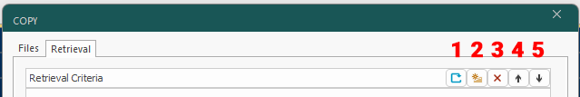
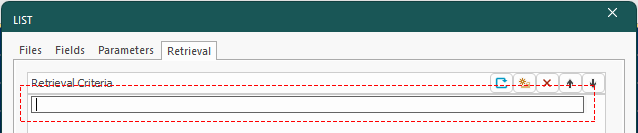

# Retrieval Criteria

**Retrieval criteria** are a useful feature of Studio application [**processes**](<Studio%203%20Commands%20and%20Processes.md>).

Processes are file-based. They require one or more files in Datamine binary format and, depending upon the process, convert the data to create one or more new Datamine format files. 

Processes are recognizable by the typical "Files, Fields and Parameters" tabbed screen, for example, the TONGRAD process looks like this:

TONGRAD is an example of a Studio application process. There are many more.   
  
Many processes support retrieval criteria. Retrieval criteria let you specify a range of values within which a field value must lie for it to be accepted by a process. In essence, it allows the data that is processed to be filtered, allowing the process to work with a subset of data.

**Note** : Retrieval criteria works as if **input** file(s) are filtered prior to in-memory processing. The process then functions as normal. This is different to just filtering output records.

For example, [LIST](<../Process_Help_XML/list.md>) is a process that is used to list the contents of a file, which supports retrieval criteria. As such, it has a Retrieval Criteria tab. When activated, the following tools become available:  
  

  1. **Restore** previous retrieval criteria history: If selected, previous retrieval criteria (used in prior successful process runs) can be reinstated. This is a useful way to adjust retrieval criteria iteratively, possibly to check for field value sensitivity.

  2. **Create** a new retrieval criterion. 

  3. **Delete** the selected retrieval criterion.

  4. **Move** the criterion **up** the list (and therefore process it sooner).

  5. **Move** the criterion **down** the list (and therefore process it later).

One or more retrieval criterion can be specified, and all criterion must be met for an input file's value to progress to processing. Each criterion can reference any field that exists in any input file (as specified on the Files tab). 

### LIST Example 

To LIST records in the specified input file that lie between, say, 300 and 400 in X coordinates (inclusive), add a retrieval criterion using button (2) on the panel. Once added, the next available empty line becomes editable:  
  

Each criterion can reference one field only. Once a field criterion has been specified, it can't be used in subsequent criteria for the same process run. That said, a criterion can feature multiple operators and values if needed.

You can enter criteria one-per-line or multiple criteria on the same line, separated by commas. Some examples of this are displayed below.

Criteria are entered using the format FIELD-OPERATOR-VALUE. So, to list only records between 300 and 400 in X (inclusive), the criterion below is valid:
    
    
    X>300<400

Note that there is no requirement for "=" to define an inclusive range, so the range above in fact means "X>=300 and <=400" (described this way for clarity and is not valid syntax).

Omitting either the lower or upper limit is also valid. In this case, all available values above or below the specified value can be listed using this type of criterion:
    
    
    X>300

or;
    
    
    Y>400

Pressing <ENTER> commits the criterion to the list. If you wish, you can add further criteria to further filter the data records on which a process will act, although note that once a field criterion has been specified, it can't be used in subsequent criteria for the same process run.

For example, adding the following two criteria is not valid:
    
    
    X>250
    
    
    X>200

However, the following criteria are acceptable:
    
    
    X>200
    
    
    Y>500

The equals sign is also valid, and can be used to refine your input records to attributes containing specific numeric or alphanumeric values. For instance, processing all model records that have the numerical lithology (LITH) attribute value 3 could be achieved using the following syntax:
    
    
    NLITH=3

### Specifying Alphanumeric Values

If you want to reference an alphanumeric value in a retrieval criterion, use single quotes, e.g.:
    
    
    LITH='Siltstone'

You can also use > and < operators with alphanumeric values. In this case, the sorting method is alphabetical. Be wary, though, of how this can be interpreted to avoid unexpected results.

Consider the following example, where a file contains 6 records for borehole ID (BHID):
    
    
    BH1
    
    
    BH2
    
    
    BH3
    
    
    BH11
    
    
    BH12
    
    
    BH13

The following criterion is used, again with the LIST process (as it is the simplest example):
    
    
    BHID>'BH2'

When LIST is processed, the following records are listed:
    
    
    BH2
    
    
    BH3

However, and this is where you need to be careful, the following criterion:
    
    
    BHID>'BH1'<'BH2'

...instructs the LIST process to only process (and display) the following records:
    
    
    BH1
    
    
    BH11
    
    
    BH12
    
    
    BH13

In this case, to list borehole IDs within a range that is treated numerically, it would be necessary to split off the numeric part of the ID to a new, numeric field using other processes (such as [EXTRA](<../Process_Help_XML/extra.md>)) and then specifying a numeric retrieval criterion range.

### Retrieval Criteria Rules

There are several features of retrieval criteria that are important,

  * Retrieval criteria are additive. A record from the input file will pass through to the process if it satisfies ALL retrieval criteria.
  * Criteria apply to all input files in the process. This is important where more than one file contains the same attribute, such as a block model and input drillholes file sharing the same zone attribute with the [SWATHPLT](<../Process_Help_XML/swathplt.md>) process, for example.
  * Up to 20 criteria can be specified, and all must refer to different fields
  * You cannot have 2 or more criteria referencing the same field.
  * If a criterion references a field that doesn't exist in any input file, the criterion will be ignored.
  * Field references in the same set of criteria can be from different input files. For example, you could filter records for process where X>200 (in a points file) but also XC>300 (in a model file):
        
        X>200  
        XC>300  
        

  * Criteria can be entered in one line, separated by commas or on different lines (or any combination). For example
        
        ZONE>1  
        AU>0.01

Can also be specified as:
        
        ZONE>1, AU>0.01

  * Retrieval criteria will not be restored if the Restore button is used on a process dialog. If you have particularly lengthy or complex criteria that may be needed again, copy the text to a text file and paste it back it when needed.

Related topics and activities

  * [Accessing Commands and Processes](<Studio%203%20Commands%20and%20Processes.md>)