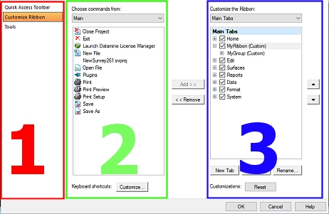
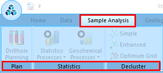

# Ribbon Customization

To display this screen:

  * Right-click an empty area of any ribbon and select **Customize the ribbon**. Select **Customize Ribbon**.

Your application uses a ribbon system to deliver core functionality. Context-sensitivity means that only the commands relevant to your current data view are accessible.

Configure existing ribbons and set up your own using a simple customization utility that should be familiar to Windows application users:

  * Create custom tabs and panels.
  * Show/hide all default ribbon tabs and panels.
  * Change ribbon tabs and panels order.
  * Rename tabs, panels and commands.
  * Associate keyboard shortcuts with commands (not to be confused with [command quick keys](<Studio%203%20Quick%20Keys.md>) \- these are not configurable).
  * Modify custom command icons.

The Customize Ribbon screen has 3 areas:

  1. Tabs: provides access to other customization options.
  2. A list of available commands within a category.
  3. A list of ribbons that can be customized.

To create a new ribbon:

  1. Display the **Customize** screen.

  2. Select the **Customize Ribbon** tab.
  3. Using the right-hand panel select the ribbon to the _left_ of where you wish your new ribbon to appear. 

  4. Click New Tab.

**New Tab** and  _New Group_ appears below the previous selection. In this case 'tab' and 'ribbon' are synonymous.

  5. Select **New Tab** and click Rename to rename your ribbon.

**Tip** : use a consistent convention when naming ribbons.

  6. Select **New Group** and Rename your command group - this description will appear below the icons in the new command group. In the example, below, the **Sample Analysis** ribbon (tab) contains 3 groups; **Plan** , **Statistics** and **Decluster** :

To add a new group to an existing ribbon:

  1. Display the **Customize** screen.

  2. Select the **Customize Ribbon** tab.
  3. Using the right-hand panel select the ribbon to contain a new group.

  4. Select the existing group that will appear to the left of the new group, or select the ribbon description to add the new group in the leftmost position.

  5. Click **New Group**.

_New Group_ appears.

  6. With the new group item selected, click Rename to rename your group.

To add a command to an existing ribbon command group:

  1. Display the **Customize** screen.

  2. Select the **Customize Ribbon** tab.
  3. Select a category of available commands from the Choose commands from list.
  4. Within that category, pick the command you wish to add to a ribbon.
  5. Using the right-hand panel, select an existing ribbon, expand it and select the appropriate command group.
  6. Click Add to add the selected command to the selected ribbon command group.
  7. Click **OK** on the Customize screen to update the selected ribbon.

To delete a ribbon, command group or command:

**Warning** : If you delete a ribbon, group or command by mistake, you can only reinstate it if is part of the default ribbon configuration for your product. Custom ribbons, groups and ribbon items will be removed if you reset your UI and it is not possible to undo this action.

  1. Display the **Customize** screen.

  2. Select the **Customize Ribbon** tab.
  3. Select the ribbon, group or command you wish to delete.
  4. Right-click the item and select Delete.

To reorder ribbon contents:

You can change the left-right order of custom ribbon items (or the top-bottom order of drop-down menu items) by selecting the ribbon, group or item you wish to reposition and using the up and down arrows on the right of the form.

Related Topics and Activities

  * [Ribbons](<Ribbons-overview.md>)
  * [Quick Access Toolbar](<Ribbon_Quick_Access.md>)
  * [Customize Quick Access](<Ribbon_Customize.md>)
  * [The Project Button](<Ribbon_File_Button.md>)