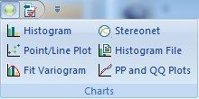

# Customize Quick Access

To access this screen:

  * Expand the drop down menu on the [Quick Access toolbar](<Ribbon_Quick_Access.md>). Select More Commands...

Located at the top-left of your screen, and always available, the Quick Access toolbar can be used to create your own group of favourite commands. 

The **Quick Access Toolbar** screen is part of the **[Customize](<Customizing.md>)** console.

The Customize screen contains the following sections:

  * Quick Access Toolbar
  * [Customize Ribbon](<Ribbon_Customization.md>)
  * [Tools](<Customize_Tools.md>)

By default, the **Quick Access** toolbar contains a Save Project button, but this can be disabled in the context-menu menu and/or replaced with whichever commands you like.

To customize the Quick Access Toolbar:

The **Quick Access Toolbar** screen contains a menu of selectable commands on the left, and the list of commands already instated on the right. Customizing the toolbar generally involves picking an existing command and transferring it to the ribbon:

  1. Using the Choose commands fromlist, select the ribbon that contains the command you wish to add to the **Quick Access** toolbar. Choose any ribbon, even if it is not currently displayed. 

**Note** : you can also add menus (containing other commands) to the quick access toolbar.

  2. Locate the command you wish to add to the **Quick Access** toolbar in the **Commands** list.

Commands are represented by both a label and (on the left) their assigned graphic. Where an entry represents a drop-down menu, you a downward arrow on the right, similar to this:

**Note** : the actual format of the downward arrow depends on your currently selected visual theme.

Adding a menu to the Quick Access bar allows you to access all of the commands that are available within it, for example:  
  

  3. Select a command or menu on the left, then **Add** it to the right, or select a command on the right.

**Tip** : if a command hasn't already been added to the Quick Access toolbar, you can double-click it in the left window to move it to the right.

**Note** : to remove existing toolbar entries, highlight an entry on the right and select **Remove**.

  4. Use the up and down arrows on the right of the screen to move the selected command up or down the list. This determines the position of the command in the **Quick Access** toolbar (highest = rightmost).

  5. Optionally, move the **Quick Access** toolbar to the bottom of the main ribbon area by checking **Show Quick Access Toolbar below the Ribbon**.

  6. Click **Reset** to return the toolbar to its default settings. This cannot be undone.

Related topics and activities

  * [About Studio Ribbons](<Ribbons-overview.md>)

  * [Quick Access Toolbar](<Ribbon_Quick_Access.md>)