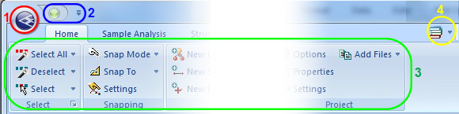

# Ribbons

Your application uses a ribbon system to deliver core functionality. Context-sensitivity means that only the commands relevant to your current data view are accessible.

The ribbon system provides groups of commands:

  1. The Project Button: this contains commonly-used commands relating to your current project. See [[The Project Button](<Ribbon_File_Button.md>)](<Ribbon_File_Button.md>).
  2. The Quick Access toolbar: a customizable area of your UI that can be used to host your favorite commands. See [Quick Access Toolbar](<Ribbon_Quick_Access.md>).
  3. Ribbons: select a link from the Table of Contents for more information.
  4. Help Menu: access help, tutorials and system information. See [Help!!!!](<Ribbon_Help_Menu.md>)

## Plot Item Ribbons

Highlighting a plot item anywhere on a plot displays a dedicated ribbon containing various options for resizing, formatting and managing the contents of the target. All commonly-used properties can be accessed here and is generally the most convenient option for configuring plot items.

The options that appear depend on what you select. For example, selecting a [Title Box](<../PLOTS_LOGS/TitleBlock.md>) plot item displays a ribbon to let you manage the arrangement of cells within it, whilst selecting a **[North Arrow](<../PLOTS_LOGS/NorthArrow.md>)** item displays a different set of controls to determine the arrow's appearance:

;>)

The Title Box ribbon

;>)

The North Arrow ribbon

**Note** : To return to more general plot management functions, activate the **Manage** ribbon. Plot item ribbons only display for as long as the plot item is selected.

**Note** : Deselect a plot item by holding <CTRL> and left clicking it.

Related Topics and Activities

  * [Customize Quick Access](<Ribbon_Customize.md>)
  * [Ribbon Customization](<Ribbon_Customization.md>)