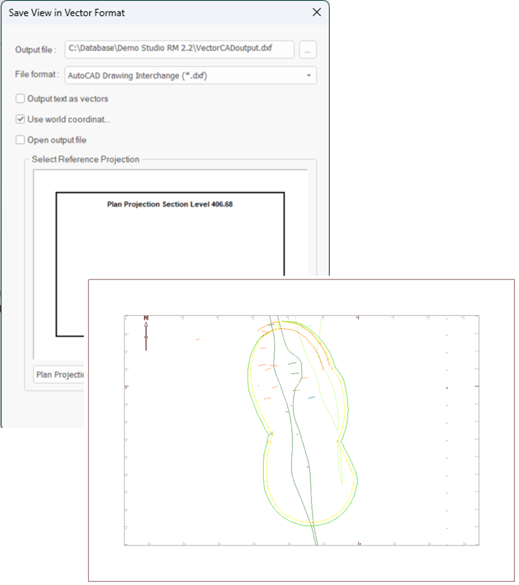

# Export Plot to Vector Format

To access this screen:

  * **Plots** window **> > Manage ribbon >> Save To >> Vector >> Vector**.

Export visible Plots data to a CAD interchange format. 

All plot sheet contents are exported as displayed, so it is important to configure the display before you start. Data outside the current projection(s) isn't exported. Both 2D and 3D projection data is exported.

;>)

An example of an exported plot sheet shown at an oblique angle in a CAD data viewer.

The following export formats are available:

  * AutoCAD Drawing (.dwg)

  * AutoCAD Drawing Interchange (.dxf)

  * AutoCAD Drawing Interchange Binary (*.dxb)

**Note** : you can also access this function via script, using the SaveViewAsVectorFormat() method within IDmDesign.

Data for each overlay is exported to a unique CAD layer, as are labels (if exported as characters).

To export Plots data in a vector format:

  1. Display a plot sheet you wish to export, at the desired scale. Ensure all projections are oriented as you need them.

**Note** : projections do not have to be axis-aligned for export, and can be of the 2D or 3D type. See [Projection Overlay Types](<../PLOTS_LOGS/Projection%20Overlay%20Types.md>).

  2. Browse to the location to store the exported CAD file. 

  3. Enter a file name.

  4. Pick the export data format using the Save as Type list (see above for supported formats).

  5. Click **Save**.

The **Save As** screen disappears.

  6. Choose how to export text in your plot sheet:

     * If Output text as vectors is **checked** , text characters export as a series of unconnected vectors (lines). This can be more accurate than choosing to display the text as characters in the destination CAD package. Labels are added to a dedicated CAD layer.

     * If Output text as vectors is **unchecked** , exported text is rendered as characters. This adds vector information to the common CAD layer.

  7. Control how coordinates are interpreted during export:

     * If Use world coordinates is **checked** , the Select Reference Projection box displays. Expand the list to choose a projection of your plot sheet, for example, _Plan Projection_. 

The selected projection is exported using georeferenced coordinates, and the remaining projections are given arbitrary, non-georeferenced coordinates. This ensures that the selected projection appears at the coordinates of the original data when imported into AutoCAD, or similar. 

**Tip** : this approach is useful where exported plot information needs to be shown in relation to existing georeferenced CAD data from other workflows.

     * If Use world coordinates is **unchecked** , output is created using a local coordinate system based on the current plot drawing unit system, arbitrarily scaled to ensure output hardcopy plots are printed with the highest precision. 

**Note** : drawing units are configured using the **System Options** screen. See [Data Options](<data%20options.md>)

  8. If you want to display the generated file using the default viewer for the selected file type, **check****Open output file**. If **unchecked** , the generated file is not opened.

  9. Click **OK**.

The displayed plot data is exported in the selected format, and if requested, displayed in its default viewing application. The **Save View in Vector Format** screen closes.

Related topics and activities

  * [The Plots Window](<Window_PLOTS_Overview.md>)

  * [Projection Overlay Types](<../PLOTS_LOGS/Projection%20Overlay%20Types.md>)

  * [Plot Drawing Scales and Units](<../PLOTS_LOGS/scalesandunits.md>)