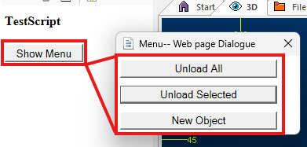

# Script Updater

To access this tool:

  * Using the **[command line](<Command_Toolbar.md>)** , enter "update-scripts"

  * Display the **[Find Command](<findcommand.md>)** screen, locate **update-scripts** and click **Run**.

  * Load a script containing potentially dangerous elements and click **Open Script Updater** in the displayed banner.

  * **Home** ribbon **> > Automate >> Script >> Update Scripts**.

Studio products have long provided rich opportunities for automation. Developing software that can be manipulated through COM-aware scripting languages has been at the heart of what we do

for many years, and we intend to continue providing this facility long into the future, extending the reach of our automation facilities, in fact, to accommodate modern scripting environments, languages and techniques.

However, the sad truth is that today's digital world contains a myriad of risks for the unsuspecting scripter, and each opportunity to communicate with local software and hardware components, whilst offering bespoke and targeted ways to model, plan and schedule your operations.

### Safer Scripting

To maintain the highest level of local data security, we've rigorized our scripting interface in Studio products to provide a way to securely instantiate approved ActiveX objects through automation scripts. This provides a safer and more marshalled automation environment. 

In brief, we've introduced a new Studio application method (CreateObject) that can be used in place of the deprecated `new ActiveXObject("Prog.ID");` instruction. A call to something like `window.external.System.CreateObject("Prog.ID");` allows approved ActiveX objects to be instantiated to support your scripts. Most importantly, the ones that provide the highest risk are blocked. 

The **Datamine Studio Script Updater** , accessible via your **Home** ribbon, can update your scripts either individually or as a batch, automatically making them safer to use. 

If you load a script that looks like it could benefit from additional protection, a banner appears atop your display area. This also provides access to the conversion utility:

### Using the Script Updater

You can convert scripts individually or as a batch. For example, if you have a collection of scripts in a folder, you can convert them as a batch by adding that folder.

All updated scripts are backed up. Your original scripts will be where they were, but the files will now have a ".bak" file extension.

When you click **Update** , all scripts listed under **Scripts for Updating** are analysed. Where a call is made to instantiate an ActiveX object, a check is made to ensure it isn't one that could cause harm, or provide an opportunity for a thread actor to circumvent your local security settings and do something potentially harmful to your local system, or your extended network.

Conversion is really quick, even if processing several large files. On completion, a summary is shown of any changes that have been made, for example:

Script Updater Log
    
    
    Script Updater Log  
  
---  
      
    
       
      
    
    Start time: 2025-09-03 15:45:25  
      
    
       
      
    
    Checking C:\Database\MyScripts\ImplicitModelling\ImplicitModelling_VFS.js for required updates...  
      
    
       
      
    
    Line 59 updated from locFso = new ActiveXObject("Scripting.FileSystemObject"); to locFso = window.external.System.CreateObject("Scripting.FileSystemObject");.  
      
    
       
      
    
    Updated: C:\Database\Autotests_DM\System_Areas\ImplicitModelling\ImplicitModelling_VFS_Client\ImplicitModelling_VFS_Client.js  
      
    
       
      
    
    1 script(s) updated.  
      
    
       
  
In the example above, one call was made to the operating system's proprietary FileSystemObject(). This is a common way to manipulate local files. This is converted to a more protected and marshalled access method for the object, ensuring it can be run only within a Studio environment.

The converted script operates exactly as it did before.

**Functions on this screen include:**

  * Add File(s) Browse for one or more script files (.htm, .html, .js or any other ASCII text file.

  * Add Folder Select a folder. All files within it are interrogated as scripts.

  * Remove Selected Remove highlighted items in the **Scripts for Updating** list.

  * Remove All Files Clear the **Scripts for Updating** list.

  * Update Run the conversion, backing up the original scripts first. 

  * Show Log Display a cumulative log file showing the results of each conversion.

  * Clear Log Start a new log file for the next conversion.

  * Close

### Managing External Windows

You may use your script to display an external window with supporting content for your script. For example, a context menu system to support the parent script functions. 

If the external popup menu script contains ActiveX declarations, and these scripts are part of the conversion scope for the **Script Updater** , they are automatically converted to safer Studio-application-bound equivalent object instantiations, which makes the script fail because **window.external** is no longer the Studio application object.

Let's follow a very simple example. Say you have prepared a web page that emulates a menu system, with a set of buttons that you want to present separately to your main script UI, like this:

The menu buttons are held in an external page, and displayed using the ShowModalDialog standard Javascript function:
    
    
    window.showModalDialog("LoadMenuButtons.html", "", "dialogWidth:100px; dialogHeight:100px; center:yes; resizable: yes;");

Before conversion, both the parent (Show Menu) and popup window script (both .htm files) manipulated data files using now deprecated ActiveX instantiation. For example, in the both scripts, access to the FileSystemObject was originally instantiated like this:
    
    
    var objFSO = new ActiveXObject("Scripting.FileSystemObject");

After conversion, instances of the above declaration were converted to:
    
    
    var objFSO = window.external.System.CreateObject("Scripting.FileSystemObject");

This is fine for the parent script, but the popup menu script is no longer a 'child of the application', meaning some of its functions no longer work correctly.

What can you do about this?

There are two approaches. One is recommended.

  * Persist the deprecated ActiveX calls in your popup script. Whilst this may return script function to normal, it isn't the safest approach and Microsoft may withdraw support or even block this kind of syntax in the future. For that reason, Datamine recommends the following instead:

  * Pass in the Datamine application object to the popup script as part of the **ShowModalDialog** call. For example:  

        
        window.showModalDialog("LoadMenuButtons.html", "{Application: window.external}", "dialogWidth:100px; dialogHeight:100px; center:yes; resizable: yes;");

The second argument can be a value, variable, object or array (even an array of multiple objects). In the case of an array or the specification of multiple items in curly brackets), items are passed to the modal window as the windows `dialogArguments` array. You can then retrieve these values or object handles in the child window script. There's an example of this below.

#### Model Child Window Example

Consider the following example, where the Datamine Application Object (oDmApp) and a script helper object (oScript) need to be passed to a modal child window to eliminate the need for ActiveX object instantiation in the child window script functions. There are two user interfaces; a parent window and a child window ("ChildWindow.html").

First, an array is declared. This will eventually represent the modal window arguments:
    
    
    var gobjArgs = new Array();

Into the array, push a Datamine Application Object (formed with `oDmApp = window.external;` in the parent header section) and a Studio Script Helper object (formed with `oScript = window.external.System.CreateObject("StudioCommon.ScriptHelper");`, also in the parent header):
    
    
    gobjArgs=[]
    
    
    gobjArgs.push(oScript)
    
    
    gobjArgs.push(oDmApp)
    
    
    gobjArgs.push(gstrProjectName)

Open the modal popup window using something like this:
    
    
    window.showModalDialog("ChildWindow.html", gobjArgs, "dialogWidth:100px; dialogHeight:100px; center:yes; resizable: yes;");

In the child window ("ChildWindow.htm") script, access the handle to the `oDmApp` and `oScript` objects by referencing the child window's `dialogArguments` array:
    
    
    var args = dialogArguments;
    
    
    oScript = args[0];
    
    
    oDmApp = args[1];

You can pass in any object to a subordinate window this way.

Related topics and activities

  * [Automating Studio Products](<concept_studio%203%20scripting%20overview.md>)

  * [Customization Control Bar](<customization%20window.md>)

  * [Introducing Macros](<Introducing%20Macros.md>)