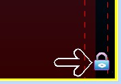
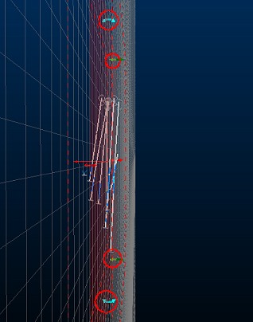
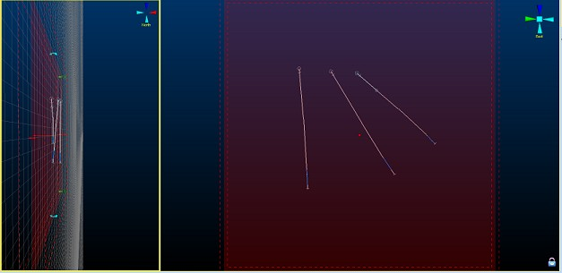
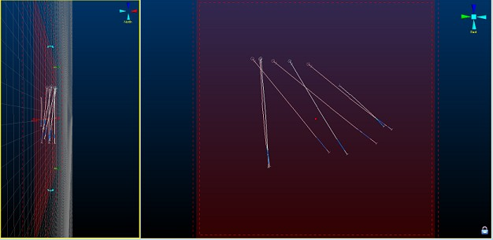
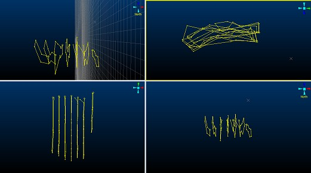

# Section Locking

Your application makes use of the 3D window for both visualization and designing/digitizing.

Because the requirements for 3D visualization and CAD-style drafting are different, the 3D window offers two separate modes of operation, both of which can be displayed and used simultaneously:

  * Locked In this mode, a 3D data window is "Locked" into a position so that the active section is orthogonal to the current camera position. Whilst in this mode, it is not possible to rotate the view although panning and zooming are still possible. The active section can be visible or invisible, clipped or un-clipped, and data can be digitized directly onto the section, or snapped to data according to your current settings.

You can lock more than one 3D view if you wish, although you can only lock those views to the same active section. It is possible, however, to align any view to any section without locking it (see the examples below).  

  * Freeform The default setting, and lends itself towards a more dynamic digitizing and visualization environment. In this mode, all view editing commands are available (rotate, view, pan). You will still digitize onto the active section or snap to the relevant data points, but the section may not be face-on to the camera.

Both operating modes permit the same access to data formatting commands, and you can use a combination of locked and freeform views for digitizing if you wish.

Note: An external 3D view cannot be locked - only views that reside within the main application may be locked.

## Locking Example

Note: This example is relevant to all Studio products other than Studio Mapper.

;>)   

The following example is a good approach for general digitizing scenarios; you can digitize onto a fixed section and also see the position of the active section in a non-orthogonal view. Another added benefit is that you can see the effect of your designing operation in other 3D views, in real-time.

In this example, all views are 'internal' to your application, and a simple 2 screen set up is performed, with the left screen being locked. Digitizing will only be performed within the locked view.

Remember, this is just a basic example of what you can do, using low-resolution data and a selection of the options available - similar procedures can be used for 4-split windows and more complex digitizing operations.

  1. To set up the views, ensure you have 3D data loaded.

Note: The example file "_vb_holes.dm" is loaded in the above example, and the default section is set to a North-South alignment. Data is clipped with a section corridor of 25m either side of the section, and clipping is set to "Outside".

  2. When you are happy with the clipping extents for your data, split the window into 2 portions using the 3D View ribbon's Window >> Split Vertically option. 

  3. Move the window splitter by dragging it to the desired position. In the example above, the right-hand window covers approximately 2/3 of the screen - this is the intended 'locked' section.

  4. Use the rotate, pan and zoom commands to set up your freeform window to a suitable orientation. The actual alignment is dependent on the task you are performing.

In the example above, the left-hand view has been set up so that the section indicator is enabled, and the position of the section in 3D is easily seen.

  5. Click inside the view you wish to lock and click the View ribbon's Lock command:

  6. The locked view automatically aligns to position the camera face-on to the section, and a small padlock icon will appear in the bottom right corner of the view:  
  

  7. Ensure your visible formatting is relevant to the digitizing process. The above example shows demonstration drillhole data coloured on Copper grade.

  8. Position the section at the desired location in 3D space. For this example, the Interactive Section Editor is used to position the section in real-time, using the freeform window (on the left).

In this example, the click is inside the left window to activate it (a yellow line will appear around the edge).

  9. Using the  View ribbon, select the  Sections >> Edit Interactively option.

Note the 'widgets' that appear around the edge of the section:

;>)

  10. In this example, the user clicks and drags one of the green widgets to the left until an easting of approximately 5930.00 is reached (this value appears in the status bar at the bottom of the screen) - the right hand window contents update automatically as the view is locked to the section being moved on the left. In this example, the view appears as follows:

;>)

  11. The locked view is then selected by left-clicking inside it - this view is now surrounded by a yellow border.

  12. Next, a closed string is digitized (using the "ns" shortcut) to encompass the non-absent data, digitizing into the right-hand locked view.

  13. The section is moved (using the freeform view) to expose drillholes further into the sample set; as before, click into the freeform view to activate it, and enable the Interactive Section Editor.

  14. In this example, the section is moved to 5960E \- the previous digitized string will (just) disappear. 

Why does it disappear? Because the section corridor in this example is 25m in front and behind of the section centreline. As the section was moved from 5930E to 5960E (a movement of 30m), the data digitized within the previous section position is now clipped (30m > 25m):

;>)

  15. Again, a closed string is digitized around non-absent data (clicking inside the locked section first to activate it, then using "ns"):

  16. Continuing the move-digitize-move steps above, a series of closed strings are digitized throughout the sample data set. In this example, a manual section movement of 30m is performed each time (for greater accuracy, the section properties dialog could be used to manually set the required position, instead of a manual movement)

  17. Once the drillhole data set has been traversed, you're left with a series of outlines that can be used as a basis for linking and subsequent model development:

;>)

## Tips and Guidance

With multiple 3D views and a locked section, the process of designing in 3D can be more rapid, accurate and informative than previous 2.5D operations. Here are some tips that may help your transition to 3D digitizing more satisfying:

  * Set up your 3D views and [sections](<../VR_Help/Sections.md>) in advance of digitizing.

  * If you're using multiple monitors, try using the external 3D view option to spawn multiple windows on one monitor whilst keeping the 'parent' application in the other. All views will update in real-time.

  * Don't forget that just because a view is locked, the section itself is still available for reformatting (positioning, clipping, display format and so on.)

  * The padlock icon is your indicator that a view is locked

  * If you need to position your design section at a specific point, double-click the section in the Sheetsor **Project Data** control bar to define the orientation, reference point, dimensions and/or plane width. There is no need to unlock a view to do this

  * Use your data snapping options to ensure right-click digitizing behaviour is as expected, prior to digitizing.

  * You can use data zooming and panning commands in any view, locked or otherwise, even in the middle of a digitizing command. Zoom and pan the view and just continue digitizing.

  * 3D grids are a great way to keep an eye on your coordinates \- you can create any number of grids in 3D. See [Grids Folder](<TheGridsFolder.md>).

Related topics and activities:

  * [Splitting Windows](<../VR_Help/Split_Windows.md>)

  * [3D Sections](<../VR_Help/Sections.md>)

  * [External 3D Windows](<External_3D_Windows.md>)

  * [The 3D Grids Folder](<TheGridsFolder.md>)