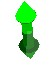
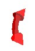

# 3D Section Widgets

To display section widgets:

  * **3D View** ribbon **> > Sections >> Edit Interactively**.

Section widgets are ideal for editing and positioning display sections in any 3D window.

By default, sections are displayed without 'widgets' (control handles), which when displayed, surround the currently active section:

Note: The section editing tool is a temporary mode; if you enter another command in your application (or even click outside of the application) you will automatically disable the widget display.

There are three types of widget available, and all are used to reposition the active section in real-time, honouring any existing clipping settings that are associated with the section.

 | Adjust the Z reference point of the section in the direction of the normal of the section plane.  
---|---  
 |  Change the azimuth of the active section.  
 |  Change the dip/inclination of the active section.  
  
Related topics and activities:

  * [3D Sections](<../VR_Help/Sections.md>)
  * [Section Locking](<Section_Locking.md>)