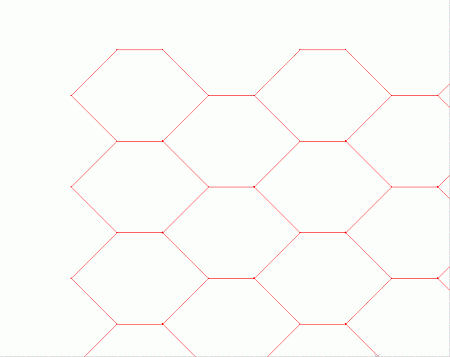
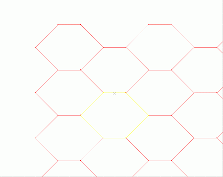
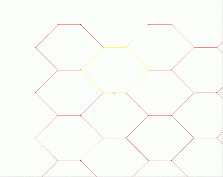

# Selecting 3D Data Interactively

There a number of methods and settings which can be used to assist or control the selection of 3D object data in the3D window. These can be used when selecting data for querying, editing or manipulation purposes.

The data that is selected will depend on your current selection settings, and any constraints applied via the **[Overlay Selection](<OverlaySelectionDialog.md>)** screen. You can change your default data selection settings using the **Home** ribbon.

## Data Selection Methods and Modes

The following options are avaliable to select data. You can use a combination of these methods.

  * Click (left-click) \- select the closest object (e.g. wireframe, strings) or object item (e.g. string, point, model cell, plane, drillhole segment). 
  * <CTRL> \+ Click (left-click) - individually select multiple objects or object items ; performing <CTRL> \+ Click on an already selected item will deselect the item.
    * By default, "CTRL selection" will alternate the selection state of data within the selection region; all unselected data will become selected and any selected data will become unselected. This is because the default setting for the [selection-mode-append-switch](<../command_help/selection-mode-append-switch.md>) state is disabled.
    * If the [selection-mode-append-switch](<../command_help/selection-mode-append-switch.md>) is enabled, any data selected using the CTRL key modified will be added to the current set if data within the selection area is unselected. Essentially, if this mode is set, data can only be added to the currently selected data pool, not removed.
  * Selection Box/Rectangle (click-and-drag diagonally) - select multiple objects or object items (e.g. planes, points, strings) lying partially or fully within the selection rectangle. This selection method is enabled using the [selection-mode-box-switch](<../command_help/selection-mode-box-switch.md>) command, or the 'smx' quick key combination.
  * Selection Swipe/Line (click and drag). This selection mode, enabled using the [selection-mode-line-switch](<../command_help/selection-mode-line-switch.md>) command, can be used to form a point-point line of variable width, selecting all data that either falls within the selection boundary, or partly overlaps it, depending on your data selection settings.

Tip: Use the **Home** ribbon's Select >> Swipe Selection button to quickly toggle between swipe and box selection.

These actions are effected by a number of general settings, including:

  * Overlay and object Selection settings.

  * Snap Mode settings.

A number of commands are also available for actively selecting multiple objects of the same data type, like [select-all-strings](<../command_help/select-all-strings.md>). Certain querying or editing commands allow the further selection of a form of object type (such as a perimeter or closed string), an object items data, for example, a string vertex or midpoint; or a wireframe triangle. Other commands like this include:

  * [query-points](<../command_help/query-points.md>)

  * [query-triangle](<../command_help/query-triangle.md>)

  * [snap-to-mid-string-switch](<../command_help/snap-to-mid-string-switch.md>)

## Selection and Snapping Settings

;>)

When working with multiple overlays and multiple data types, selection can be restricted by:

  * overlay, for a specific window (3D), using the [Overlay Selection](<OverlaySelectionDialog.md>) screen.

  * a particular aspect of a wireframe, such as by constant attribute value, group value or filter, using the [Project Settings: Wireframing](<Project%20Settings_Wireframing.md>) screen.

  * data type, for all windows, using the object type selection switches like [select-point-data-switch](<../command_help/select-plane-data-switch.md>)or commands on the Home ribbon's Select  group of controls.

In addition, the ability to control what object item and where on an object item the snap action selects, is controlled by:

  * overlay snap settings \- controls what overlays are available for snapping to; these are set in the [Snap Mode](<SnapSettings.md>) screen.

  * snap mode settings - controls where on an object item the snap action selects such as when on the line, at vertex points; this is set in the Snap To group on the [Snap Mode](<SnapSettings.md>) screen.

  * data type snap settings \- controls what type of data is available for snapping to points, strings, drillholes, wireframes and so on; these are set using the snap to data type swtches like [snap-to-point-data](<../command_help/snap-to-plane-data-switch.md>).

#### Point and String Selection Settings

The selection of Points and Strings data using a selection box is controlled by the Data Selection group of settings on the Project Settings dialog's, [Points and Strings](<Project%20Settings_Points%20and%20Strings.md>) tab. These control whether all or only part of a string needs to fall with the selection rectangle in order for it to be selected.

### Selection of Coincident Data

Where there are multiple candidates for a selection (e.g. coincident string points, coincident string segments, coincident points), repeated clicks (at the same location) will cycle through each candidate in turn. If the <Ctrl> is pressed to modify a candidate's selection state (i.e. selected/deselected), each selection candidate will be toggled on and then off before moving on to the next candidate. This will allow an individual candidate to be toggled without affecting the others.  
  
Since the default selection mechanism is also used to select model cells or wireframe triangles for display in the Data Properties control bar, these can also be added to the end of the candidate list if they lie under the cursor.

Note: Closed strings do not have a priority over open strings with this selection mechanism. Where closed string are required in preference, the perimeter selection method or switch should be chosen instead using commands like [select-perimeter](<../command_help/select-perimeter.md>) and [perimeter-selection-switch](<../command_help/perimeter-selection-switch.md>).

The example below illustrates how this mechanism works. This set of perimeters (closed strings) contains many strings which have coincident string segments i.e. have segments which share the same location as those of some of their neighbours. Selecting a particular string (without using the above-mentioned perimeter selection options) can be done by repeatedly clicking at the same point in order to cycle through the strings with coincident segments until the required string is selected (the selected string is highlighted yellow).

This is the set of perimeters before any selection has been made:

;>)   

Clicking the for first time, at the location of the cross, selects the highlighted string:

;>)

Clicking for a second time, at the same location, selects the string above it:

;>)

Note: Clicking at the same point for a third time will again select the string shown in the second image.

### Special Modes

Drillhole data has additional selection modes as dictated by Project Settings. These are also set by the [switch-drillhole-selection](<../command_help/switch-drillhole-selection.md>) and [toggle-drillhole-selection](<../command_help/toggle-drillhole-selection.md>) commands. These modes let you pick drillhole data in any 3D window either as an entire hole, intervals (according to **FROM** -**TO** values), the current legend intervals or by any unique attribute value.

Related topics and activities

  * [Selecting Wireframes](<selecting_wireframes.md>)

  * [selection-mode-box-switch](<../command_help/selection-mode-box-switch.md>)

  * [selection-mode-line-switch](<../command_help/selection-mode-line-switch.md>)

  * [selection-mode-append-switch](<../command_help/selection-mode-append-switch.md>)

  * [toggle-drillhole-selection ("tds")](<../command_help/toggle-drillhole-selection.md>)

  * [switch-drillhole-selection ("sds")](<../command_help/switch-drillhole-selection.md>)