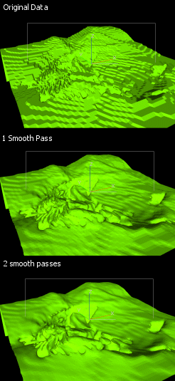

# Smooth Wireframe

To access this screen:

  * **Wireframe** ribbon **> > Operations >> Smooth**.

  * Run [wireframe-smooth](<../command_help/wireframe-smooth.md>) in the Command toolbar.

  * Type the 'wfs' quick key combination into the 3D window.

Wireframe smoothing allows you to smooth wireframes, or portions of wireframes, by relaxing the positions of the existing vertices. This removes sharp edges by minimizing the distance between connected vertices.

No data is lost with this operation; the same number of vertices are present before and after the operation, although some may have been repositioned. You can use this command as often as is required to generate the required effect, by setting the number of "passes". Each pass represents one iteration of the smoothing process across the entire wireframe surface.

Here's an example:

It should also be noted that this function honours the convention that duplicate vertices indicate a break in surface topology, and so any unintentional duplicate vertices should be removed before calling this function (for example, by running [Verify](<../command_help/wireframe-verify.md>)).

The wireframe object to be smoothed can either be selected in the Object list or you can choose the **Selected triangles** option, meaning cleaning is restricted to selected triangles only. 

**Note** : This command supports [**flexible wireframe selection**](<Wireframe_Selection_Concept.md>).

Activity steps:

  1. Load wireframe data and, if you are smoothing a subset of triangles, select them in the 3D window.

  2. Display the **Smooth Wireframe** screen.

  3. Select either a wireframe **Object** in memory you wish to smooth, or Selected triangles to smooth only the selected data. 

Note: You can also (re)select wireframe triangle data whilst the Smooth Wireframe screen is displayed.

  4. Choose the number Smoothing Passes required. A higher number will result in a smoother object.

Warning: Multiple passes lead to increased smoothing and can sometimes also cause a reduction in wireframe extents and volume if over-applied.

Related topics and activities:

  * [wireframe-smooth](<../command_help/wireframe-smooth.md>) (command)
  * [Selecting Wireframe Data](<Wireframe_Selection_Concept.md>)