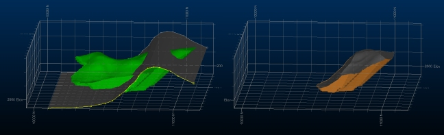

# Split Solid by DTM

To access this screen:

  * Structure ribbon | Operations | DTMs | Split by DTM

  * Run the command [wireframe-split-by-surface](<../command_help/wireframe-split-by-surface.md>).

  * Use the quick key combination "spbd".

Splits a closed wireframe or a selection of triangles representing a solid by a DTM (or selected triangles of a DTM). You may choose to keep the solid above the DTM data or the solid below it. You can output data either to the current object, another object or a new object.

;>)

An example of input (left) and output data with Split Solid by DTM

If the solid data input is a closed wireframe and has a clean line of intersection with the DTM input, the new object will also be a closed solid.

This command is the interactive part of the [wireframe-split-by-surface](<../command_help/wireframe-split-by-surface.md>) command.

**Note** : This command supports [**flexible wireframe selection**](<Wireframe_Selection_Concept.md>).

Activity steps:

  1. Load or create closed wireframe data representing the "solid" to be split.

  2. Load or create an open surface (a DTM) to act as the splitting shape.

  3. Display the **Split Solid by DTM** screen.

  4. Select the **Solid**.

     * Either select a wireframe object representing a fully-closed volume, or interactively pick triangle data in one or more wireframe objects in the 3D window (Selected triangles) and use Store current selection to commit it to the command.

  5. Select the **DTM**.

     * Select an open surface that fully-intersects the Solid (see above). This cannot be a partial intersection. As above, you can choose either a full surface object or Selected triangles.

  6. Choose which data to keep after splitting:

     * Keep Solid above DTM Retain the data that sits on the side of the DTM that represents "up" (according to the wireframe surface normals: "up" could actually be in any direction).

     * Keep Solid below DTM Keep the data below the DTM after splitting.

  7. Choose to **Output** data either within the Current object, an existing wireframe object (pick it from the list) or a new object (type a new name).

  8. Click **OK** to generate split data.

  9. Review your data by viewing it in a 3D window.

  10. Save your project.

Related topics and activities:

  * [wireframe-split-by-surface](<../command_help/wireframe-split-by-surface.md>)

  * [Wireframe Verify](<Wireframe%20Verify%20Dialog.md>)

  * [Selecting Wireframe Data](<Wireframe_Selection_Concept.md>)