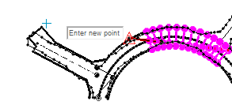

# Cursor Tooltips

Cursor tooltips display context-sensitive information about your current 3D window command. 

If enabled, tooltips offer guidance on the next step to perform when executing a design command, such as digitizing a new string, for example:

To configure cursor tooltips:

  1. Display the system **[Options](<Options.md>)** screen.

  2. Display the **Environment >> Cursor Tooltips** screen.

  3. Toggle the display of cursor tooltips.

     * If **Show Cursor Tooltips** is selected, cursor tooltips will be shown in the primary 3D window.

     * If **Show Cursor Tooltips** is unselected, no cursor tooltips will be displayed.

  4. Pick a size for cursor tooltips.

     1. Expand **Font** to pick a font face.

     2. Use the spin controls to increase or decrease the pixel size of the font, or enter a number directly. 

  5. Set the font Size.

  6. Click **OK**.

  7. Save your project.

Related topics and activities:

  * [System Options](<Options.md>)

    * [Options: Environment](<Options_Environment.md>)