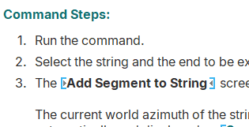

# Using this Help File

Your application contains a wide range of varying functions and tools. Your help file helps you understand them.

Help topics are broadly available in the following types:

  * Conceptual topics which describe the general concepts and background information on how to get the most out of the system.

  * Command- and process- specific topics which how to use a specific command and achieve the desired results i.e. the input data requirements, the parameters, settings, methods and output.

  * Window, toolbar, control bar and screen topics which describe how to use the various Studio 3 components. Many of these topics are context-sensitive and appear when specific buttons are clicked, or F1 is pressed, with a particular screen displayed.

### Activities

Where appropriate, an "activity" is provided to outline the basic steps required to achieve a particular outcome.

Whilst sequential, activities can contain other reference information and even links to other activities (to explain a wider workflow). 

### Reference Topics

Some topics contain reference material, often in tables. One example of this is a "command table" that outlines all commands starting with a particular letter, and links to further help. 

Examples of this type of content:

  * [Command and Processes Table \- G](<../command_help/COMMAND%20TABLE_G.md>)

  * [File Types](<filetype.md>)

### Searching for Help

Use the search facility to locate specific help. Searches are not case-sensitive. 

If you're viewing online help (which is highly recommended), you can use logic statements and other syntax to support your search:

  * Enclose a "search phrase" in double quotation marks.

  * Use Boolean operators (AND, OR, NEAR, NOT).

  * If you are viewing content using browser-based machine translation, enter search terms in English.

Related topics and activities

  * [ Help System Changes](<Help-project-update.md>)

  * [Get Help with Studio RM](<Get-Further-Help.md>)