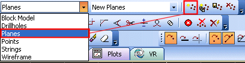

# Planes Data

Planes are a file type that can be used to indicate a 2-dimensional 'sheet' within your data set. They can be generated manually or as a result of converting from another data type, e.g. strings.

Planes require both explicit position and orientation settings; in Datamine products, a plane is referenced to a single point in 3D space (XYZ) and a specific dip direction. Although a 2D object, the planar qualities are extrapolated from the XYZ position and directional information. Once created, planes can be used in other processes (e.g. [Stereonet Charts](<../Stereonet/Stereonet%20Introduction.md>) or the active **3D** window, say, as part of rock mass structure analysis). As such, a plane object is closely aligned to a points object, albeit with additional information.

Planes are, in essence, points with a supporting dip and dip direction. A planes object can be generated from a string, for example. In this situation, a plane is aligned with the string following a 'best fit' approach.

Each plane object contains the following fields:

Field |  Numeric or Alphanumeric |  Implicit or Explicit |  Description  
---|---|---|---  
XP |  N |  E |  X coordinate of the center of the plane.  
YP |  N |  E |  Y coordinate of the center of the plane.  
ZP |  N |  E |  Z coordinate of the center of the plane.  
DIPDIRN |  N |  E |  Dip direction of the plane.  
SDIP |  N |  E |  Dip of the section.  
HSIZE |  N |  E |  Horizontal size of the plane.  
VSIZE |  N |  E |  Vertical size of the plane.  
VARIANCE |  N |  E |  Where a plane has been generated from another process, this value describes a measure of how closely point data in the original object relates to the position of the plane (best fit analysis).  
BLOCKID |  N |  E |  A mining block identifier.  
  
### Creating Planes

There are several ways to create plane data objects in your application:

  * You can generate a new, empty, planes object using the Current Object toolbar. Select the [Planes] option from the drop-down menu, then click the new object icon as shown below:

;>)

  * Type "create-new-planes-object" into the **Command line** to create a new, empty plane data object. See [create-new-planes-object ("cnn")](<../command_help/create-new-planes-object.md>)

  * Type "cnl" with the cursor in any 3D window. This also launches the [create-new-planes-object ("cnn")](<../command_help/create-new-planes-object.md>)command.

  * Convert a string object to a plane using either the **Sheets** (or **Project Data Bar**) menu to **Convert to Planes** , or using a ribbon equivalent command (the location of which depends on your product).

  * Import a previously saved plane data file.

### Plane Visual Formatting

A plane is like any 3D object and is supported by a 3D Properties screen. This can be used to change the colour, shape and other properties of the plane. See [Planes Properties](<../VR_Help/Planes%20Properties%20Dialog.md>).

Related topics and activities

  * [Sheets Control Bar Overview](<Sheets%20Control%20Bar%20Overview.md>)

  * [Planes Properties](<../VR_Help/Planes%20Properties%20Dialog.md>)

  * [create-new-planes-object ("cnn")](<../command_help/create-new-planes-object.md>)

  * [string-to-plane ("cstp")](<../command_help/string-to-plane.md>)

  * [3D Planes](<../VR_Help/Creating%20Planes.md>)

  * [Import Plane Data](<../VR_Help/VR_Importing%20Planes.md>)