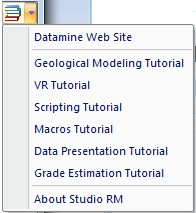
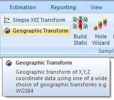
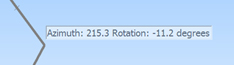

# User Interface

Your application adopts a ribbon system to deliver the majority of its core functionality, moving away from the toolbar-heavy approach used in previous versions. Context-sensitivity means that only the commands relevant to your current Data View (see below) will be displayed and/or enabled.

The out-of-the-box configuration has been designed to serve the vast majority of geological modelling needs, segregating functions into domain-based command groups and tabs whilst keeping commonly-used commands available at all times.

An example of a Studio UG ribbon

Ribbons are also available for customization to allow you to set up your user interface the most appropriate way for your role and tasks.

Context-sensitive information for every ribbon command has been provided (way in advance of the previous tooltips) to allow you to research your command choice before you activate it. This information isn't provided instead of detailed online Help, it is provided in addition to comprehensive digital documentation.

## Data Windows

As in previous versions of Studio, dedicated (linked) data windows are provided to deliver the most appropriate context for the type of work being performed. By default, the following data views are displayed:

  * Start Window

The landing page. The Start window is displayed on initial startup and is available throughout your project session. It can be used to view the latest online/offline information relating to your product, access recently-opened projects, create a new project or browse for a project.

  * 3D Window(s)

A combined visualization and engineering environment. Many interactive commands are available to make the geological modelling process intuitive and rich in 3D visual feedback.

See [3D Window Visualization](<../VR_Help/VR_Introduction.md>).  

  * Plots Window

Report-ready plots, logs, charts and other supporting data can be constructed from your 3D data quickly and easily with the Plots window. Working with the same data displayed in other data windows (including 3D), and with a powerful template function, you can create detailed and unequivocal standard reports in minutes.

See [The Plots Window](<Window_PLOTS_Overview.md>).

Other data windows are displayed either on request, or automatically as a result of creating a particular type of data:

  * Logs Window

Strip log display and configuration, again based on the same underlying data as shown in other data views. This window is automatically displayed when a new Log Sheet is created, and will be automatically displayed if a project containing log data is loaded.

See [The Logs Window](<Window%20Overview_%20Logs.md>).

  * Tables Window

Context-sensitive data table formatting options can be found in the Tables window, allowing you to create a formatted view of your data objects using a wide range of display options.

See [The Tables Window](<tables%20window%20overview.md>).

  * Graphics Window

Included for legacy support of older Studio processes - this will be displayed automatically if required by the running process.

  * Screen Window

Included for legacy support of older Studio processes - this will be displayed automatically if required by the running process.

Control Bars

Control bars are a great way to access data-specific functions and processes. 

  * See [[Data Selection Control Bars](<Studio%203%20Browsers.md>).](<Studio%203%20Browsers.md>)

  * See [[Data Control Bars](<Interface_ControlBars.md>)](<Interface_ControlBars.md>).

  * See [Output Windows](<Interface_Output.md>).

## Getting More Help

Your application is designed to be intuitive. In addition to supporting you through one of our many international offices, you can find a wealth of information about your system using the following methods:

  * Online Helpclearly, you know how to access this already! However \- you can find out more about getting the best out of your Help system [here](<Studio%203%20Help%20File.md>), and can access a range of help topics and tutorials using the 'Pile of Books' icon at the top right corner of the screen:  
  

  * Context-sensitive Ribbon Tooltipsmuch more than the tooltips of old, all ribbon commands are introduced by a short overview of the command and pointers on how to use it, e.g.:  
  

  * Cursor Tooltips your application builds on the feedback system of previous versions to promote your awareness of important information throughout your project session. One of the main advances in this respect is the new [Cursor Tooltips](<Cursor_Messaging_System.md>) that can be enabled to provide status information on-screen at the appropriate place, e.g. close to the active cursor. This resolves the issue faced by many traditional software applications whereby status information could be missed as it does not appear in the area of focus:  
  
