# 3D Symbols Library

Studio products allow you to use symbols to represent the nodes of loaded 3D objects, specifically points, strings and block models (if rendered as points).

Symbols can be specified in multiple, mutually-exclusive ways:

  * A default, fixed symbol can be applied. This will display a monochrome symbol (index=0) for all points in the 3D data object.

  * A custom, fixed, monochrome symbol can be applied to all points. This is achieved used the 3D object properties dialog, either using the Symbols tab (for block models, the Points display type must be selected).

  * A monochrome symbol can be applied according to an attribute value and an associated symbol legend.

  * A full-colour image file can be displayed, based on the file reference in an alphanumeric attribute.

[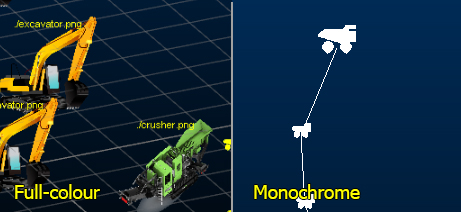](<javascript:void\(0\);>)

3D window content showing 3D (.x) symbols and 2D symbols

## Monochrome Symbols

A set of monochrome symbols can be applied to string, point and block model data. By default, symbols are 2D.

A 2D symbol does not require an additional attribute to specify an image file. Instead, a SYMBOL column within each data object will contain an index number that is matched to one of the items in the standard library of symbols that Studio products use.

Symbols are only associated with a value (or range, or filter expression) once they have been referenced by a display legend. The table below displays the available system legends and their respective descriptions along with their internal system ID.

This ID is only used to differentiate the symbols within your system and should not be regarded as an absolute label. In the same way as colors have an internal 'Datamine' number, the system symbol number is not necessarily the index that is associated with it in a legend. For example; symbol ID 0 (zero) represents the default node marker, and is shown at the top of the list when the Symbol list is shown for a particular legend interval in the Datamine **Legends Manager**. You can then associate this symbol with any value (for example, "64.5"), range (for example, "100.0 to 105.5") or filter expression (for example, ">100 AND <200"). 

All of these symbols are stored in a installed local system file (`system.psd`). If your copy of `system.psd` has been modified, this list may no longer be valid. For more information on creating custom legend symbols, please refer to your Legends online Help (press F1 in the Legends Manager).

The following table lists all default symbols provided by your application.

|  Symbol Description |  |  Symbol Description  
---|---|---|---  
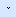 |  0 - Default |  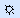 |  37 - Miscellaneous Symbol 1  
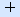 |  1 - Cross |  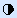 |  38 - Miscellaneous Symbol 1  
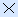 |  2 - Diagonal Cross |  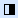 |  39 - Miscellaneous Symbol 1  
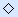 |  3 - Diamond |  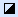 |  40 - Miscellaneous Symbol 1  
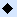 |  4 - Filled Diamond |  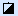 |  41 - Miscellaneous Symbol 1  
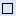 |  5 - Square |  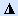 |  42 - Miscellaneous Symbol 1  
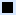 |  6 - Filled Square |  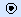 |  43 - Miscellaneous Symbol 1  
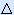 |  7 - Triangle |  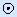 |  44 - Miscellaneous Symbol 1  
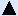 | 8 - Filled Triangle |  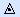 |  45 - Miscellaneous Symbol 1  
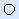 |  9 - Circle |  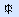 |  46 - Miscellaneous Symbol 1  
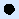 |  10 - Filled Circle |  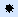 |  47 - Miscellaneous Symbol 1  
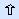 |  11 - Block Arrow |  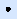 |  48 - Miscellaneous Symbol 1  
 |  12 - Filled Block Arrow |  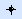 |  49 - Miscellaneous Symbol 1  
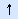 |  13 - Arrow |  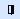 |  50 - Miscellaneous Symbol 1  
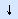 |  14 - Reversed Arrow |  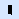 |  51 - Miscellaneous Symbol 1  
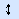 |  15 - Double Headed Arrow |  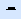 |  52 - Miscellaneous Symbol 1  
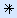 |  16 - Miscellaneous Symbol 1 |  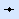 |  53 - Miscellaneous Symbol 1  
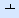 |  17 - Miscellaneous Symbol 1 |  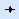 |  54 - Miscellaneous Symbol 1  
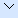 |  18 - Miscellaneous Symbol 1 |  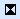 |  55 - Miscellaneous Symbol 1  
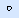 |  19 - Miscellaneous Symbol 1 |   |  56 - Miscellaneous Symbol 1  
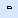 |  20 - Miscellaneous Symbol 1 |  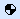 |  57 - Miscellaneous Symbol 1  
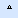 |  21 - Miscellaneous Symbol 1 |  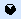 |  58 - Miscellaneous Symbol 1  
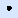 |  22 - Miscellaneous Symbol 1 |  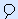 |  59 - Miscellaneous Symbol 1  
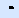 |  23 - Miscellaneous Symbol 1 |  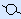 |  60 - Miscellaneous Symbol 1  
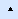 |  24 - Miscellaneous Symbol 1 |  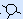 |  61 - Miscellaneous Symbol 1  
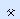 |  25 - Miscellaneous Symbol 1 |   |  62 - Miscellaneous Symbol 1  
 |  26 - Miscellaneous Symbol 1 |   |  63 - Miscellaneous Symbol 1  
 |  27 - Miscellaneous Symbol 1 |   |  64 - Miscellaneous Symbol 1  
 |  28 - Miscellaneous Symbol 1 |   |  65 - Miscellaneous Symbol 1  
 |  29 - Miscellaneous Symbol 1 |   |  66 - Miscellaneous Symbol 1  
 |  30 - Miscellaneous Symbol 1 |   |  67 - Arrow Head  
 |  31 - Miscellaneous Symbol 1 |   |  68 - Filled Arrow Head  
 |  32 - Miscellaneous Symbol 1 |   |  69 - Arrow In  
 |  33 - Miscellaneous Symbol 1 |   |  70 - Arrow Out  
 |  34 - Miscellaneous Symbol 1 |  |   
 |  35 - Miscellaneous Symbol 1 |  |   
 |  36 - Miscellaneous Symbol 1 |  |   
  
## Full Colour Symbols

To use full-colour symbols, the input data object must contain at least one attribute that references an image file in the project directory.

The following general procedure can be used to apply full-colour symbols to your loaded string, point or block model data:

  1. Copy the images you wish to use to your project directory. 

  2. Ensure your 3D data file contains an alphanumeric attribute column (say, IMAGE).

  3. For each data record for which you wish to set a symbol, the corresponding image attribute should describe a valid image file name, including the file extension, for example:

  4. Load the 3D data into any 3D view.

Note: Your loaded 3D object(s) can be loaded from any location, but all images references by those files must be in the project folder.

  5. Using the Sheets or **Project Data** control bar (or double-clicking the 3D data in a3D view), display the String, Point or  Block Model Properties screen.

  6. If you are visualizing a block model, ensure it is set to the _Points_ Display Type.

  7. Activate the Symbols tab and (for points and strings objects) and check Display Symbols.

  8. Select the 2D symbol option. 

Note: Full-colour images can only be applied as 2D symbols.

  9. In the Style group, choose Legend (not Fixed).

  10. Set the Legend to _< none>_ and the column to whatever attribute contains an image file name in your loaded object.

  11. Set the Scale of your symbol .

Tip: Click Apply to preview the symbol at its current size in the 3D view - although this may take some time depending on the density of your loaded data). You can also control the scale of an object with a legend, in the same manner as for monochrome symbols.

  12. Apply the changes and the points on the strings should change to the images defined in your input data file.

Note: If you want to use full-colour images instead of symbols, the corresponding 3D object property screen should display a symbol legend of "<none>". See above for more details.

Related topics and activities:

  * [Symbol Plot Items](<../PLOTS_LOGS/Symbols.md>)

  * [Symbol Properties](<../PLOTS_LOGS/Symbol-properties.md>)

  * [Format Structural Symbols](<../VR_Help/DHProp-format-structural-symbols.md>)

  * [Format Landmark Symbols](<../VR_Help/DHProp-format-landmark-symbols.md>)

  * [Drillholes Properties: Symbols](<../VR_Help/Drillholes%20Properties%20Dialog%20\(Symbol%20Visual\).md>)

  * [Drillhole Symbols](<../VR_Help/DHProp-symbols-overview.md>)

  * [Strings Properties: Symbols](<../VR_Help/String_Properties_Dialog_VertexVisualTab.md>)

  * [Points Properties: Symbols](<../VR_Help/Point_PropDialog_Symbols.md>)