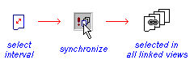

# Link and Live Settings

You can link data between different [plot](<Window_PLOTS_Overview.md>) views using _link_ and _live_ settings.

The same data may be selected in different views, it may be displayed in different views or it may be selected and displayed in different views. It is also possible to display and select completely different data in the different views. 

The relative settings of three toggles are used to set this behaviour.

  * **Link** 

The **Link** setting determines whether data selection between windows will be the same. On its own, it only means that common selection is available. The synchronize toggle must also be on to trigger the link.

  * **Live** 

The **Live** toggle controls the data display, determining whether the same or different data is displayed across views. The synchronize toggle must also be on to trigger the display of the same data.

  * **Synchronize** 

**Synchronize** is a switch that activates or deactivates the actions selected using the Link and Live toggles. When several windows are open at one time, for example, Plots, Logs and Tables, it activates the link and live selections.