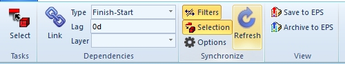
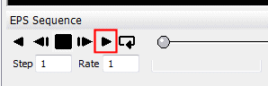

# Animate a DTS Schedule

Note: "DTS" refers to Datamine Task Scheduler. Studio products can connect to a DTS project and display and animate the project schedule in the Studio 3D window.

You can visualize your **DTS** schedule in 3D, and interrogate it.

This topic assumes that you have already loaded sequenced wireframe data into your application and have [linked](<EPS%20Sync%20Options%20Dialog.md>) to a valid DTS project.

During this procedure, you will create an animation which is based on the settings and dependencies of the connected DTS project. You will be able to play, rewind and step through your animation, plus define the 'slice' of data that will be shown during playback.

To create an animation of an existing DTS Schedule:

This procedure assumes that you have progressed your underground design to the point where a sequenced wireframe is available within your project, and that the DTS application is open.

Note: Providing DTS is open, using the Refresh button on the DTS ribbon will connect automatically to the open schedule. The running DTS project is detected by your application and the relevant task, duration and date values are retrieved.  

  1. Rotate your view so that you can see the aspects of your sequenced wireframe that you wish to animate.

  2. Ensure both Filters and Selection toggles are selected - then click Refresh.  
  

  3. This will initially retrieve all of the project settings within the currently linked project and update the animation field based on the dependencies found within the schedule. 

Next, your application displays the DTS Sequence control bar at the bottom of the viewing area.

Note: The animation timescale can be changed using the crosstab in DTS (from monthly to weekly, for example). Synchronizing your application with DTS will update this field in your application.

  4. The Sequence control bar allows you to define the animation frames to be displayed at any one time, the speed of playback, the direction of playback and other useful parameters. 

Make the relevant settings on the control bar and click Play:  
  

  5. Depending on the settings applied in the control bar, a series of animation frames will show the progression or regression of the mine design, according to the task dependencies configured in your **DTS** project.

  6. The animation sequence can be specified as Forwards, Single Frame or Reverse within the Wireframe Properties screen of the sequenced wireframe you have animated. 

To create or update an animation file for DTS:

Once connected to DTS, you have the option to generate an animation file to connect with the currently active schedule. You can do this in two ways:

  * Save to DTS Generate a Datamine Animation File (.evr) that can interact with the currently active project session. The animation file will be restricted to the generated solids only.

  * **Archive to DTS** As above, but the generated animation archive will contain all loaded and displayed 3D data, including model(s), mined-out wireframes, drillholes, design strings, activity points and so on.

Related topics and activities:

  * [Introducing InTouch DTS](<V14%20CONCEPT%20-%20InTouchEPS.md>)

  * [DTS Synchronization Options](<EPS%20Sync%20Options%20Dialog.md>)

  * Animate a DTS Schedule

  * [Filtering DTS Schedule Data](<v14%20intoucheps%20-%20filtering%20schedule%20data.md>)

  * [The Crosstab Control bar](<V14%20InTouchEPS%20-%20Crosstab.md>)

  * [DTS Dependencies & Animations](<V14%20InTouchEPS%20-%20Visualization.md>)