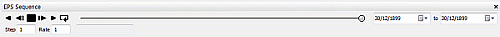
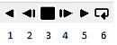

# Sequence Control bar

To access this control bar:

  * Right-click a 3D window overlay - that has been assigned a **Sequence Column** in the **Sheets** or **Project Data** control bars, and select **Sequence Controls**.

  * The **Sequence Control** bar is also displayed automatically in some cases, such as when playing back a sequenced animation after connecting to a **DTS** schedule.

The Sequence control bar controls the playback of animated data the 3D window. Data is based on animation data synchronized with a DTS schedule.

;>)

The Sequence control bar

Use the Sequence control bar to:

  * Step forward and backward manually through an animation, step-by-step (according to the Step value).

  * Play an animation in forward or reverse direction, based on the M4DANI field value in underlying data.

  * Set the rate and step of your animation.

  * Determine the section to be animated by specifying dates in the Sequence control bar.

  * Easily view the actual calendar dates that relate to the animation currently being displayed.

## Sequence Playback Controls  

The following animation controls are available:

  1. Play the animation in reverse order, according to the specified settings.

  2. Rewind the animation by a single step ("step back").

  3. Stop the animation.

  4. Forward the animation by a single step ("step forward").

  5. Play the animation in a forward direction.

  6. Rewind and replay the animation.

Step is the number of frames to skip for each animation frame. If set to 2, for example, frames 1, 3, 5 , 7 and so on, will be played. The default value is 1, meaning all distinct animation frames (according to the values set in the **M4DANI** field) will be played in sequence (forward or reverse).

Rate represents the speed at which the animation is played.

Related topics and activities:

  * [Introducing InTouch DTS](<V14%20CONCEPT%20-%20InTouchEPS.md>)

  * Sequence Control bar

  * [DTS Synchronization Options](<EPS%20Sync%20Options%20Dialog.md>)

  * Sequence Control bar

  * [Filtering DTS Schedule Data](<v14%20intoucheps%20-%20filtering%20schedule%20data.md>)

  * [The Crosstab Control bar](<V14%20InTouchEPS%20-%20Crosstab.md>)

  * [DTS Dependencies & Animations](<V14%20InTouchEPS%20-%20Visualization.md>)