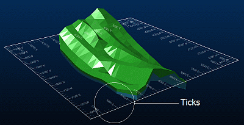
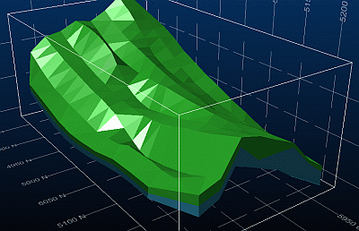

# Grid Properties: Options

Note: A Datamine [eLearning course](<https://datamine.learnupon.com/>) is available that covers functions described in this topic. Contact your local Datamine office for more details.

To access this screen:

  * Display the [**Grid Properties**](<grid%20properties%20dialog.md>) screen and select the **Options** tab.

Configure the base properties of a 3D window grid, including:

  * Basic display format

  * Grid intervals

  * The type and position of grid annotation.

The following options are available regardless of the tab you are displaying:

Option | Description  
---|---  
Line type |  Configure the type of line used to represent the grid elements.

  * _Ticks_ ;>)
  * _Lines_ ;>)
  * _Crosshairs_ ;>)

  
Show line |  Toggle to show grid lines for a particular axis.  
Fixed intervals |  By default, grid intervals are set at a level which is appropriate to the viewing scale. A similar amount of information is displayed regardless of the scale. Check to override this setting, and define the display resolution independently for each grid axis.  
Align with |  Enter a value to position a grid line, along the specified axis. For example, if '1000' is set for the X axis, this will ensure that a grid interval marker (tick, line etc.) is placed in the nominated position, with intervals being positioned either side, as determined by the other settings on this screen.  
Decimal places | Specify the number of decimal places for grid labels.  
Major line every N |  By default, a major (bold) line is drawn on the grid every tenth minor interval. Change this by setting another value.  
Tick size | The default pixel size can be overridden by specifying your own setting here. The larger the value, the more the grid interval marker will encroach on the display area of the active 3D window.  
Grid color |  Select a general grid colour for all axes. Note: This can be overridden with axis-specific settings on the [Grid Properties: Advanced Options](<VR_Grids_Advanced_Options.md>) screen.  
Annotation  | Check one or more groups of grid text, or uncheck all options to hide grid text completely.  
Major lines only | Check to draw only the major lines in a grid interval.  
Position |  Choose how to display annotation, either _Inside Border_ or _Outside Border_.  
Style | Choose the alignment style for grid text.   
Font |  Pick a font for grid text. For any section-type grid (default or custom), you can display text either as 'flat' text (2D) or **3D** text. Note: 3D Hull type grids are always labelled using 3D text.  
Size |  Enter the font size.  Note: If defining a 3D Hull type grid, you can specify the size as % Interval (say, "make my text 50% of the gap between intervals") or in absolute world units ("make my text 15m high in world units").  
  
Related topics and activities:

  * [Grid Properties: Options](<grid%20properties%20dialog.md>)

  * [Grid Properties: Advanced Options](<VR_Grids_Advanced_Options.md>)

  * [Grid Properties: More Line Formatting](<VR_Grids_More_Line_Formatting.md>)

  * [Grid Properties: Templates](<VR_Grids_Templates.md>)