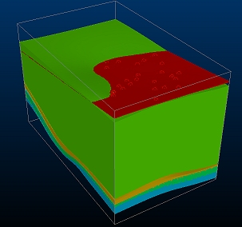
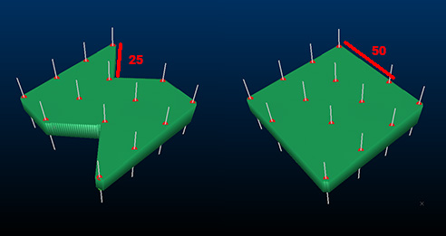
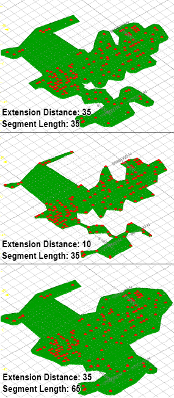
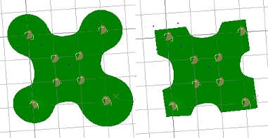
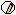
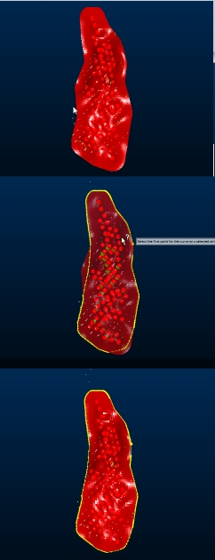
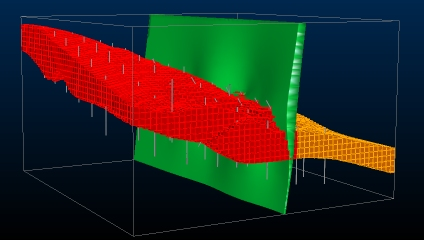

# Boundary Options

Note: A Datamine [eLearning course](<https://datamine.learnupon.com/>) is available that covers functions described in this topic. Contact your local Datamine office for more details.

Boundary clipping options are either calculated based the arrangement of your samples or defined manually, using a perimeter string (also known as the "custom" method) or a block model exterior hull (the "proto" option).

Boundary options can be used in conjunction with all other surface and vein modelling parameters.

## Automatic Boundary

Automatic options are:

  * Alpha Shape: create an alpha shape around positive samples based on a given extension distance. This is the default setting for all new data. 
  * Aligned Square: a simple cuboid bounding calculation.
  * Custom: involves either selecting a perimeter object in which to create a boundary string (or add an existing string), or letting Studio RM create a new perimeter object for you, if one isn't selected or available.
  * Proto: use a loaded prototype model cuboid as a constraint for volume and surface generation. 

You can also use any existing block model and its outer hull is used to form the cuboid boundary. One advantage of this option is that the same cuboid boundary can be used for multiple modelled values. In the image below, all modelled volumes representing lithological zones have been clipped to the same prototype model hull:  
  

You can also define a boundary clipping option if accessing the vein-from-samples command from script. See [Create Vein Surface: Automation](<Create_Vein_Surfaces_10_Automation.md>).

## Alpha Shape Boundary

An Alpha shape boundary requires a Segment length to determine the alpha shape of the exterior hull and an Extension distance to control the distance at which the boundary is placed in relation to the peripheral positive samples of the set.

Depending on the specified Segment Length, a more or less generalized outline is produced, for example:

;>)

An alpha shape models intrusions into the surface providing it is possible to do so with the specified Segment length and Extension Distance . 

Alpha shape clipping can be useful if you wish to control the extent to which concave intrusions into a modelled surface are clipped. In the following example, a simple 4 sample lode with constraining negative samples implies a crescent-like shape. Alpha shape clipping allows a continuous surface boundary to be constrained to a given distance from positive samples:  

In the example below, three configurations have been set for Alpha shape clipping. Note how the surface shape is controlled by the Segment length parameter, whilst the extent of the boundary (conservative, generous) is managed by the Extension Distance.

  

## Aligned Square Boundary  

The **Aligned Square** boundary method uses a bounding cuboid to restrict the surface hull. The hull includes all positive samples and is extended beyond this by an **Extension Distance**.

With this option, the bounding hull is the absolute limiting factor for surface creation - no surface data can be created beyond this extent.

;>)

You can alter the size of the bounding cuboid and subsequently the expanse of the grid of points to be used as a basis for creating HW and FW surfaces. 

## Custom Boundary

A custom boundary lets you limit the projection of your surface up to, but not beyond, a limiting boundary string or strings. Strings must be closed and pre-selected in order to be used in surface creation. 

String data is specified in the form of a loaded object, which is either modified or created (if one isn't selected, or none are available). You can also digitize a new boundary string.

With this option, you can either:

  * Create a new object by digitizing a perimeter in any 3D window using the  icon (it is recommended that you enable Auto look to view your structure orthogonal to the mean plane of the positive sample points).

  * Update an existing object by digitizing new perimeter data into it. Select a strings object in the Custom drop-down list, then digitize a new perimeter using using the  icon.

  * Add existing perimeter string data to a new perimeter object. Select any closed string (in any object), then ensure the Custom drop-down list doesn't show an existing object. A new perimeter object will then be created, and the selected closed string(s) are copied to it. This does not affect the original string object. This could be, for example, a string output by the vein modelling command, using the optional Boundary output option.

  * Add existing perimeter string data to an existing perimeter object. This is similar to the above, but data is added to whichever strings object is shown in the Custom drop-down list.

**Tip** : Perimeter objects can be edited using editing tools (smooth, resolve points, insert curve, insert line etc.), commonly found on the Edit ribbon.

The number of selected strings is shown as a read-only label. This value is updated as string data is selected.

The selected string data will trim data if it intercepts it. This clipping is applied as a final step in surface generation and is analogous to a 'cookie cutter' function. The clipping is applied orthogonally to the mean plane of the positive samples (the same plane used to determine the **Auto Look** orientation.

**Tip** : Generate a surface or volume, then use the Structure ribbon's Plane >> Hull to Strings option to generate a silhouette string collection. Use the Edit ribbon's Combine function to create a single closed string then edit this string to modify the mathematically projected boundary.

Consider the following example. The image at the top is the 'raw' output, with no boundary applied. The image in the middle shows the selected boundary string and the lower image shows the output volume where a custom boundary string is used.

## Proto Boundary  

Select the **Proto** option and a loaded block model (or model prototype) object from the drop-down list provided to constrain output to the outer hull of the selected model, as indicated by its prototype. 

For example, in the image below, the output vein model (green) is shown with a structural block model (red, orange) with both confined to the output hull (shown as a 3D wireframe cuboid):

;>)

Related topics and activities

  * [Vein Modelling](<Create_Vein_Surfaces_Overview.md>)

  * [[Create a Vein Model](<Create_Vein_Surfaces_2_Activity.md>)](<Create_Vein_Surfaces_Overview.md>)

  * [Create Contact Surface](<../STUDIO_RM/Surface_From_Samples.md>)