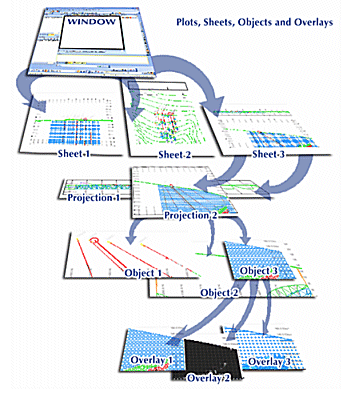

# The View Hierarchy

Your application provides numerous ways for viewing and interrogating the same mining and geological data. It does this through a variety of windows which each concentrate on a different aspect of the data. As the summary table below indicates, the data are not displayed directly in any window but as overlays within a projection on a sheet within the window.

To be viewed, the data must be loaded into memory where they are regarded as 3D objects, with tabulated properties (attributes), which may be selected and made visible as points, faces blocks, labels and so on using an overlay. The same data may be displayed in several ways within the same projection by using multiple overlays.

**Note** : with regards to the Plots window (and to a lesser extent, the Logs window), much of the hierarchical structure of a particular sheet can be stored in template form. This minimizes the effort required to generate a consistent look and feel across a range of presentation projects by automatically generating a standard arrangement of sheets, projections and, if required, data object overlays. See [Plot Templates](<../PLOTS_LOGS/PLOTS_Plot%20Templates.md>).

The following image describes the view hierarchy as would be found in the Plots window, this being the most complex of the viewing windows in this respect:

Note how the Plotswindow can contain multiple sheets, and a sheet can (optionally) contain more than one projection. Each projection, in turn, can contain a view of multiple objects, which, at the bottom of the hierarchy, can each be displayed using a variety of overlays.

#### 3D Windows (including Independent 3D Windows)

The 3D Window, because it has only one sheet with one projection, gives the appearance of containing only overlays. One or more 3D windows can support a project session. These additional windows can be [independent or linked](<External_3D_Windows.md>), and can be displayed as an embedded viewport or a floating, resizable equivalent. 

#### Managed Task Windows

These windows are used to support an active managed task, such as 3D variogram map generation or automated pit design. It has the same visual hierarchy as a 3D window (see above).

#### Plots Window

The Plots window contains as many sheets as are required to represent the data appropriately, and each sheet may also contain more than one projection. Data exist in memory as 3D objects and these are displayed as overlays within a projection. See [**Plots window**.](<Window_PLOTS_Overview.md>)

#### Tables Window

The Tables window contains a sheet for each loaded table. These represent the loaded data and may be formatted to display the data graphically. See [Tables window](<tables%20window%20overview.md>).

#### Reports Window

The Reports window contains a single sheet which contains loading and validation information from plots and logs window actions.

#### Logs Window

The Logs window can contain many sheets, with multiple projections per sheet, however, due to the format of data displayed in this window, there is no facility to apply overlays. See [Logs window](<Window%20Overview_%20Logs.md>).

#### Files Window

The Fileswindow does not display projections and overlays as this formatting facility is not relevant to the display of file and folder icons. All data is displayed on a single 'sheet'.

Related topics and activities

  * [Views, Sheets and Overlays](<concept_views%20sheets%20overlays.md>)

  * [Formatting Object Overlays](<Formatting%203D%20Objects.md>)

  * [About 3D Windows](<../VR_Help/VR_Introduction.md>)

  * [Introducing the Plots Window](<Window_PLOTS_Overview.md>)

  * [Introducing the Logs Window](<Window%20Overview_%20Logs.md>)

  * [Introducing the Tables Window](<tables%20window%20overview.md>)

  * [Plot Templates](<../PLOTS_LOGS/PLOTS_Plot%20Templates.md>)