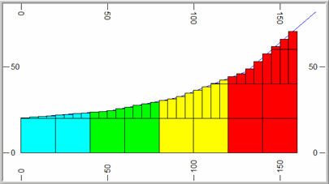
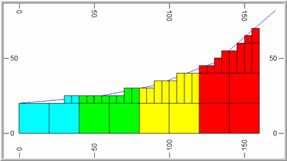

# Volumetric Block Modelling

Volumetric block modelling refers to the creation of a single or composite block model from one of more wireframes, optionally using perimeters for additional control.

In brief, this type of modelling uses interrelated wireframe volumes, commonly representing geological domains into which grades are estimated. These structures are encoded in the model and are understood by other processes, including tonnes and grades evaluation and advanced estimation. 

Models are created within each enclosed volume, then combined to form a unified model. This involves the use of various application commands and processes. 

This is achieved using the [Volumetric Block Modeling](<VolumetricBlockModeling_Dialog.md>) screen.

Tip: As this type of modelling relies primarily on file-based processes, you can use the macro recorder to capture a reusable macro for automation later.

## Combining Block Models

The order in which block models are combined is very important. Essentially, this defines the chronology of the domains that are represented by the model.

The following diagram shows the sequence in which individually modelled features need to be added in order to create a composite block model:

## Subcelling

The generation of accurate block models is achieved by a using a combination of the parent cell size parameters (defined in the prototype) and the various settings which control the orientation and size of the subcells splitting. These include the options and values defined in the Plane, Subcelling group and Optimize Subcells fields of the **Volumetric Block Modelling** screen and are described further below. 

Examples are based on a topographic surface using a value of Plane = _XY_ which means that splitting is regular in the XY plane but variable in Z. 

Note: The principles are identical if splitting is in one of the other planes.

Only cells that are intersected by the wireframe are split into subcells. All others remain as parent cells.

### Defining Subcells

The degree of splitting is controlled by the **XYZ** fields and Resolution parameters. These specify the number of subcells to be created in the two directions defined by the Plane parameter and the size resolution in the perpendicular direction defined by the Resolution parameter. 

For example if **X** =_2_ and **Y** =_4_ , then 2 subcells are created in X and 4 in Y and the value of Z is ignored. This is illustrated in the images below.

;>)

;>)

The Resolution parameter controls the size of the subcell in the direction perpendicular to the plane defined by the Plane parameter. 

In the examples given above Plane = _XY_ and so Resolution controls the size in the Z direction. If Resolution = 0 (the default) then the subcell size in Z is calculated exactly, from the elevation of the point where a wireframe triangle crosses the mid point of the subcell in X and Y. This is illustrated in the two examples above where it can be seen that the wireframe intersects the midpoint of each subcell. Resolution must be set to an integer value.

If Resolution is greater than zero then the cell size is rounded to the nearest **ZINC** /**Resolution** where **ZINC** is the parent cell size in Z. For example if **ZINC** =20 and Resolution=4 then the cell size in Z is rounded to the nearest 5m as illustrated in the image below:

;>)

## Dip of Wireframe

In the example so far, the degree of splitting is dependent on the dip of the wireframe. 

With Plane = _XY_ , this means that there is little or no splitting where the surface is approximately horizontal but increased splitting as the dip of the wireframe increases. This is controlled by setting a Reference Dip value, in degrees. 

Then for each parent cell that is intersected by a triangle, the maximum dip of all triangles, intersecting or adjacent to the parent cell, is calculated. The definition of adjacent is a rectangular area of dimensions 2* **XINC** by 2* **YINC** centred on the parent cell centre, where **XINC** and **YINC** are the parent cell dimensions in X and Y. 

The amount of splitting is then defined by the ratio of the maximum dip of intersecting or adjacent triangles to the Reference Dip value as shown in the table below.

Ratio | Calculated Number of  
subcells  
---|---  
< 2 | 1*1  
>= 2 < 4 | 2*2  
>= 4 < 8 | 4*4  
>= 8 | 8*8  
  
The Max Subcells parameter is used to define the maximum level of splitting. In the above table it is assumed that Max Subcells=8*8. If it were set to 4*4 , the maximum number of subcells would be 4*4 even if the ratio exceeded 8. The same level of splitting is always applied in both the X and Y directions.

For example; let Max Subcells be set to 8*8 and the Reference Dip=5.

If the maximum dip of triangles intersecting or adjacent to the cell is 11 then the ratio is 2.2, so there are 2*2 subcells.

f the maximum dip of triangles is 35 then the ratio is 7, so there are 4*4 subcells. This is illustrated in the South-North section below (left) where the slope of the wireframe increases from left to right. The surface for all East-West sections is totally horizontal. The plan (right) shows the cell structure at an elevation of 21m where the parent cell size is 20x20x20m.

;>)

;>)

If Reference Dip is set to 0 then the ratio is infinity and the cell is always split. The degree of subcelling will then be independent of the dip ratio and only dependent on the Max Subcells parameter.

f Reference Dip=0 and Max Subcells=4*4 then all parent cells that are intersected by the wireframe is divided into 4*4 subcells in X and Y.

Related topics and activities:

  * [Volumetric Block Modeling](<VolumetricBlockModeling_Dialog.md>) (screen)

  * [Define Model Prototype](<CreateModelPrototype_Dialog.md>)

  * Processes relating to volumetric modelling:

    * [CDTRAN](<../Process_Help_XML/cdtran.md>)

    * [TRIFIL](<../Process_Help_XML/trifil.md>)

    * [ADDMOD](<../Process_Help_XML/addmod.md>)

    * [SELWF](<../Process_Help_XML/selwf.md>)

    * [PROMOD](<../Process_Help_XML/promod.md>)