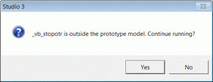

# Volumetric Block Modeling

To access this screen:

  * Run the command [model-from-multiple-wireframes](<../command_help/model-from-multiple-wireframes.md>).

  * Use the quick key 'mfw'.

  * **Model** ribbon **> > Create >> Fill Wireframes**.

Generate a single or composite block model from one of more wireframes, optionally using perimeters for additional control.

For background information, see [Volumetric Block Modelling](<Volumetric-Block-Modelling.md>).

## Perimeter String Files

You can specify a bounding string to constrain the extent of modelling, noting the following

  * If the strings file contains more than one perimeter, then all perimeters are used by this command. The perimeters need to be planar and parallel to the XY plane.

  * Any open strings are treated as closed strings.

  * Your perimeter control file cannot contain spaces in the filename.

## Create a Model

Activity steps:

  1. Display the **Volumetric Block Modelling** screen.

  2. If you have previously saved modelling settings to a file during a previous session, click Load and pick the settings file. 

Note: If you do this, it's likely you can review the imported settings and make selective changes, skipping many of the steps below.

  3. Choose a Prototype block model file; this can either be a a block model or prototype block model. The records in a block model are ignored; rotated block models or prototypes can also be used.

Note: If you don't have a prototype, you can create one based on loaded 3D data by clicking Create Model Prototype. See [Create Model Prototype](<CreateModelPrototype_Dialog.md>).

  4. Optionally, select a Control perimeter string file to restrict block filling within the wireframe(s) volume(s) to an area lying within the selected perimeter. You can also **Preview** the string in the primary 3D window if required. 

See "Perimeter String Files", above.

  5. Select one of more Boundary wireframes by clicking **+** to add a row to the table. These can be DTMs or solid (closed) wireframe files; each file can contain one or more wireframe surfaces. 

Note: When creating a composite block model from multiple wireframe files, the order in which the files are listed in the Boundary Wireframes grid is important, as this order defines the sequence in which the individual block models are combined. See [Volumetric Block Modelling](<Volumetric-Block-Modelling.md>) for notes on combining models.

For each selected wireframe file, define the following:

     * Run Check to include the wireframe in modelling or uncheck to ignore the data. This is automatically checked when a **Wireframe** is specified.

     * Topo Check if the wireframe is a DTM (open surface), meaning all cells above the surface are removed. This setting affects **Boundary Type** options.

     * Wireframe Browse for a wireframe file.

     * Zone Field Optionally, pick a zone control field to identify distinct surfaces or volumes in the wireframe. Empty by default, meaning a single wireframe structure is assumed. You can also specify a new field name, which you would do if setting a custom **Zone Code** for output model data (see below).

     * Zone Code Define a zone control value for the cells filling the selected wireframe. This option is disabled if the selected Zone Field is present in the wireframe and _(From Field)_ is displayed. In this case, the value is taken from the wireframe(s). If a new Zone Field is defined, the default Zone Code value is set to '0'. 

     * Plane Choose a subcell splitting plane. Splitting is regular in the specified plane, but variable in the unspecified plane. For example, _XY_ is regular in the horizontal plane but variable in Z.

       * _XY_ Typically used for DTMs or solids which have a low dip

       * _XZ_ Variable splitting in Y. Typically used for DTMs or solids which have a moderate to steep dip and are striking approximately west-east

       * _YZ_ Variable in X. Typically used for DTMs or solids which have a moderate to steep dip and are striking approximately north-south

Note: Care must be taken in selection of the plane to be used if the ends of the wireframe have not been linked (closed) as the wireframe model is then partially 'hollow' when viewed from certain directions.

       * Boundary Type Decide how cells are applied to the model in relation to the wireframe data:

         * _Single Surface - Fill Above_ Only available if **Topo** is checked. Select this option to fill above the DTM.

         * _Single Surface - Fill Below_ (Topo only) select this option to fill below the DTM.

         * _Solid - Fill Inside_ Flood the wireframe volume with cells.

         * _Solid - Fill Outside_ Flood the area outside the wireframe with cells. This can be useful to define initial waste blocks, replaced by subsequent modelling.

         * _Single Surface - Fill Below_ Fill below a DTM.

         * _Single Surface - Fill above_ Fill above a DTM.

         * _Two Surfaces - Fill Between_ Flood the area between two surfaces.

         * _Two Surfaces - Fill Above and Below_ Flood the area outside two surfaces. This could be useful to define initial waste blocks between an upper and lower surfaces encompassing load bearing material.

Note: "Above and below" relate to the normal direction of the wireframe surface.

         * If a **Control perimeter** was specified, **Use perimeter** determines if it constrains the modelling of the selected domain or not.

         * Set a default Density for the domain blocks.

  6. Define **Subcelling** settings. 

     * Select Define Number of subcells to set subcell splits in the axes of the selected **Plane**.

     * Select Use Dip of Wireframe to control subcelling by the dip of the wireframe within the parent cell, define the Max Subcells in the format `n*n`. This option also needs you to set a Reference Dip angle in degrees.

Note: In either case, use **Z Resolution** to define the size resolution factor for the subcells in the direction perpendicular to the selected Plane (default '0'). If this value is set to '0', the subcell size is calculated precisely ( defined by the point at which it crosses the wireframe). If this value is greater than zero, then the cell size in the perpendicular direction is rounded to the nearest parent cell size.

  7. Regardless of your subcelling option, you have the option to ripple the same settings to all wireframes listed in the table. If you select Apply Values to All Wireframes, they all inherit the same subcelling values from the one current selected.

  8. Define **General Options** :

     * Validate Input Check to validate the selected input files before the modelling process is started. The validation checks that the extents of all the selected wireframes lie within the block model prototype. 

A warning message and prompt is displayed if the validation fails, as shown below. Clicking Yes continue, while clicking No will stop the modelling process:

;>)

     * Load All Wireframes Click to load and display all wireframes selected for the run. Only those which are not already loaded into memory are loaded.

     * Tolerance This value is used to filter out any blocks smaller than the specified amount (relative to the size of parent blocks).

Note: When block models are added together in order to create the final block model, the tolerance is calculated as `0.025 / Max (XINC,YINC,ZINC)`.

  9. Define **Output** options:

     * Block Model Define a new block model file name or browse for an existing file; the existing file is replaced.

     * Optimize Subcells Check to optimize the number of subcells in the final block model. See [PROMOD](<../Process_Help_XML/promod.md>) for more information.

     * Keep Intermediate Files Check to keep the intermediate files which are used to generate the final block model; these files can be used to validate or investigate the output from the various stages of the block modelling process. The temporary Datamine files have the prefix '_spmod'.

Note: Intermediate files are cleared up at the start of each modelling run.

  10. Click **Apply** to start the modelling process.

  11. Review your results.

  12. Save your project.

Related topics and activities:

  * [Volumetric Block Modelling](<Volumetric-Block-Modelling.md>)

  * [Define Model Prototype](<CreateModelPrototype_Dialog.md>)

  * Processes relating to volumetric modelling:

    * [CDTRAN](<../Process_Help_XML/cdtran.md>)

    * [TRIFIL](<../Process_Help_XML/trifil.md>)

    * [ADDMOD](<../Process_Help_XML/addmod.md>)

    * [SELWF](<../Process_Help_XML/selwf.md>)

    * [PROMOD](<../Process_Help_XML/promod.md>)