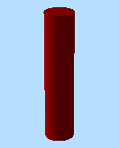
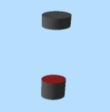
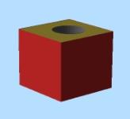

# Wireframe Difference

To access this screen:

  * **Wireframe** ribbon **> > Boolean >> Difference**.

  * Using the **[command line](<Command_Toolbar.md>)** , enter "wireframe-difference"

  * Use the quick key combination "wdi".

  * Display the **[Find Command](<findcommand.md>)** screen, locate **wireframe-difference** and click **Run**.

Use two open or closed wireframe objects (or two selections of wireframe triangle data, or a combination of object and selection) to create another wireframe object which represents the _first_ wireframe data with any volume shared with the _second_ wireframe data removed.

**Note** : this command is also available using the [BOOLEAN](<../Process_Help_XML/boolean.md>) process (@METHOD=2)

**Note** : selection order is important for this command. The result of (Wireframe 1 - Wireframe 2) may be different from (Wireframe 2 - Wireframe 1).

**Note** : This command supports [**flexible wireframe selection**](<Wireframe_Selection_Concept.md>).

## Command Example

Original Wireframe Objects |   
---|---  
Object 1 |  Object 2 |  Output  
 |   |    
 |   |    
  
Command steps:

  1. Load both wireframe objects that are considered during the Boolean calculation.

  2. Choose the data to represent **Wireframe 1**. This can either be an entire Object, or the **Selected triangles** of one or multiple wireframe objects.

**Note** : if using selected triangles, click **Store current selection** to identify the data to be used in calculations. If you change your selection, remember to reselect this button to ensure the input data is updated.

  3. Do the same for **Wireframe 2**. 

**Note** : you don't have to follow the same data selection method as **Wireframe 1** (for example, **Wireframe 1** could be a full object and **Wireframe 2** could be selected triangles).

  4. Create **Output** data either within the Current object, an existing wireframe object (pick it from the list) or a new object (type a new name).

  5. Click **OK**.

Related topics and activities

  * [wireframe-difference ("wdi")](<../command_help/wireframe-difference.md>) (command)

  * [Wireframe Extract Separate](<Wireframe%20Extract%20Separate%20Dialog.md>)

  * [Wireframe Intersection](<Wireframe%20Intersection%20Dialog.md>)

  * [Wireframe Union](<Wireframe%20Union%20Dialog.md>)

  * [Wireframe Solid Hull](<Wireframe%20Solid%20Hull%20Dialog.md>)

  * [Strings from Intersections](<Wireframe%20Strings%20From%20Intersections%20Dialog.md>)

  * [Boolean operations](<boolean_operations.md>)

  * [Selecting Wireframe Data](<Wireframe_Selection_Concept.md>)