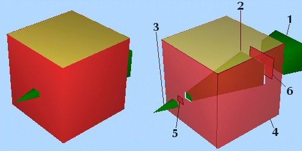
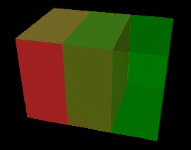
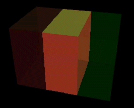
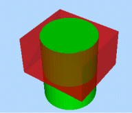
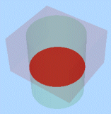
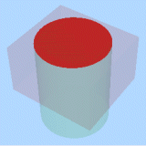
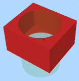
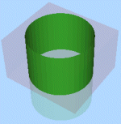
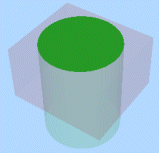
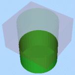

# Wireframe Extract Separate

To access this screen:

  * **Wireframe** ribbon **> > Boolean >> Extract Separate**.

  * Using the **[command line](<Command_Toolbar.md>)** , enter "wireframe-extract-separate"

  * Use the quick key combination "wes".

  * Display the **[Find Command](<findcommand.md>)** screen, locate **wireframe-extract-separate** and click **Run**.

Creates separate wireframes for each logically discrete piece of data formed by the interaction of two wireframe data collections. Two separate data are input to this command, and each output represents one interconnected surface from the original objects; however original surfaces may have been divided by intersection with the other objects wireframe. Inputs can either be loaded wireframe objects or collections of preselected wireframe triangle data.

The Extract Separate command will attempt to classify each new wireframe data surface with respect to the other wireframe data. Each surface may be classified as being Inside, Outside, or On the other wireframe object. This classification method makes use of the face direction stored for each triangle within the wireframe.

**Note** : the Extract Separate screen is also displayed when the **wireframe-merge** command is run.

**Note** : this command is also available using the [BOOLEAN](<../Process_Help_XML/boolean.md>) process (@METHOD=4).

**Note** : This command supports [**flexible wireframe selection**](<Wireframe_Selection_Concept.md>).

When considering closed volume inputs:

  * Inside will be within the interior of the volume
  * On will coincide exactly with part of the volume surface.
  * Outside is within the exterior of the volume

When considering open surfaces, such as DTM data:

  * Inside is under the DTM
  * On coincides exactly with part of the DTM surface.
  * Outside is above the DTM

If choosing wireframe object inputs, at least two must exist in memory before this command can be run. If using Selected triangles, data must be selected and committed to the command using the corresponding Store current selection button before executing the command.

### Custom Boolean combinations

The Extract Separate command can be used to create customised combinations of wireframe data, including the standard Boolean combinations (Union, Intersection and Difference). This can be done by filtering the Single Object Output data or by manually combining the various output objects when Single Object Output has not been specified. Commonly, you will want to define results based on the input data (1) where its components fall relative to the other input data (2). To make this easier, 6 Output options can be used in combination to specify which items should be written to the output:

Setup | Output  
---|---  
Wireframe 1 inside Wireframe 2 | Elements from Wireframe 1 which fall inside (or below for a DTM) Wireframe 2.  
Wireframe 1 on Wireframe 2 | Elements from Wireframe 1 which fall directly on the surface of Wireframe 2.  
Wireframe 1 outside Wireframe 2 | Elements from Wireframe 1 which fall outside (or above for a DTM) Wireframe 2.  
Wireframe 2 inside Wireframe 1 | Elements from Wireframe 2 which fall inside (or below for a DTM) Wireframe 1.  
Wireframe 2 on Wireframe 1 | Elements from Wireframe 2 which fall directly on the surface of Wireframe 1.  
Wireframe 2 outside Wireframe 1 | Elements from Wireframe 2 which fall outside (or above for a DTM) Wireframe 1.  
  
For example, selecting only the two Outside options will give a result similar to the Boolean _union_ , whilst selecting only the two Inside options will give a result similar to the Boolean _intersection_.

### A Note About On...

The **Extract Separate** command only produces wireframe data as an output. 

The On value relates to triangles which fall exactly on the surface of the other source object. It may be easier to think of it as "not inside or outside". With cube and pyramid test data, there is a clean intersection, so everything is either inside or outside (i.e. not ambiguous), and therefore the On option will result in nothing.

The image below shows 2 overlapping boxes (the green is set to transparent to make the overlap clearer):

Selecting On for Wireframe 1 (the red cube), produces the result shown in the accompanying image (both source wireframes are transparent for a clearer display of the result):

### What Will an "Extract Separate" Produce?

By default, the process will produce a single new wireframe which may contain elements from both input wireframe data collections. The triangles will be classified using three fields: SURFACE, GROUP and INSIDE. The SURFACE contains an index which is unique for all the triangles belonging to a single interconnected surface. GROUP contains a value of 1 or 2, relating to the number of the input wireframe the triangles were extracted from (i.e. Wireframe 1 or Wireframe 2). INSIDE contains a value which classifies the triangles with respect to the object they were not extracted from (0=outside, 1=inside, 2=on, 3=unknown)

If you elect not to use the Single Object Output option, the Extract Separate command will automatically split the output into separate objects, which may produce a large number of new objects. For this reason, your application will perform a cursory check of the data in question to determine the likely 'load' on your available memory space, and display how many new objects are to be created.

If you choose not to continue, after seeing the potential number of results, you are asked if you would prefer to output simple groups instead. If you choose this option, the command will generate, at most, six objects representing:

  * the part of Wireframe 1 inside Wireframe 2

  * the elements of Wireframe 1 on Wireframe 2

  * the part of Wireframe 1 outside Wireframe 2

  * the part of Wireframe 2 inside Wireframe 1

  * the elements of Wireframe 2 on Wireframe 1

  * the part of Wireframe 2 outside Wireframe 1

If you decide not to continue at this stage, you are offered a final option to default to the single object output (see below). If this option is refused, no objects result from this operation.

### Extract Separate Worked Example

The choice of surfaces to be output can be confusing, so consider the following example of a cuboid (Wireframe 1) and a cylinder (Wireframe 2). The table below summarizes the surfaces that are created for each of the Output options.

Here are the input objects displayed in a **3D** window:

The top surface of Wireframe 2 (the cylinder) is shared with the cube but the bottom end projects below the cube - this is important to demonstrate the difference between the Inside, On and Outside calculations:

Wireframe 1 **Inside** Wireframe 2 |  Wireframe 1 **On** Wireframe 2 |  Wireframe 1 **Outside** Wireframe 2  
---|---|---  
 |   |    
Wireframe 2 **Inside** Wireframe 1 |  Wireframe 2 **On** Wireframe 1 |  Wireframe 2 **Outside** Wireframe 1  
 |   |    
  
Note the difference between the two images in the central column (the "on" calculations); the spatial data is identical but the attributes for each output represent the attribute (in this case represented by colour) of the first object in the calculation description - object 1 is red, object 2 is green.

To extract component data from input wireframe objects based on Boolean relationships:

  1. Load both wireframe objects that are considered during the Boolean calculation.

  2. Choose the data to represent **Wireframe 1**. This can either be an entire Object, or the **Selected triangles** of one or multiple wireframe objects.

**Note** : if using selected triangles, click **Store current selection** to identify the data to be used in calculations. If you change your selection, remember to reselect this button to ensure the input data is updated.

  3. Do the same for **Wireframe 2**. 

**Note** : you don't have to follow the same data selection method as **Wireframe 1** (for example, **Wireframe 1** could be a full object and **Wireframe 2** could be selected triangles).

  4. Decide which data you are going to **Keep**. Choose the components of both Wireframe 1 and Wireframe 2 included in the output wireframe(s). See Creating custom Boolean combinations above, for more information.

  5. Create **Output** data either within the Current object, an existing wireframe object (pick it from the list) or a new object (type a new name).

Alternatively, choose Multiple New Objects: select this option to generate one or more new objects, with each containing one element of the extract separate output. Once enabled, you can either select the default prefix of "Extract:" or enter any prefix you like; objects are generated with the prefix and an ID, e.g. "Extract:1", "Extract:2" and so on.

Before you create the new objects, a message is displayed to indicate the number of objects that are created.

  6. Click **OK** to generate your output.

Related topics and activities

  * **[wireframe-extract-separate](<../command_help/wireframe-extract-separate.md>)** (command)

  * [Wireframe Difference](<Wireframe%20Difference%20Dialog.md>)

  * [Wireframe Intersection](<Wireframe%20Intersection%20Dialog.md>)

  * [Wireframe Union](<Wireframe%20Union%20Dialog.md>)

  * [Wireframe Solid Hull](<Wireframe%20Solid%20Hull%20Dialog.md>)

  * [Strings from Intersections](<Wireframe%20Strings%20From%20Intersections%20Dialog.md>)

  * [Boolean operations](<boolean_operations.md>)

  * [Selecting Wireframe Data](<Wireframe_Selection_Concept.md>)