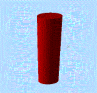
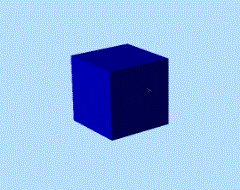
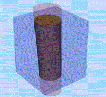

# Wireframe Intersection

To access this screen:

Take two wireframe objects (or wireframe triangle selections, or a combination) and create a new wireframe object representing their overlapping (common) volume.

**Note** : this command is also available using the [BOOLEAN](<../Process_Help_XML/boolean.md>) process (@METHOD=3)

Note: the order in which inputs are chosen is not important for this command.

**Note** : This command supports [**flexible wireframe selection**](<Wireframe_Selection_Concept.md>).

### Intersection Example

Original Wireframe Objects |   
---|---  
Object 1 |  Object 2 |  Output  
 |   |    
  
  1. Load both wireframe objects that are considered during the Boolean calculation.

  2. Choose the data to represent **Wireframe 1**. This can either be an entire Object, or the **Selected triangles** of one or multiple wireframe objects.

**Note** : if using selected triangles, click **Store current selection** to identify the data to be used in calculations. If you change your selection, remember to reselect this button to ensure the input data is updated.

  3. Do the same for **Wireframe 2**. 

**Note** : you don't have to follow the same data selection method as **Wireframe 1** (for example, **Wireframe 1** could be a full object and **Wireframe 2** could be selected triangles).

  4. Create **Output** data either within the Current object, an existing wireframe object (pick it from the list) or a new object (type a new name).

Related topics and activities

  * [wireframe-intersection ("win")](<../command_help/wireframe-intersection.md>) (command)
  * [Wireframe Extract Separate](<Wireframe%20Extract%20Separate%20Dialog.md>)

  * Wireframe Intersection

  * [Wireframe Union](<Wireframe%20Union%20Dialog.md>)

  * [Wireframe Solid Hull](<Wireframe%20Solid%20Hull%20Dialog.md>)

  * [Strings from Intersections](<Wireframe%20Strings%20From%20Intersections%20Dialog.md>)

  * [Boolean operations](<boolean_operations.md>)

  * [Selecting Wireframe Data](<Wireframe_Selection_Concept.md>)