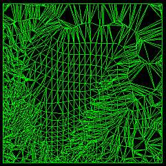
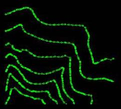
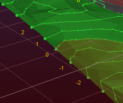

# Wireframe Multiple Section 

To access this screen:

Create strings along the intersections of parallel, equally-spaced planes, based on either a selected wireframe or preselected wireframe triangle data. 

Consider the following wireframe:

If represented as section strings, it would look like this:

These are, effectively, elevation contours, as the intersecting plane in this example is horizontal (zero azimuth, zero dip).

**Note** : This command supports [**flexible wireframe selection**](<Wireframe_Selection_Concept.md>).

To create equally spaced sections strings at nominated intervals throughout a wireframe:

  1. Load the open wireframe data to form sectional strings.

  2. Define a section that represents the plane to use to create multiple sectional strings at fixed intervals. See [3D Sections Menu](<../VR_Help/workspace_sections.md>).

  3. Run the **wireframe-section-multiple** command.

  4. Choose a loaded wireframe Object (the default is the current object) or selected wireframe triangle data (Selected triangles). You can select triangle data whilst the **Project to Plane** screen is displayed. See [Selecting Wireframe Data](<Wireframe_Selection_Concept.md>).

**Note** : if choosing **Selected triangles** , section string data is produced at the intersection of selected wireframe data and the section intervals only.

  5. Define the **Plane Orientation** of the 3D section plane:

     * Horizontalset the plane to be horizontal (i.e. both Azimuth and Inclination are 0 degrees).
     * North-Southset the plane to a vertical North-South orientation (i.e. Azimuth is 90 degrees and Inclination is -90 degrees).

     * East-Westset the plane to a vertical East-West orientation (i.e. Azimuth is 0 degrees and Inclination is -90 degrees).

     * 3D Sectionif any [sections have been defined in the active 3D window](<../VR_Help/workspace_sections.md>), these section planes can be used to generate section string data at fixed intervals. 

Click to transfer the azimuth and dip of the section to the relevant fields. The _Default Section_ option is listed alongside any custom sections that exist for your project.

     * Azimuthset the azimuth of the section plane manually. 

Note: this field is automatically overwritten if any of the preset options are selected.

     * Inclinationset the inclination of the section plane manually.

Note: this field is automatically overwritten if any of the preset options are selected.

  6. Define the position of the initial section's center point using the **Plane Reference Point** values. Define **X** , **Y** and **Z**.

  7. As an alternative to explicitly defining the plane orientation you can use one of the following automatic options:

     * Use View Planefix the plane as the current view plane in the currently active 3D window.

     * Pick Faceclick to select a wireframe face in the 3D window. 

The **Azimuth** and Inclination update to reflect the orientation of the picked face and the **Plane Reference Point** (see above) updates to the coordinates of the selected point. This option fully defines the plane in 3D space.

  8. Choose to output section strings as either a **Single Object** or **Multiple New Objects** :

     * If **Single Object** is selected, output data either within the Current object, an existing wireframe object (pick it from the list) or a new object (type a new name).

     * If **Multiple New Objects** is selected, enter a **Prefix** to be applied to all generated string objects (a string object is created for every unique intersection with the wireframe).

  9. Optionally, define an additional field representing the **Section Column** to which each string entity relates. 

You can either:

     * enter a new column definition that is added to the resulting string object, containing an automatically-incremented section index, relevant to each string entity, or;

     * select an existing field description from the drop-down list (generated from the descriptions found in the original wireframe file) or;

     * leave the field set to _< none>_ so that no section index is output.

For example, in the image below, a single wireframe object is output and a new data column called REFSECT was added (via the first option, above). The resulting wireframe, if labelled using the REFSECT attribute shows how the string representing the intersection with the actual 3D section is labelled zero, whilst the sections above and below and labelled higher and lower respectively:

  10. Click **OK** to generate output string data representing wireframe sections.

Related topics and activities

  * [wireframe-section-multiple ("msl")](<../command_help/wireframe-section-multiple.md>) (command)

  * [Wireframe Section](<Wireframe%20Section%20Dialog.md>)

  * [Hull to Strings](<hull%20to%20strings%20dialog.md>)

  * [Strings from Intersections](<Wireframe%20Strings%20From%20Intersections%20Dialog.md>)

  * [Selecting Wireframe Data](<Wireframe_Selection_Concept.md>)