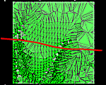
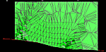
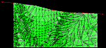
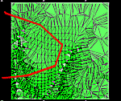
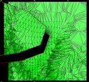
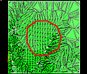
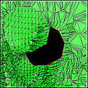
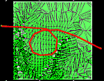

# Wireframe Split by String

To access this screen:

  * **Wireframe** ribbon **> > Plane >> Split**.

  * Using the **[command line](<Command_Toolbar.md>)** , enter "wireframe-split-string"

  * Use the quick key combination "spbs".

  * Display the **[Find Command](<findcommand.md>)** screen, locate **wireframe-split-string** and click **Run**.

Split a wireframe (or preselected wireframe triangle data) into two or more parts using the selected string and defined projection parameters.

**Note** : This command supports [**flexible wireframe selection**](<Wireframe_Selection_Concept.md>).

When selecting a string to perform a wireframe 'split', it is important that the string in question is able to subdivide the wireframe data into two separate objects. Looped strings will not be permitted, nor strings that do not extend beyond the wireframe boundaries fully when viewed along the projection plane.

The following table gives examples of what is, and what is not, permitted when using the Split by String command:

Wireframe and String |  Permitted |  Result  
---|---|---  
 |  Yes |     
Single open line, not looped, with terminal points extending beyond the wireframe data body on two separate edges when viewed along the projection plane.  
 |  Yes |    
Single open line, unlooped, with terminal points extending beyond the wireframe data body on the same edge when viewed along the projection plane.  
 |  Yes |    
Single closed line, with no extents beyond the edge of the wireframe data when viewed from the projection angle. Note that a boolean is still possible even if the closed line 'hangs over' one or more edges of the wireframe  
 |  No |    
Single looped line, with the looped section positioned along the projection plane. In this situation, two objects will still be created, one empty, and one as the original.  
  
In all situations, the defined line must be able to intersect wireframe data when it is projected in the direction specified.

To split a wireframe (once) using a nominated cutting string:

  1. Load the wireframe data to be sectioned. This can be open or closed.

  2. Define a section that represents the plane to use to create a closed intersection string. See [3D Sections Menu](<../VR_Help/workspace_sections.md>).

  3. Run the **wireframe-split-string** command.

  4. Choose a loaded wireframe Object (the default is the current object) or selected wireframe triangle data (Selected triangles). You can select triangle data whilst the **Project to Plane** screen is displayed. See [Selecting Wireframe Data](<Wireframe_Selection_Concept.md>).

**Note** : if choosing **Selected triangles** , only selected wireframe data is split. This can be useful to partially cut a wireframe, for example.

  5. Define the **Plane Orientation** of the 3D plane. Cutting takes place orthogonally to the specified section:

     * Horizontalset the plane to be horizontal (i.e. both Azimuth and Inclination are 0 degrees).
     * North-Southset the plane to a vertical North-South orientation (i.e. Azimuth is 90 degrees and Inclination is -90 degrees).

     * East-Westset the plane to a vertical East-West orientation (i.e. Azimuth is 0 degrees and Inclination is -90 degrees).

     * 3D Sectionif any [sections have been defined in the active 3D window](<../VR_Help/workspace_sections.md>), these section planes can be used to control the projection angle of the cutting string.

Click to transfer the azimuth and dip of the section to the relevant fields. The _Default Section_ option is listed alongside any custom sections that exist for your project.

     * Azimuthset the azimuth of the section plane manually. 

Note: this field is automatically overwritten if any of the preset options are selected.

     * Inclinationset the inclination of the section plane manually.

Note: this field is automatically overwritten if any of the preset options are selected.

  6. Define the position of the section's center point using the **Plane Reference Point** values. Define **X** , **Y** and **Z**.

  7. As an alternative to explicitly defining the plane orientation you can use one of the following automatic options:

     * Use View Planefix the plane as the current view plane in the currently active 3D window.

     * Pick Faceclick to select a wireframe face in the 3D window. 

The **Azimuth** and Inclination update to reflect the orientation of the picked face and the **Plane Reference Point** (see above) updates to the coordinates of the selected point. This option fully defines the plane in 3D space.

  8. Create **Output** data either within the Current object, an existing wireframe object (pick it from the list) or a new object (type a new name).

Multiple wireframe objects arise after splitting, so you can choose Multiple New Objects to generate multiple separate objects, with each containing one element of the output. Once enabled, you can either select the default prefix of "String Split:" or enter any prefix you like; objects are generated with the prefix and an ID, e.g. "String Split:1", "String Split:2" and so on.

Before you create the new objects, a message is displayed to indicate the number of objects that will be created.

  9. Click **OK** to generate your output.

Related topics and activities

  * [wireframe-split-string ("spbs")](<../command_help/wireframe-split-string.md>) (command)

  * [Wireframe Split Multiple](<Wireframe%20Split%20Multiple%20Dialog.md>)

  * [Wireframe Section](<Wireframe%20Section%20Dialog.md>)

  * [Wireframe Multiple Section ](<Wireframe%20Section%20Multiple%20Dialog.md>)

  * [Wireframe Multiple Section ](<Wireframe%20Section%20Multiple%20Dialog.md>)

  * [Hull to Strings](<hull%20to%20strings%20dialog.md>)

  * [Strings from Intersections](<Wireframe%20Strings%20From%20Intersections%20Dialog.md>)

  * [Selecting Wireframe Data](<Wireframe_Selection_Concept.md>)