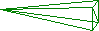
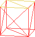
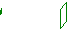

# Strings from Intersections

To access this screen:

  * **Wireframe** ribbon **> > Boolean >> Intersection Strings**.

  * Using the **[command line](<Command_Toolbar.md>)** , enter "wf-intersections"

  * Use the quick key combination "sfi"

  * Display the **[Find Command](<findcommand.md>)** screen, locate **wf-intersections** and click **Run**.

Take two intersecting wireframe objects and create strings along the intersections. 

The generated string data inherits the properties of the first object. As such, the choice of **Wireframe 1** and **Wireframe 2** can be important with this command.

  * Attributes for each string edge match the corresponding triangle in the first wireframe.

  * If the first wireframe doesn't have any non-system attributes, no attributes are inherited.

You can either create the intersection string for full objects or you can preselect wireframe triangles beforehand and generate an intersection of the selected data only.

**Note** : This command supports [**flexible wireframe selection**](<Wireframe_Selection_Concept.md>).

### Examples

Original Wireframe Objects |  Resultant Wireframe Objects  
---|---  
Object 1 |  Object 2  
 |   |    
 |   |    
  
Note: This functionality is also available using the [BOOLEAN](<../Process_Help_XML/boolean.md>) process (@METHOD=5)

To create strings representing the intersection of two wireframe objects:

  1. Load the wireframe data to intersect. This can be open or closed.

  2. Run the **wf-intersections** command.

  3. Choose a loaded wireframe object for **Wireframe 1** (the default is the current object) or selected wireframe triangle data (Selected triangles). You can select triangle data whilst the **Strings from Intersections** screen is displayed. See [Selecting Wireframe Data](<Wireframe_Selection_Concept.md>).

**Note** : if choosing **Selected triangles** , only selected wireframe data is used to generate intersection strings. 

  4. Choose the data to use for **Wireframe 2**. As above, object data or selected triangles can be used.

  5. Create **Output** data either within the Current object, an existing wireframe object (pick it from the list) or a new object (type a new name).

  6. Click **OK**.

Intersection string data is generated.

Related topics and activities

  * [wf-intersections ("sfi")](<../command_help/wf-intersections.md>) (command)
  * [Wireframe Difference](<Wireframe%20Difference%20Dialog.md>)
  * [Wireframe Extract Separate](<Wireframe%20Extract%20Separate%20Dialog.md>)

  * [Wireframe Intersection](<Wireframe%20Intersection%20Dialog.md>)

  * [Wireframe Union](<Wireframe%20Union%20Dialog.md>)

  * [Wireframe Solid Hull](<Wireframe%20Solid%20Hull%20Dialog.md>)

  * [Boolean operations](<boolean_operations.md>)

  * [Selecting Wireframe Data](<Wireframe_Selection_Concept.md>)