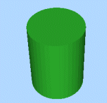
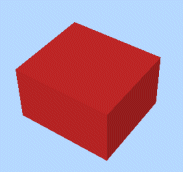
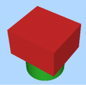

# Wireframe Union

To access this screen:

  * **Wireframe** ribbon **> > Boolean >> Union**.

  * Using the **[command line](<Command_Toolbar.md>)** , enter "wireframe-union"

  * Use the quick key combination "wun".

  * Display the **[Find Command](<findcommand.md>)** screen, locate **wireframe-union** and click **Run**.

Perform a boolean union operation on two wireframe objects (or separate collections of selected triangle data) to create a new, single wireframe object with the same surface appearance and characteristics as the two component wireframes together. Any common volume is not distinguishable.

**Note** : This command supports [**flexible wireframe selection**](<Wireframe_Selection_Concept.md>).

### Wireframe Union Example

In the following example, an overlapping cube and cylinder are available for selection (as independent wireframe objects). The table further below details the output data created as a result of using the Wireframe Union command.

Initial objects

Original Wireframe Objects |   
---|---  
Object 1 |  Object 2 |  Output  
 |   |    
  
To generate a union object of two input wireframe data sets:

  1. Load both wireframe objects that will be considered during the Boolean calculation.

  2. Choose the data to represent **Wireframe 1**. This can either be an entire Object, or the **Selected triangles** of one or multiple wireframe objects.

**Note** : if using selected triangles, click **Store current selection** to identify the data to be used in calculations. If you change your selection, remember to reselect this button to ensure the input data is updated.

  3. Do the same for **Wireframe 2**. 

**Note** : you don't have to follow the same data selection method as **Wireframe 1** (for example, **Wireframe 1** could be a full object and **Wireframe 2** could be selected triangles).

  4. Create **Output** data either within the Current object, an existing wireframe object (pick it from the list) or a new object (type a new name).

  5. Click **OK**.

Union data is generated.

Related topics and activities

  * [wireframe-union ("wun")](<../command_help/wireframe-union.md>) (command)

  * [Wireframe Difference](<Wireframe%20Difference%20Dialog.md>)
  * [Wireframe Extract Separate](<Wireframe%20Extract%20Separate%20Dialog.md>)

  * [Wireframe Intersection](<Wireframe%20Intersection%20Dialog.md>)

  * [Wireframe Solid Hull](<Wireframe%20Solid%20Hull%20Dialog.md>)

  * [Strings from Intersections](<Wireframe%20Strings%20From%20Intersections%20Dialog.md>)

  * [Boolean operations](<boolean_operations.md>)

  * [Selecting Wireframe Data](<Wireframe_Selection_Concept.md>)