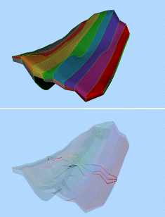
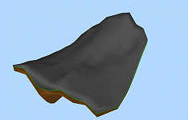
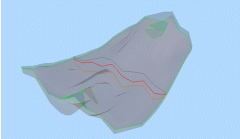
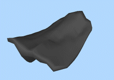
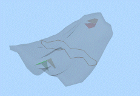
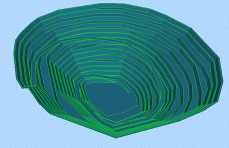

# Verify Wireframe: Examples

The primary purpose of the [Wireframe Verify](<Wireframe%20Verify%20Dialog.md>) function is to create manifold surfaces from the wireframe. In order to do this, Verify will look for the highest, non-vertical triangle in the selection, and alters its normal so that it is pointing upwards. It then looks at all adjacent triangles, and ensures that their normals are consistent with that face. The process then continues from these faces, until no more are unassigned, or adjacent triangles are found. If all triangles have been assigned, the process is complete, otherwise the Surface Number is incremented, and the process starts again with the highest, non-assigned, non-vertical triangle.

This topic describes common verification scenarios, and highlights how your application's mesh verification engine interrogates surface data, reporting areas of potential concern and 'healing data' where it is appropriate. Sanitized wireframe data is significantly less likely to cause unexpected results in subsequent processing.

Consider the following examples:

#### Duplicate Vertices Found

In the [Wireframe Verify](<Wireframe%20Verify%20Dialog.md>) dialog, turning off the Remove Duplicate Vertices option and ensuring that no Key Field value is set will treat each wireframe link as an independent group, since the duplicate vertices that are present in this file indicate that triangles should not be connected across that edge. This results in a large number of surfaces and many open edges between each link (green lines in the screenshot shown directly below).

Although the result may not be desired, it has the side-effect of bypassing any problems with shared edges, and produces a valid volume with the Calculate Volume command (auto-validate disabled):

#### No duplicate vertices

With the same data set (reloaded), removing duplicate vertices removes the barrier between the links. This works well for the upper and lower surfaces, but the middle of the wireframe has triangles from both zones, which are now regarded as being duplicates.

Although the result may look ok on a visual inspection, it is clear from the Calculate Volume results (auto-validate disabled) that the wireframe has been damaged by the Verify process, and cannot be relied upon for use in future calculations.

#### No duplicate faces (at all)

Since the problem with the previous exercise was the large amount of duplicate faces in the centre of the wireframe, we can try to bypass the problem by removing this layer completely. This is done by de-selecting the Leave original option. Looking at the screen shots it can be seen that this has successfully given a single external shell, and removed most of the triangles in the middle. However, a few internal surfaces remain where abutting surfaces varied from each other, resulting in non duplicate triangles.

In this case, the problems were not enough to prevent the Calculate Volume command from completing (with auto-validate disabled), although it may have been safer to have filtered the object so that just the outer surface was used.

#### Handling Data Filters

The real issue with the wireframe discussed thus far is that it is actually 2 independent volumes which happen to abut, differentiated by their ZONE values. As has been proven, this has implications when it comes to verifying the integrity of the surfaces involved -

The safest way of dealing with these in the Verify command is treat them separately, and use a filter on ZONE to deal with each separately. Other than the duplicate vertices which have resulted from the string linking function, the filtered volumes verify without errors, and Calculate Volume (again, with auto-validate disabled) produces a valid volume, which matches that of the individual segments seen in the first example.  

#### Isolating "Feature" edges

An example of the use of feature edges can be seen using the pit profile form the tutorial data (C:Database\DMTutorials\VBOP\Data\Datamine\\_vb_trpit240tr/pt). Choosing a feature edge of 45 degrees creates strings representing the toe and crest of each bench, and the edges of the haul road. Note how the bench limits are generated as strings as the data normals in this areas supersede the 45 degree limit:

Feature edge detection is always coupled with another property - Feature Angle. The Feature Angle represents the minimum change in normal direction that needs to be present before a vertex of a feature edge is identified. A series of qualifying points will indicate a change in direction that could, potentially, identify a shelf, seam or bench of particular geospatial significance.

String data is generated wherever this criterion is matched.

Related topics and activities

  * [Verify Wireframe](<Wireframe%20Verify%20Dialog.md>)

  * [Clean Wireframe](<Wireframe%20Clean%20Dialog.md>)