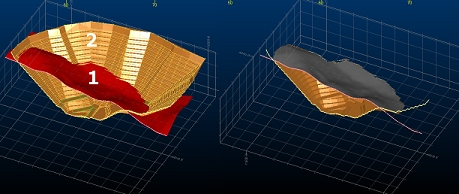

# Volume between DTMs

To access this screen:

  * Using the **[command line](<Command_Toolbar.md>)** , enter "wireframe-between-surfaces-intersecting"

  * Display the **[Find Command](<findcommand.md>)** screen, locate **wireframe-between-surfaces-intersecting** and click **Run**.

Create a closed wireframe describing the volume between Upper and Lower DTMs. These DTMs must fully intersect or unexpected results can occur.

Unlike the [wireframe-under-surface](<../command_help/wireframe-under-surface.md>) and [wireframe-under-surface-intersecting](<../command_help/wireframe-under-surface-intersecting.md>) commands, both cut and fill volumes are created with this command.

Volumes are created where there is a clear and closed line of intersection between the two surfaces (no checks are made to validate this, which is why the command is so quick, but watch out for unexpected results if there is no clear intersection).

For example, in the cutaway image below, a topography (Upper DTM) and a pit bowl (Lower DTM) are processed. The result is shown on the right with the original wireframes shown as sectional strings. 

;>)

**Note** : data is created (if a new object is created, with a "Between:" prefix) containing volumes both above and below the input surfaces. As such, it doesn't matter which of the objects is selected as the Upper DTM or Lower DTM.

One or more closed volumes are generated. Disable an output precludes that surface data from the output object.

**Note** : This command supports [**flexible wireframe selection**](<Wireframe_Selection_Concept.md>).

To create a volume from two input and intersecting wireframes:

  1. Load the wireframe data to intersect. This can be open or closed.

  2. Run the **wireframe--between-surfaces-intersecting** command.

  3. Choose a loaded wireframe **Object** for **Upper DTM** (the default is the current wireframe object) or selected wireframe triangle data (Selected triangles). You can select triangle data whilst the **Volume Between DTMs** screen is displayed. See [Selecting Wireframe Data](<Wireframe_Selection_Concept.md>).

**Note** : if choosing **Selected triangles** , only selected wireframe data is used to generate an enclosed volume.

  4. Choose the data to use for **Lower DTM**. As above, **Object** data or **Selected triangles** can be used. It doesn't matter which data is picked for upper and lower as the resulting volume is identical if selected the other way around.

  5. Create **Output** data either within the Current object, an existing wireframe object (pick it from the list) or a new object (type a new name).

  6. Click **OK**.

Related topics and activities

  * [wireframe-between-surfaces-intersecting](<../command_help/wireframe-between-surfaces-intersecting.md>) (command)
  * Volume between DTMs

  * [Volume under Intersecting DTM](<Wireframe%20Volume%20under%20Intersecting%20DTM%20Dialog.md>)

  * [Wireframe Project to Plane](<Wireframe%20Project%20To%20Plane%20Dialog.md>)