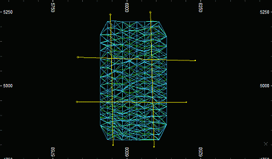
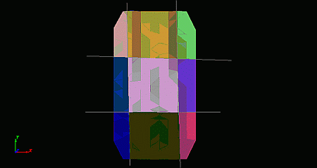
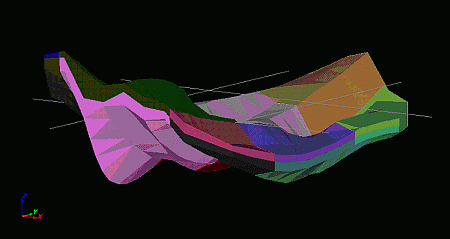
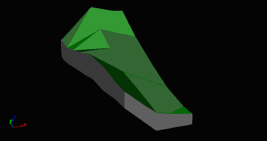
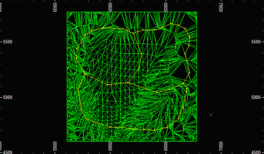
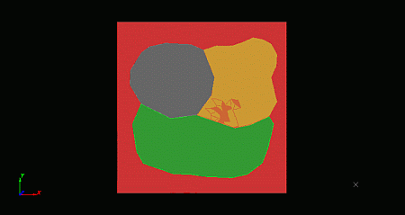
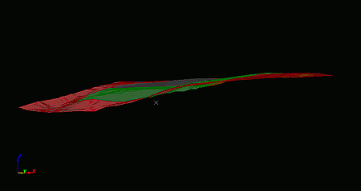
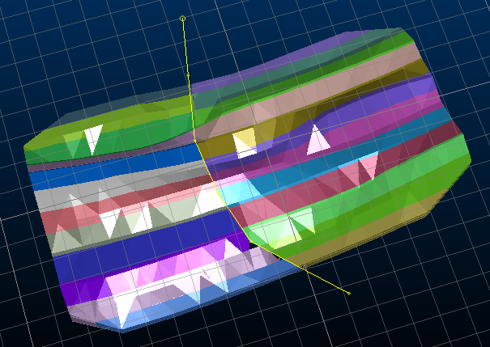

# Divide Wireframe

To access this screen:

  * **Wireframe** ribbon **> > Plane >> Divide by String**.

  * Using the **[command line](<Command_Toolbar.md>)** , enter "**divide-wireframe-by-strings** "

Split a wireframe into several parts using selected strings. Open wireframe surfaces (DTMs) are split into DTMs, whereas closed volumes are split into multiple closed volumes.

After the wireframe has been split, the different wireframe parts are assigned a numeric **Block ID** to define which group of parts they belong to. Within each Key Field pass, each part having the same relationship to the cutting strings and optional planes (being in front or behind each in turn) will share the same **Block ID** , even if they are separate surfaces or volumes.

The order the IDs are applied is non-specific and is independent of the wireframe and strings geometry

This command makes assumptions about input data:

  1. The input wireframe must have been [verified](<Wireframe%20Verify%20Dialog.md>) without any shared edges, intersections or open edges (if a closed volume). If a key field was necessary for a successful verification, then it should also be used as the key field for this function.

  2. Strings should pass completely through the wireframes they are segmenting i.e. extend beyond the wireframe's limits. A partial cut will not create separate segments.

  3. The Block ID classification assumes that each wireframe segment is clearly on one side or the other of each string. Open strings which do not pass across the entire wireframe extents may lead to ambiguous classification and possibly erroneous results.

  4. Planes should preferably be perpendicular to the cutting strings. Planes which are parallel to the cutting strings will prevent the creation of the additional closing edges on closed volume wireframes and may lead to erroneous results.

  5. Strings or cutting planes which exactly align with wireframe triangle surfaces may lead to problems in the internal Boolean functions and erroneous results. If this is suspected, then moving the string or wireframe a tiny amount away from the triangle surface will usually resolve the situation as it provides clearer evidence of distinct surfaces.

## Divide Wireframe by Strings Examples

#### Dividing a closed volume with open strings

In this example, the _vb_mintr wireframe from the tutorial data set is divided by a series of strings describing a rough 2D grid. Since the wireframe object contains 2 adjacent volumes identified by the ZONE field, that is used as a Key Field. No additional cutting planes were used.

A Plan view of the input wireframe object and cutting strings:

A Plan view of the output wireframe object, coloured by **BLOCKID** :

A 3D view of output wireframe object, coloured by BLOCKID:

A close up view of one the individual wireframe blocks, showing the new sides (in grey) which have been added to make it a closed volume:

#### Dividing a closed volume with open strings

In this example, the _vb_stoptr wireframe from the tutorial data set is divided by a series of closed perimeters outlining some notional key areas.

A Plan view of the input DTM wireframe object showing the cutting strings (perimeters):

A Plan view of the output wireframe object, coloured by BLOCKID:

A side 3D view of the output wireframe object, showing that, unlike with the closed wireframe, no additional sides have been created:

**Note** : string data can be selected before or after running the command, but they must be selected before clicking **OK**.

### Split Wireframe by String Activity

To split a loaded wireframe object (or selected triangles) using selected string data:

  1. Load the wireframe data to be split.

  2. Load the string file(s) containing string data to be used to split wireframe data.

  3. Run the **divide-wireframe-by-strings** command.

  4. Choose a loaded wireframe Object (the default is the current object) or selected wireframe triangle data (Selected triangles). You can select triangle data whilst the **Project to Plane** screen is displayed. See [Selecting Wireframe Data](<Wireframe_Selection_Concept.md>).

**Note** : if choosing **Selected triangles** , only selected wireframe data is split by the selected strings.

  5. Choose the Type of input wireframe you are going to split:

     * Closed Volumethe wireframe is a fully closed volume, or contains multiple closed volumes.

     * DTMall wireframe data is open. 

**Note** : if your input wireframe contains a mixture of open and closed data, you should filter your data beforehand to show only a single type, then run the process again for the other type.

  6. Choose your Output option. You can output data either within the Current object, an existing wireframe object (pick it from the list) or a new object (type a new name).

  7. Define the **Cutting string projection** , which is essentially a 3D plane that defines the orthogonal projection direction of the cutting strings.

     * Horizontalset the plane to be horizontal (i.e. both Azimuth and Inclination are 0 degrees).
     * North-Southset the plane to a vertical North-South orientation (i.e. Azimuth is 90 degrees and Inclination is -90 degrees).

     * East-Westset the plane to a vertical East-West orientation (i.e. Azimuth is 0 degrees and Inclination is -90 degrees).

     * 3D Sectionif any [sections have been defined in the active 3D window](<../VR_Help/workspace_sections.md>), these section planes can be used to project string data. 

Click to transfer the azimuth and dip of the section to the relevant fields. The _Default Section_ option is listed alongside any custom sections that exist for your project.

     * Azimuthset the azimuth of the section plane manually. 

Note: this field is automatically overwritten if any of the preset options are selected.

     * Inclinationset the inclination of the section plane manually.

Note: this field is automatically overwritten if any of the preset options are selected.

  8. Choose if Additional Cutting Planes are used. 

In addition to the strings being used for cutting the wireframe object, an optional set of regularly spaced planes can contribute to the splitting. These may be useful for augmenting the input strings to create a 3D grid, for example, with the strings splitting the wireframes vertically, and horizontal planes splitting the results into different layers.

**Note** : the output data has a unique Block ID for each segment of data that is generated (see below for more information on setting up Block IDs). 

If selected, the following additional options are available:

     * Distance between planesenter a value for the perpendicular cutting plane spacing. By default, this is zero, meaning only a single additional planar cut is made to the output data. This will match the **Plane orientation** definition (see below).

     * **Plane orientation** a section definition representing the primary additional cutting plane. If **Distance between planes** is zero, this is the only additional planar cut made to the output data.

     * **Plane reference point** define the centre point of the additional cutting plane. 

For example, say your output wireframe volume is split using a boundary string. To ensure the 'cutout' is split into horizontal benches of 10m height, the **Distance between planes** is 10 and a vertical additional cutting plane is used:

;>)

In this example, the string is projected vertically and the object is coloured according to **BLOCKID**.

  9. Choose your Cutting string options.

You can optionally inject an attribute value from the cutting string into the resulting wireframe segment by selecting **Outlines only**. This reveals the following options:

     * Inside columntypically used where outline data is generated with the [outline-inside-switch-on](<../command_help/outline-inside-switch-on.md>) enabled, you can select an attribute that determines if a boundary string is 'inside' the targeted wireframe. This lets you create voids in blocks, or to speed up the processing of outlines with only a small number of nested outlines.
     * Copy columnselect a non-system attribute on the selected cutting string(s) to add the corresponding value to the output wireframe. This could be a location indicator, for example.
  10. Control how **Block ID** values are assigned to output data. Each independent segment of data that is created carries its own Block ID. This is a numeric and unique integer:
     * Choose the **Output column** used to store the ID. This can be an existing field, or you can type in the name of a new one. By default, _BLOCKID_ is used.
     * Set the **Initial value** of the first ID. This is 1 by default.
     * Choose the **Increment** to use for subsequent IDs. This is also 1.
  11. Click **OK** to generate your output data.

Related topics and activities

  * [divide-wireframe-by-strings](<../command_help/divide-wireframe-by-strings.md>) (command)

  * [Wireframe Section](<Wireframe%20Section%20Dialog.md>)

  * [Wireframe Multiple Section ](<Wireframe%20Section%20Multiple%20Dialog.md>)

  * [Strings from Intersections](<Wireframe%20Strings%20From%20Intersections%20Dialog.md>)

  * [Wireframe Split](<Wireframe%20Split%20Dialog.md>)

  * [Wireframe Split Multiple](<Wireframe%20Split%20Multiple%20Dialog.md>)