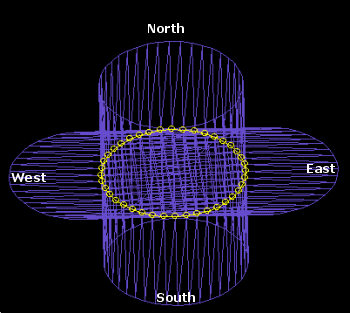
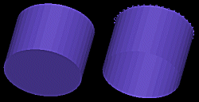
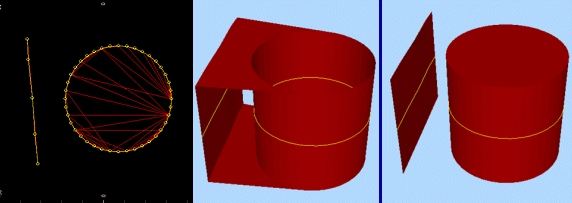

# Extrude Strings

To access this screen:

  * **Explicit** ribbon **> > Create >> Link >> Extrude Strings**.

  * Using the **[command line](<Command_Toolbar.md>)** , enter "extrude-strings"

  * Use the quick key combination "exs".

  * Display the **[Find Command](<findcommand.md>)** screen, locate **extrude-strings** and click **Run**.

Create wireframes from strings, extruded in a particular direction.

Before you can use this command, at least one string entity must be loaded. More than one string can be selected before an extrusion is performed; all are extruded in the same way. Both open and closed strings can be extruded.

String data must be selected before data is processed. Only selected string data is extruded.

To extrude strings to form wireframe data:

  1. Choose your Output option. You can output data either within the Current object, an existing wireframe object (pick it from the list) or a **New object** (type a new name).

  2. Specify the **Extrusion Direction** using one of the following methods.

     * Manually set the Azimuth and Dip. This extrusion direction is used consistently for all selected string data.

     * Defining an **Azimuth Column** or **Dip Column** (or both). Numeric fields of the target string object(s) are listed.

**Note** : if using in-object data columns to determine extrusion direction, if absent data is encountered, the manually specified **Azimuth** and **Dip** (see above) are used.

     * Apply one of the **Extrusion Presets** :

       * Upproject with an azimuth of 0 and a dip of -90.
       * View Planeproject the string in a direction perpendicular to the current view direction.

       * Downproject with an azimuth of 0 and a dip of 90.

       * Northproject directly northwards, that is, at an azimuth and dip of 0.

       * Westproject the string with a 270 azimuth and 0 dip.

       * Eastproject the string with a 90 azimuth and 0 dip.

       * Southproject the string with a 180 azimuth and 0 dip

       * 3D Sectionselect an existing [3D window section](<../VR_Help/workspace_sections.md>) to determine the projection direction.

The following images describe the preset directions more graphically. The left hand image shows a closed, circular string, created on the bias between plan and east-west directions. This string has been projected in North, South, East and West directions:

;>)

**Note** : choosing a preset automatically updates **Azimuth** and **Dip** fields, which can subsequently be edited manually if required. Even if a preset is applied, if an **Azimuth Column** or **Dip Column** is specified, in-object settings are used in preference to other direction values.

  3. Define an **Extrusion Distance** by defining a **Forwards** and **Backwards** distance, or leaving the default zero value to only project on one side of string data.

  4. Choose fine-tuning **Options** :

     * **End Link** optionally create a 'capped' wireframe. If checked, you will create an additional surface at each 'end' of the generated wireframe object, for example:

If an open string is projected, it is still possible to cap the ends of the resulting wireframe, although the effect is determined by the overall geometry of the base string - this command will join first and last vertices to create a cap wherever possible.

**Note** : the default value for End Link is a [project setting](<Project%20Settings_%20Wireframe%20Linking.md>).

     * Separate ends decide if multiple projected strings are treated as entirely separate things or not. Separate entities are extruded in isolation, whereas you can also consider multiples strings a part of the same extrusion.

This is best explained by example; the left image shows the original data used to generate an extrusion (in plan view). The central image shows an isometric view of the generated wireframe when ends are capped, but **Separate Ends** is **unchecked**. Compare this with the right-hand image in which the Separate Ends is **checked** :

;>)

     * Wireframe Attributes from stringsif **checked** , the attributes of the original string are copied to the output wireframe object. If unchecked, system default attributes are used to create the resulting wireframe.

  5. Click **OK** to generated extruded wireframe data from the selected strings.

Related topics and activities

  * [extrude-strings ("exs")](<../command_help/extrude-strings.md>) (command)

  * [link-strings ("ls")](<../command_help/link-strings.md>)

  * [end-link ("eli")](<../command_help/end-link.md>)