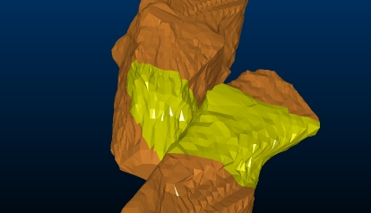
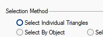
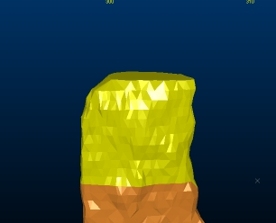
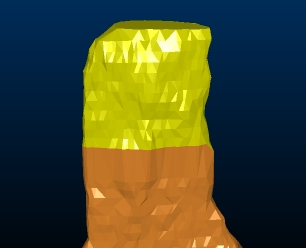

# Selecting Wireframe Data

Some structural modelling commands in your product allow you to select all or part of a wireframe object, or multiple wireframe objects.

Wireframe data showing partial data selection.

## Wireframe Selection Modes

To select wireframe data in your product, the following settings must be enabled:

  * Wireframe data selection must be enabled. If disabled, wireframe data cannot be picked by the cursor, regardless of other settings.
  * The wireframe overlay you need to select must be enabled in the [Overlay Selection](<OverlaySelectionDialog.md>) screen. By default, the default overlay created for a loaded 3D item is selectable.
  * Your **Project Settings** determine which aspect of your wireframe is selected. By default, left-clicking a wireframe will select the entire wireframe object, however, you can change this to select one or more triangles. See [Project Settings: Wireframing](<Project%20Settings_Wireframing.md>).

## Picking Wireframe Data

You can select wireframe data as any other 3D data type; either by left-clicking with the cursor to pick a particular wireframe, group, surface, triangle etc. (depending on your project's settings) or you can left-click and hold to draw a box that will pick data that falls within in (again, the actual data that is selected with this method depends on project settings).

For example, if you want to select the upper section of a cavity wireframe to extend it upwards by 5m (e.g. to encourage a more generous model evaluation), you would enable the Select Individual Triangles project setting:

Then drag a box around the wireframe data to be translated, e.g.:  
  

Translating the wireframe ([translate-wireframe](<../command_help/translate-wireframe.md>), quick-keys 'trw') will then translate the selected data whilst maintaining the integrity of the closed volume, e.g.:

This concept applies to all wireframing commands that support data selection, including boolean and plane commands, wireframe copying and deleting and so on.  

## Commands Supporting Wireframe Selection

Some commands in your product provide useful shortcuts when working with selected wireframe data.

For example:

  * Pressing <Delete> where wireframe triangles are selected will remove those triangles from the wireframe object, although you should note that closed wireframe volumes are not automatically 'capped' with this facility and thus become open.
  * You can copy a part of a wireframe, say, by selecting a subset of triangles, then using the[ copy-wireframe](<../command_help/copy-wireframe.md>) command.
  * Boolean commands, such as [wireframe-union](<../command_help/wireframe-union.md>) can work using selected data and this applies to both input objects. You can create a union, say, of wireframe 1 and a part of wireframe 2\. 

The data used for either the first or second object is specified by first, selecting the wireframe data in either object to form a union, then using the corresponding Store Current Selection button to commit the selected data to the command. Boolean commands are not available in all Studio products.  

  * Plane commands, such as [wireframe-section](<../command_help/wireframe-section.md>), honour preselected wireframe data, allowing a subset of a loaded wireframe object (or objects) to be processed. 

In the wireframe-section case, for example, you could select a part of a wireframe beforehand (with the wireframe selection method set to Selected triangles), and a section string is generated based on the intersection of the selected wireframe and nominated section only. Plane commands are not available in all Studio products.

Related topics and activities

  * [Boolean and Plane Calculations](<boolean_operations.md>)

  * [Project Settings: Wireframing](<Project%20Settings_Wireframing.md>)

  * [Overlay Selection Dialog](<OverlaySelectionDialog.md>)