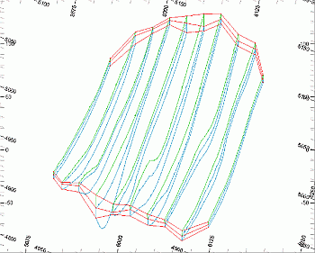
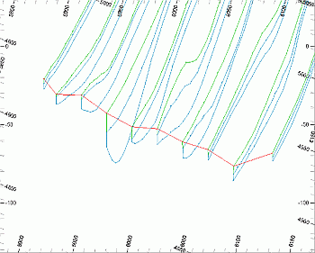
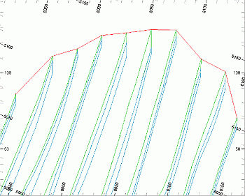
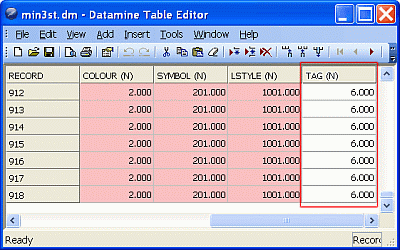

# Wireframe Tag Strings

_Tag_ strings are a special type of string used to provide additional control when wireframes are generated using the various string linking commands (for example, "link-strings"). 

Tag strings are added to a string object in order to optionally guide wireframe creation commands. They are optional in the case of linking simple string models but are can be very useful when modelling more complex geometries.

Tag strings help with with the following aspects of manual wireframing:

  * Precise placement of wireframe edges

  * Avoiding twisted wireframes where strings of relatively different shapes are linked.

**Note** : tag strings are not required, or considered, when using implicit modelling commands such as creating a vein, a categorical model, a grade shell, and so on.

;>)

An example of tag strings (in red) used to control the shape of a closed volume

Tag strings are added to existing string models and are created using the [create-tag-string](<../command_help/create-tag-string.md>) command. Each tag string is digitized by sequentially snapping to corresponding points in adjacent such that the resultant string represents an edge. This edge can then optionally be used to control subsequent string linking wireframe commands. 

The images below show a set of geological section strings (green and blue) and the associated tag strings (red) which connect edges at the ends of the string model:

;>)

;>)

Strings tables and files which contain Tag String data have an additional numeric field (TAG). Each tag string has a unique value TAG value, for example: 

;>)

**Note** : tag Strings are identified by the field TAG containing a value greater or equal to '1'. All other 'normal' (non-tag) strings in the same object has TAG set to '-'.

To set the colour of tag strings:

  1. Run the command **[tag-string-colour](<../command_help/tag-string-colour.md>)**.

The **Tag String Colour** screen displays.

  2. In the **Tag String Colour** field, enter a Datamine colour index.

  3. Click **OK**.

Subsequent tag strings are in the chosen colour.

Related topics and activities

  * [tag-string-colour ("taco")](<../command_help/tag-string-colour.md>)

  * [use-tag-switch ("uta")](<../command_help/use-tag-switch.md>)