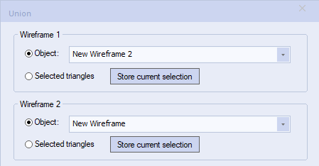

# Boolean and Plane Calculations

Your application has a comprehensive set of commands and processes for performing boolean and other related operations on wireframes, such as: unions, intersections and splits. 

  * **Boolean** operations allow you to calculate the results of the interaction with one wireframe and another. 

  * **Plane** operations let you visualize the results of interactions between a wireframe and one or more cross-sectional planes.

These calculations can be accessed directly, such as by running the **wireframe-union** command, or can be run as part of a more complex operation, automatically, such as when generating cut and fill volumes for end-of-month reporting.

**Note** : Before you run boolean and plane wireframe operations, you should verify input data first. 

As with many commands in Studio products, access is granted only when the required data objects are available and displayed. As such, if no wireframe objects are currently loaded, boolean and plane ribbon entries are inaccessible.

## Boolean Commands and Wireframe Selection

Boolean commands let you use partially-selected data objects from which to calculate an interaction. This is done using the **Store Current Selection** mechanism.

For example, if Wireframe 1 contained 2 stopes (A and B) and you wanted to show the common volume of Wireframe 2 (a drive finger) and stope A, you could preselect only stope A and store this data for Wireframe 1 before calculating a union.

Wireframe selection options are available on the **Project Settings** screen. See [Project Settings: Wireframing](<Project%20Settings_Wireframing.md>).

## The BOOLEAN Process

With the exception of the strings from intersections command, Boolean operations require at least two wireframe objects to be available before a command is accessed. If using interactive boolean commands, wireframe input data must be loaded into memory first. If you are processing data using the [BOOLEAN](<../Process_Help_XML/boolean.md>) process, data is processed directly from disk, not in-memory objects.

The **BOOLEAN** process provides file-based boolean functionality for the following boolean operations:

  1. Union \- Takes two wireframes and creates a single wireframe with the same surface appearance and volume of both wireframes. Also, see the help file for the [wireframe-union](<Wireframe%20Union%20Dialog.md>) interactive command screen. * **OUTTR** and * **OUTPT** will be generated with this method.
  2. Difference \- Takes the difference of the second from the first wireframe by removing the first volume that is common to the second. The results will differ if the first and second wireframe are swapped. Also, see the help file for the [wireframe-difference](<Wireframe%20Difference%20Dialog.md>) interactive command screen. * **OUTTR** and * **OUTPT** will be generated with this method.
  3. Intersection \- Takes two wireframes and creates a single wireframe output of their overlapping (common) volume. Also, see the help file for the [wireframe-intersection](<Wireframe%20Intersection%20Dialog.md>) interactive command screen. * **OUTTR** and * **OUTPT** will be generated with this method.
  4. Extract Separate \- Takes two wireframes and creates discrete pieces of a two wireframe intersection. The parameters **WIRE1IN** , **WIRE1ON** , **WIRE1OUT** , **WIRE2IN** , **WIRE2ON** , **WIRE2OUT** indicate which outputs are created. Also, see the help file for the [wireframe-extract-separate](<../command_help/wireframe-extract-separate.md>) interactive command dialog. * **OUTTR** and * **OUTPT** will be generated with this method.
  5. Strings from Intersection \- Takes two wireframes and creates a string outlines where the surfaces intercept. Also, see the help file for the[ wf-intersections](<../command_help/wf-intersections.md>) interactive command screen. * **OUTSTR** will be generated with this method.
  6. Solid Hull \- Creates a single shell around multiple overlapping surfaces. The option only uses the first wireframe input (* **WIRE1TR** , * **WIRE1PT**). Also, see the help file for the [convert-wf-hull](<Wireframe%20Solid%20Hull%20Dialog.md>) interactive command screen. * **OUTTR** and * **OUTPT** will be generated with this method.

Related topics and activities

  * [Project Settings: Wireframing](<Project%20Settings_Wireframing.md>)

  * [Selecting Wireframe Data](<Wireframe_Selection_Concept.md>)