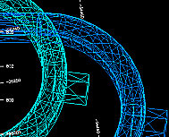
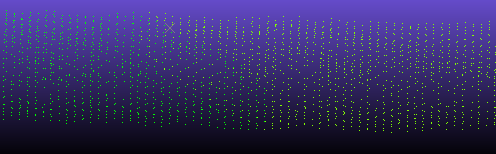
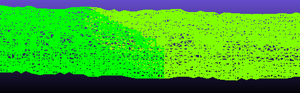
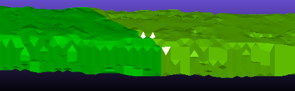
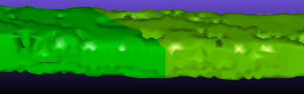
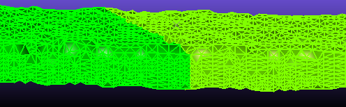

# Wireframes

You have access to many commands and functions for creating and manipulating wireframe models. Wireframes can be created from point and/or string data using either String Linking commands, DTM Creation commands or wireframe processes.

Underground decline wireframes

There are two types of wireframe model, each with its own application:

  1. Solid wireframes representing a 3D volume, such as:

     * A zone of high grade mineralization.

     * An orebody.

     * A lithology.

     * An underground drive finger, stope, decline and so on.

     * Cut and fill volumes used for EOM surveying.

Volumes and tonnages can be calculated from these wireframes, which are useful for determining resources and reserves. Orebody and other structural volumes can constrain grade model extents, ensuring zone estimation is performed tightly. Volumes are also used when detecting drillhole proximity warnings, and there are a host of other use cases for wireframe volumes in other Studio processes.

  2. Surface representation wireframes, also known as digital terrain models or DTMs, such as:

     * Topography (Digital Terrain Model).

     * Surveyed pit or drive walls.

     * Hangingwall and footwall surfaces or contact surfaces representing geostructural boundaries.

     * Pit geometry such as the ultimate pit, pushbacks and phases.

## Wireframe Display Options

A loaded wireframe **[object](<Concept_Current_Object.md>)** , as with any 3D data type, can be represented by one or more 3D overlays. See [Windows, Sheets, Projections and Overlays](<concept_views%20sheets%20overlays.md>).

Wireframes can be displayed in any 3D window using one of the following rendering options:

  * **Points** : Show only the vertex positions within the wireframe, without adjoining edges or surface.

  * **Wireframe** : Show the edges between vertices without any internal surface. 

  * **Flat** : Show each wireframe triangle as a filled (although optionally transparent) 3D surface. When this option is used, you can also apply a wireframe texture image (which can be automatically georeferenced).

  * **Smooth** : As above, but soften the edges between triangle surfaces to give the illusion of a smoother surface.

**Note** : Rendering a wireframe in this way does not change any data values. It is purely a rendering technique.

  * **Highlighted Edges** : Display both **Flat** and **Smooth** modes together with complementary colours. This can be useful if viewing the organisation of triangles within a wireframe.

  * **Intersection** : Show only the intersection of a wireframe with the current section. This can be very useful when comparing the profile of multiple wireframes in a cross-section. When rendered as an intersection, the resulting 'string' can be formatted using other settings, such as thickness, line style and colour.

Wireframe 3D window formatting, including the surface rendering option described above, is managed using the **[Wireframe Properties](<../VR_Help/Wireframe_Properties_Dialog.md>)** screen.

## Wireframe Data Files

Wireframe data is stored in two related files; a wireframe _triangles_ file and a wireframe _points_ file. These files are recognized by their identical prefix and either a "tr.dm(x)" or "pt.dm(x)" suffix.

The triangles file is picked when loading files or adding them to the current project for loading later. If you try and load a triangles file where the corresponding points file can't be found, a file browser appears so you can pick the points file yourself. 

**Note** : Generally, it is good practice to keep your wireframe file pair in the same folder so you don't lose track of either.

## Wireframe Classification

A wireframe is founded on a series of points which are interlinked to produce a network of triangles which represent a surface. The method for producing the triangles can be controlled and is dependent on the wireframe purpose and user preference.

Earlier versions of Studio classified wireframes by the following fields which are present in all wireframe triangle files. 

  * GROUP \- A GROUP can consist of one or more distinct wireframes that have the same GROUP number but may or may share the same SURFACE number.

  * SURFACE \- An individual wireframe SURFACE can be selected from within a GROUP of wireframes. This surface can be either a DTM or a solid wireframe.

  * LINK \- Each wireframe surface consists of a number of individual links, each numbered individually.

The wireframe GROUP, SURFACE and LINK numbers are stored in both the wireframe points and triangles files.