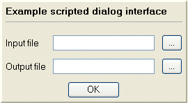

# Automating Studio Products

Your application provides a new, industry standard interface that allows you to write scripts using any COM-aware scripting language. JavaScript is popular, but any language that can access the COM layer is fine. 

Scripts are typically embedded into an HTML document, which can then be loaded into the **Customization** window in a Studio product to execute. You can drag-and-drop scripts in an .htm or .html document to load them automatically.

**Note** : For security reasons, you cannot load content into the **Customization** window that is outside of your local PC domain. This includes Internet content.

As well as running individual commands from scripts you can also run your existing macros which have long been a feature of Datamine Studio products.

The following figure shows a typical script in the Customization window:

As a web page, of course, you can create your own interface and controls. 

### Safer Scripting

To maintain the highest level of local data security, we've rigorized our scripting interface in Studio products to provide a way to securely instantiate approved ActiveX objects through automation scripts. This provides a safer and more marshalled automation environment. 

In brief, we've introduced a new Studio application method (CreateObject) that can be used in place of the deprecated `new ActiveXObject("Prog.ID");` instruction. A call to something like `window.external.System.CreateObject("Prog.ID");` allows approved ActiveX objects to be instantiated to support your scripts. Most importantly, the ones that provide the highest risk are blocked. 

The **Datamine Studio Script Updater** , accessible via your **Home** ribbon, can update your scripts either individually or as a batch, automatically making them safer to use. 

If you load a script that looks like it could benefit from additional protection, a banner appears atop your display area. This also provides access to the conversion utility:

## Script Browser Permissions

Scripts will commonly make use of a DmApplication object, which hosts the hierarchy of methods, properties and events that you can access to automate Studio functions and your workflows.

Datamine Studio's embedded **Customization** window is based on Microsoft browser technology. In order to run customization scripts, the relevant permissions must be set. 

**Tip** : You can avoid the instantiation of ActiveX controls in Studio scripts entirely by setting the reference to the DmApplication object using the **window.external** object. For example, `oDmApp = window.external; (Javascript)`.

## Script Example

Consider the following example, which displays two file browser windows to define an input and output file. The selected file names are stored in the parent screen's `tbInput` and `tbOutput` list controls. This example doesn't do anything else, but it could easily be extended to perform a function on the input file (a design command or process), saving the output accordingly.

The popup screen is an HTML table, using HTML text, buttons, text boxes and other controls. The HTML is written so that when a button is pressed, a short section of JavaScript is executed to carry out some function, such as using the Project File browser, or running some commands.

The HTML code used to represent the above table is as follows:
    
    
    <TABLE cellSpacing=0   
  
---  
      
    
         cellPadding=10 align=left border=0>  
      
    
      <TBODY>  
      
    
      <TR>  
      
    
        <TD>  
      
    
         <TABLE  
      
    
          style="BORDER-RIGHT:   
      
    
         2px outset; BORDER-TOP: 2px outset; FONT-SIZE: 10pt; BORDER-LEFT:2px outset; BORDER-BOTTOM: 2px outset; FONT-FAMILY: MS Sans Serif;BACKGROUND-COLOR: buttonface" cellSpacing=0   
      
    
         cellPadding=5 align=left border=0>  
      
    
          <TBODY>  
      
    
            <TR>  
      
    
              <TD colSpan=3><B>Example scripted dialog interface</B>  
      
    
                
  
      
    
              </TD></TR>  
      
    
            <TR>  
      
    
              <TD>Input file</TD>  
      
    
              <TD><INPUT name=tbInput></TD>  
      
    
              <TD><INPUT language=javascript style="WIDTH: 30px" onclick="return btnBrowse1_onclick()" type=button value=... name=btnBrowse1></TD></TR>  
      
    
            <TR>  
      
    
              <TD>Output file</TD>  
      
    
              <TD><INPUT name=tbOutput></TD>  
      
    
              <TD><INPUT language=javascript style="WIDTH: 30px" onclick="return btnBrowse2_onclick()" type=button value=... name=btnBrowse2></TD></TR>  
      
    
            <TR>  
      
    
              <TD align=middle colSpan=3><INPUT language=javascript style="WIDTH:75px" onclick="return btnOK_onclick()" type=button value=OK name=btnOK></TD>  
      
    
            </TR>  
      
    
          </TBODY>  
      
    
         </TABLE>  
      
    
         
&nbsp;
  
      
    
        </TD>  
      
    
       </TR>  
      
    
      </TBODY>  
      
    
    </TABLE>  
  
The JavaScript code used to activate this popup is greatly simplified by using the Datamine basic Script Library Component (SLC). The JavaScript code to initialize the SLC is already included in the auto-saved file, and is similar to the following:
    
    
      
  
Then, to add JavaScript functionality to use the Project File browser to prompt for the name of the input file, and then a snippet to write that name into the text box can be as easy as:
    
    
    tbInput.value = dm.browseForFile();  
  
---  
  
## More Information

  * See your Scripting Tutorial, available from the Help menu.

  * Datamine also offers comprehensive training courses that will teach you how to use scripting to get the best out of your system. Contact your Datamine Support Representative for more information.