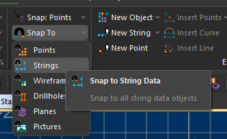

# String Data

String data is one of the basic types of 3D data understood by your application, along with points, drillholes, wireframes, block models and many others. 

A string file is recognized by your application if it contains the following system attributes. Typically, however, a string will also contain fields to define colour, symbol style and line style, as well as other attributes to support geotechnical, geological and operational workflows:

Field |  Numeric or Alphanumeric |  Implicit or Explicit |  Description  
---|---|---|---  
XP  
YP  
ZP |  N |  E |  The coordinates of the String vertex.  
PTN |  N |  E |  The String vertex number.  
PVALUE |  N |  E |  The String number.  
  
String data can exist in a number of forms:

  * A strings file \- data that exists as a Datamine file, or in another 3rd-party format such as .dxf, .duf, .str and so on.

  * A data object \- string data that has either been created within an application, or data loaded from a strings file (see above).

  * Archived data \- string data can be embedded in a project archive. See [Archive Project Data](<archiving.md>).

## Open and Closed Strings

String data can either be 'open' or 'closed':

  * If the string start and end points are not coincident, the string is open.

  * If the start and end positions are coincident, it is closed.

The distinction between open and closed string data is important for some operations. For example, when picking a boundary for implicit modelling or generating a set of outlines (a special form of closed string data), only closed strings can be processed. 

Commands such as [close-all-strings ("cla")](<../command_help/close-all-strings.md>), [open-string](<../command_help/open-string.md>) and similar can be useful to quickly swap strings from an open to closed state or vice versa.

**Note** : a special type of string known as a 'single point string' can be created, and is considered an open string in the context of other design commands and processes.

## Creating String Data

String data is created by a range of different methods:

  * Using the Datamine Table Editor \- create a table with the fields listed above, using the Table Editor, then add records and values until the string has been defined completely. This data can be saved as a strings file (see above).

  * **Interactively** , by digitizing string data in your application. This is added to a strings data object, which can subsequently be saved as a file.

  * As a result **of other design commands and processes** , such as the [convert-wf-hull ("hts")](<../command_help/convert-wf-hull.md>) command.

  * By **loading** a previously saved string file.

## Editing & Using String Data

When a string has been created, it can be subject to a host of string manipulation commands. For example, you can condition a string so that nodes (points) are automatically added at a specified interval, or you can fillet a string, allow nodes to be added so that a minimum angle is set for each coincident angle. String editing commands are found throughout your system, such as Studio UG's **Design** ribbon, Studio NPVS's **Edit** ribbon and so on.

You can use string data as a basis for more complex data objects, such as wireframes. A simple wireframe can be created by linking two strings, for example. Wireframe data is comprised of strings linked to form triangulated data.

Strings can also be used to define boundaries for other operations, such as blast design layouts, model evaluations, block model creation etc. Refer to the Table of Contents on the left for more information on these concepts.

## Clipping String Data

String traces can be clipped to other strings using one of a number of commands, such as [Clip Perimeters to Perimeters](<ClipPerimetersWithPerimetersDialog.md>). This can speed up the digitizing process by ensure string terminate at a known location, for example. In this context, string data is actually clipped (that is, the data is modified). 

String data can, like any 3D data type, also be clipped visually using view **[clipping](<../VR_Help/Clipping-Data.md>)** commands. 

## Snapping to String Data

You can snap to string data if the appropriate snapping mode has been set. How you do this depends on your application; for example, the Studio EM application's Home ribbon features a Snap to menu that determines which loaded object data (if any) can be snapped to during digitizing:

The settings in this menu control if data of the selected type can be used as a snapping point when digitizing in a 3D window.