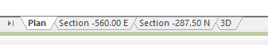
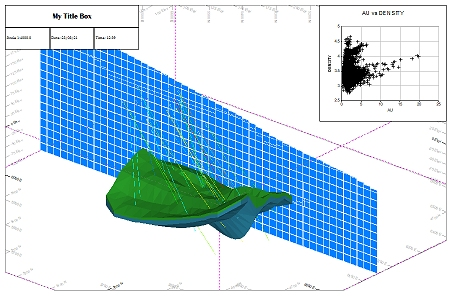
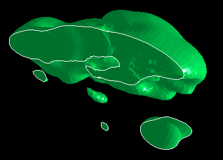

# Windows, Sheets, Projections and Overlays

The display of data is based on some fundamental concepts which, once grasped, will make the task of formatting easy.

Also see [The View Hierarchy](<View%20Hierarchy.md>).

## Principles

The following principles apply to all data, regardless of how it is displayed:

  * Data must be loaded into memory before it can be viewed in a display window.

  * When a file is loaded into memory the data becomes an **object** , and separate files become separate **objects**.

  * If an object has a spatial context (i.e. it has form and a specific location in space) it is considered a **3D object** (points, strings, wireframes and so on).

    * If data has no visual elements, it is referred to as a **table**.

  * 3D objects are represented in display windows by **overlays**. A single 3D object can be represented by many overlays but a single overlay can only represent one 3D object.

  * When 3D object is created , a default overlay is automatically created in each of the display views. You can control the settings for this default formatting using 3D display templates. See [3D Display Templates](<../VR_Help/3D_Templates.md>).

  * In the **Plots** window, data is displayed on a **sheet** and each sheet can contain one or more **projections** (displays of 3D data).

  * A **Plot** window projection can either be of the 2D or 3D variety. See [3D Overlay Groups](<../PLOTS_LOGS/3D%20Overlay%20Concept.md>).

    * **2D Plot window projections** represent a legacy approach to data display in hardcopy reports, although this approach sometimes works better for reports containing CAD-style data.

    * **3D Plot window projections** can be considered mini 3D windows, embedded in a plot sheet. These feature additional rendering, closer to that found in the 3D windows.

## Windows

In Studio products, data is displayed in a "window". There are multiple window types used in Studio products to display data, including:

  * **3D windows** embedded or external, linked or independent). One or more 3D windows can be displayed. See [3D Window Visualization](<../VR_Help/VR_Introduction.md>).

  * **Managed task windows** these are like general 3D windows (see above) but are dedicated to a particular task involving 3D data. For example, the **Auto Design** window in Studio OP focusses on displaying the inputs and results of automated pit or dump design. 

  * **The Plots window** featuring the richest hierarchy of display elements, the Plots window lets you present multiple views (known as 'projections') of data alongside other static and dynamic elements. Perfect for hardcopy reporting. See [The Plots Window](<Window_PLOTS_Overview.md>).

  * ...and there are more to display non-3D, tabular data, including the **[Logs](<Window%20Overview_%20Logs.md>)** window, the **[Tables](<tables%20window%20overview.md>)** window, the **Reports** window and the **Files** window. 

## Sheets

Sheets are independent report displays found in the **Plots** window. Each sheet is represented by a tab at the bottom of the window, for example:

## Projections

A plot sheet can contain one or more projections. A projection is a representation of 3D data and is comprised of (typically) a set of overlays that present a loaded data object's geometry.

Plot sheets can either be of the 2D or 3D variety. The 2D form represents Studio's legacy offering, but can be useful when presenting CAD-style data. More recently, 3D projections were introduced that can present data in the same way as a 3D window, with very similar formatting options, for example:

_A plot sheet's 3D overlay showing multiple object overlays and overlaid_**Plot Item Library** _elements_

## Overlays

An overlay is a representation of 3D data. A data object can be represented by one or more overlays, and multiple overlays of the same type can be displayed concurrently. For example, in a 3D window, a wireframe can be displayed as both a clipped 3D surface and an intersection, which can help to highlight the clipped edge of the data:

_2 wireframe overlays of the same underlying data object shown in a 3D window_

Related topics and activities

  * [The View Hierarchy](<View%20Hierarchy.md>)

  * [External 3D Views](<External_3D_Windows.md>)

  * [3D Window Templates](<3D_Window_Templates.md>)

  * [3D Design](<../VR_Help/Designing_in_VR.md>)

  * [The Plots Window](<Window_PLOTS_Overview.md>)

  * [Plot Item Library](<../PLOTS_LOGS/plotitemlibrary.md>)