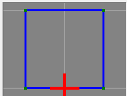
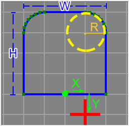

# Create Drive

To access this screen: 

  * Using the **[command line](<Command_Toolbar.md>)** , enter "create-drive"

  * Use the quick key combination "cdr".

  * Display the **[Find Command](<findcommand.md>)** screen, locate **create-drive** and click **Run**.

Extrude a designed profile shape along one or more design strings. You can either use a preset shape or set up a custom outline by defining the positions of the outline vertices. 

A profile object is used to store the details of your profile; this data is transferrable to other projects and systems using an XML format file. Profile data is not stored in memory as a 3D object and, as such, is only accessible (and editable) using the Create Drive screen.

This command would be used to construct a 3-dimension volume by extruding a profile shape along one or more design strings, typically representing an underground drive layout, although it can be used to extrude a profile shape along a design string for any purpose.

The output volume is closed (i.e. end-capped) and stored as a wireframe object that can be accessed using other structural tools in your application.

To select an existing drive profile to extrude along selected string data:

  1. Select string data to become an extruded drive.

  2. If a drive **Profile** was created previously, select it. 

**Note** : the listed profiles are not accessible as standard 3D objects (instead, they are defined as transferrable XML data). You can select an existing profile to modify, or you can Add a new shape (see below). 

  3. Click **Apply to Selected Strings**.

To create a new drive profile and extrude it along selected string data:

  1. Select string data to become an extruded drive.

  2. Click **Add**.

A new profile is created, ready for configuration.

  3. Edit the **Name** to something recognizable.

**Tip** : it can be useful to include the basic profile shape and dimensions in a profile name, for example; "Arch 3x2". A standard naming convention is also recommended.

  4. Choose a **Profile type**. you can choose a preset shape (which can be scaled) or you can define each vertex of the outline independently. The following options are available:

     1. _Pointlist_ a shape based on a list of vertex positions. This option lets you edit the **X** and **Y** positions of any vertex within the profile shape.

For example, consider a 2 x 2 profile shape with an intersection point at the bottom centre of the drive (this is the point at which the string intersects the profile during extrusion):

In this case, starting at the bottom left and going clockwise, the X, Y coordinates in the table are:

-1, 0

-1, 2

1, 2

1,0

**Tip** : to modify a standard shape, select it first and define its parameters. Then select _Pointlist_ and modify the vertex coordinates.

     2. _Rectangle_ a shape with an editable Width and Height.

     3. _Circle_ a circle with an editable Diameter.

     4. _Arch_ a shape defined by its Width, **Height** and Arch Radius. For example:  
  

Where:

H and W represent the configurable **Height** and **Width**.

R represents the turning radius of the arch curves.

X and Y represent the offset from the default intersection point (the 0,0 origin or the 2D shape). In this case Offset X = 1 and Offset Y = -1 (see below).

**Note** : if you are defining a square or arch profile for a map face, you can also automatically resize map profiles when adding them, adjusting the height and width automatically. See **Map Profiles**.

  5. If you are defining a standard shape profile (not a _Pointlist_ type) you can optionally offset the intersection point of the profile using the **Offset X** and **Offset Y** fields. 

**Note** : when an offset is applied, the coordinates table above updates automatically to show the new local, relative coordinates.

To export the current profile to a shareable file for others:

  1. Complete the procedure above to configure a new profile shape.

  2. Click **Export**.

  3. Enter a file name.

  4. Click **Save**.

The exported file can be imported by anyone using the create-drive command.

To import a previously exported drive profile and extrude it along selected string data:

  1. Click **Import**.

  2. Locate a previously saved .xml profile configuration file.

  3. Click **Open**.

The **Create Drive** screen updates to show the imported profile shape and parameters.

Related topics and activities

  * **[create-drive](<../command_help/create-drive.md>)** (command)