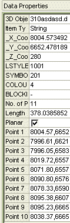
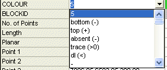
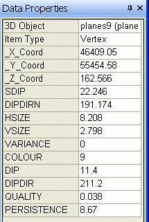

# Data Properties Control Bar

The Data Properties control bar is a context-sensitive data browser that allows you to see the data values associated with a selected object.

The contents of this window will be relevant to the data selected and the window in use. For example, to view the XYZ coordinates of all points on a digitized string, select the string (left-click) in the 3D window and a list of points and corresponding values will be displayed, along with string display properties and other general values.

However, if you select the contents of a cell in the Tables view (for more information on creating table views, see [Working with Tables](<../PLOTS_LOGS/abouttables.md>)), the Data Properties window reveals only data relevant to the selected data row, for example:

### Display Properties

The display style relating to the selected object, in all cases, will be reported if such information exists, and a colour preview bar will be shown to the left of these display items. In the above image, editable fields exist representing display formatting; **LSTYLE** , **SYMBOL** , and **BLOCKID**. Selecting one of these fields presents a drop down arrow, used to display a drop-down list from which a value can be selected, for example:

The top of this list displays the standard 'special values', used throughout the system to denote standard, non-numerical data values. Below this, numeric values relevant to the selection will be displayed, e.g. for the drop-down list, all available colour values will be displayed. Selecting a colour value will update the colour of the selected object, and the colour bar preview. Note that the number and type of editable fields available depends on the type of data selected, and in which window.

As with all control bars, the Data Properties control bar can be displayed or hidden, docked or floated. For more information on customizing your application, see [Customizing Control Bars](<Customizing.md>).

## Planes Objects

When a planes object item, i.e. a single plane, is selected in either the 3D window, the selected plane's data properties are displayed in the Data Properties control bar. In addition to the [standard planes object fields](<filetype.md#planes>) and custom fields, an additional data property **PERSISTENCE** is displayed, as shown in the image below. The persistence value will be either the diameter of the plane circle, or the corner to corner distance of the plane rectangle (depending on whichDisplay Type has been set in the [Planes Properties](<../VR_Help/Planes%20Properties%20Dialog.md>) screen). 

This read only value is calculated from the values listed in standard **HSIZE** and **VSIZE** fields.

Related topics and activities

  * [Customizing Control Bars](<Customizing.md>)

  * [Data Control Bars](<Interface_ControlBars.md>)