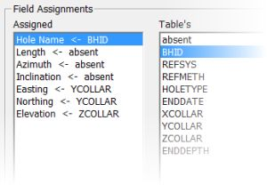

# Define Drillhole Data Table

To access this screen:

  * On the [Define Hole Tables](<Define%20Holes%20Dialog.md>) screen, select a Collars, Assays, Surveys, Lithology, Traces or Intersections table.

Define the field assignment (field mapping) and where relevant, also the dip and angle conventions for the selected dynamic drillhole table.

At any stage during or after the dynamic drillhole tables have been defined, the above definitions and mappings can be modifed and the dynamc drillholes rebuilt, without needing to redefine all the tables. Simply rerun the **[Define Holes](<Define%20Holes%20Dialog.md>)** command and change any of the required parameters before clicking OK.

It is not necessary to assign all fields, only those that are required to build (desurvey) the dynamic drillholes. All unassigned fields are imported and treated as additional attributes.

The example below shows the minimum field assignment required for a collars table. The unassigned fields in the pane on the right will be imported and treated as additional attribute columns/fields which can be used for formatting or filtering of data.

To configure field assignments for loaded drillhole data tables:

  1. Select the **Define Drillhole Data Table** screen.

  2. Select the required Table Type.

  3. In the Field Assignments group, Assigned pane, select a standard field from the list.

  4. In the Table pane, select the corresponding table column/field.

  5. Back in the Assigned pane, check that the correct assignment has been made.

  6. If there are still standard fields that need to be assigned, but which are not currently displayed in the Assigned list, select Show all field assignments.

  7. Repeat steps 2 to 5 for all required items.

Related topics and activities

  * [Define Hole Tables](<Define%20Holes%20Dialog.md>)

  * [Introducing Drillholes](<Drillhole%20Representation%20in%20Studio.md>)

  * [Creating Dynamic Drillholes](<LoadingDynamicDrillholeData.md>)