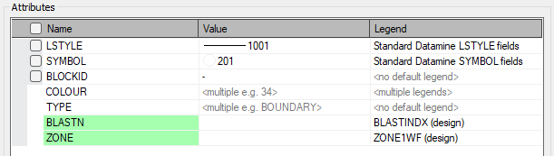
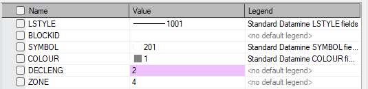
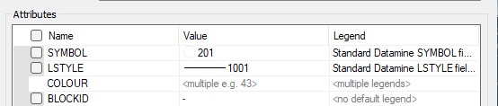

# Edit Data Attributes

To access this screen:

  * Using the Edit ribbon, select Attributes | Edit

  * Using the Structure ribbon, select Attributes

  * In the Command Line, enter 'edit-attributes', 'edit-dh-attributes'. 'edit-wireframe-attributes' or 'edit-model-cell-attributes'

  * Quick key 'eat'

  * Quick key 'ed'

  * Quick key 'ewa'.

## The Edit Attributes Screen

The **Edit Attributes** screen is used to list and edit the attributes of one or more selected 3D objects or 3D object items. This screen is displayed is used to edit the attributes of wireframes, ellipsoids, planes, points and strings, and may be displayed as a result of multiple commands.

You can either ensure the object or objects you wish to edit are selected before running this command, or pick data interactively in any **3D** window once the command is active. The contents of the dialog will update to represent the current selected data.

The behaviour of the **Edit Attributes** screen is influenced by data object selection; selected data will update the objects that are currently selected in a 3D window. For example, if one object is selected, the attributes grid will reflect the data values as that object stores them. Where multiple objects (or elements of the same object) are selected, and providing those objects are of the same type, numeric values can be averaged. For more information on multiple object selections, see "Editing multiple objects", below.

**Note** : The **Edit Attributes** screen will not display _virtual attributes_. Due to their dynamic nature, virtual data columns can only be edited by manipulating the underlying 3D data. See [Virtual data columns](<Attributes.md>).

## Edit Multiple Objects 

You can edit attributes of multiple objects if you wish. If selected data objects contain common attributes (with regards to name and attribute type), you can apply a value to all object attribute columns simultaneously. You can also edit object-specific attributes.

If objects of multiple types (e.g. strings, points etc.) are selected, the **Attributes** table will be empty and the _Selected object(s)_ field will display "Objects of multiple data types selected". You can only edit the attribute(s) of multiple objects if they are of the same type.

Providing object data of the same type has been selected in the **3D** window, you will see a list of all attributes in all data selected. For example if a string object (string 1) has the attributes ZONE and TYPE and is selected, and a second selected string object (string 2) has the attributes TYPE and BLASTN, the Attributes table will display the attributes ZONE, TYPE and BLASTN.

Continuing this example, if system fields are displayed, you would see something similar to the following in the **Attributes** table grid:

**The colouring in the table is important** : see how _TYPE_ is shown without a highlight? This indicates the _TYPE_ attribute belongs to more than one selected object (in this case, strings, but the same applies to all data types).

A green highlight is applied where an attribute exists within a single object of the selected group. In this case, _BLASTN_ and _ZONE_ are present in either the string1 or string2 object but not both.

If you have multiple objects selected, editing a unique (green) attribute and applying the change will update all selected objects, including adding a new attribute with the specified value if object data of the same type within the selection group didn't previously have one.

Continuing the above example further, if both string1 and string2 remain selected in the 3D window, setting _BLASTN_ to "3" and enabling the _BLASTN_ check box allows you to a) update the value of string1's existing _BLASTN_ attribute to 3 and b) add a _BLASTN_ attribute to string2 and set the value for all selected records to 3. Ultimately, both objects end up with a _BLASTN_ attribute with the common value 3 for all records.

If two objects share a column name but one is alphanumeric and one is numeric, **Value** will be read-only and display in red text Incompatible column types.

## Average Values 

The following information is relevant if multiple objects are selected and common numeric attributes exist.

Where multiple numeric values exist for a common attribute in the selection group, you can enable the _Display averages_ checkbox. When enabled, any columns whose values differ over selected items will be averaged and the **Value** cell will be highlighed mauve. In the example below, the _DECLENG_ attribute exists for both string 1 and string 2 but each object is represented by a different implicit numeric value throughout the object:

Numeric columns are averaged by a (possibly weighted) mean while alpha columns are averaged according to the (possibly weighted) dominant value, i.e. the mode. 

For points, planes and strings, averaging is not weighted so each selected item is treated equally. Averaging over selected wireframes is weighted by triangle surface area, and for drillholes the average is weighted by edge length, meaning the results will match the drillhole compositor when selecting multiple edges. Absent data are not included in the average.

Selecting a column that has been averaged and clicking**Apply** or **OK** will assign the _average_ value to _all_ selected items. Since all selected objects will then have the same value, the cell will no longer be highlighted mauve. This, like all other attributes changes except adding new columns, can be undone so no user warning is given. 

For example, if single instances of values 3, 4 and 5 are detected in the selected data objects, a mean average value of 4 is displayed (if **Show averages** is checked). Subsequently clicking **Apply** updates the selected data objects to include the values 4, 4 and 4, meaning only a single value is detected, and no colour highlight is required.

When **Display Averages** is not selected, if a column has multiple values over selected items, the cell will display "<multiple e.g. []>", where [] will be replaced by the first value in the data table. The check box for that attribute will be hidden to stop you from setting the value until youve typed one in or selected one from the **Value** drop down list (see below).

**Display Averages** is unchecked by default.

## Legend Information

You can choose how the _Value_ drop down list gets its values, either from those available in the selected data items (_Selected items_), or from a selection list representing legend intervals (_Legend_). This won't directly change the currently set value, only the alternative values from which to choose.

If _Legend_ is selected, and if a data column for an object has a default legend, this will be displayed in the _Legend_ column automatically. If not, "<no default legend>" will be displayed. If multiple objects are selected and they have a common column with different default legends, "<multiple legends>" will be displayed. You can also select a legend using the _Legend_ cells drop down list numeric legends for numeric columns and alpha legends for alpha columns.

For example, in the image below, 2 string objects have been selected. In both cases, the _SYMBOL_ and _LSTYLE_ legends are the same (actually, the system default legends). However, each string is coloured using a different legend, and each have a different _COLOUR_ value. As such, expanding the **Legend** drop down list will show all unique values found in both legends. 

As the values are different, a "<multiple e.g..." label is shown in the **Value** column. You can still edit this field, and apply a consistent value to both selected strings, if you wish.

The _Value_ of an attribute may be accompanied by a corresponding fill colour, line-style and symbol from the legend displayed in the _Legend_ column, if there is one. Each of these can be toggled on or off with the _Show Fill_ , _Show Line_ and _Show Symbol_ checkboxes. If the value entered in the cell doesnt exist in the domain of the legend, no icons will be displayed.

Note that the Standard Datamine SYMBOL, LSTYLE, COLOUR and FILLCODE legends will ignore these check boxes and always display their corresponding icon.

With a legend displayed in the **Legend** column, the **Value** cell will have an associated drop down where the user can select values from the legend. Each drop down item will also be accompanied by any of the fill, line-style and symbol depending on the corresponding check boxes mentioned above.

Note that selecting a legend in the grid doesnt change the object in any way, this is just for the benefit of seeing the values in the _Value_ column with the associated legend.

If the _Legend_ column is hidden (that is, _Selected items_ is chosen), _Value_ will be populated with the values of that attribute that exist across all selected items. If the attribute is numeric, the special values _bottom (-)_ , _top (+)_ , _absent (-)_ , _trace ( >0)_ and _dl ( <)_ will also be included underneath.

To edit points, planes, ellipsoids, strings or wireframe data using the attribute editor:

  1. Define appropriate data selection options (to ensure you can select the data, or part of the data that you need to edit).

  2. Either select your data and then run the **edit-attributes** command or vice versa. It doesn't matter which order is used.

The attributes table updates to show all unique attributes of all selected data items, plus a corresponding Value. 

     * If **Get value drop-down options from** is set to _Legend_ , a **Legend** column appears in the **Attributes** table, containing all legends available to the current project (system, user and project).

     * If **Get value drop-down options from** is set to _Selected Items_ , no **Legend** column appears in the attributes table, containing all legends available to the current project (system, user and project).

**Tip** : You can also set attribute value(s) by picking existing 3D data. This is explained in more detail below.

  3. If you wish to list all system attributes (these are used to define a data type within Studio products), check **Show system attributes** , otherwise system attributes will not appear in the **Attributes** table.

  4. If you plan to edit attribute values of multiple objects, you can choose how numeric values are displayed:

     * If Show averages is checked, the **Value** column will show the mean average of all numeric data values of the target attribute. Alphanumeric values will be listed as "Multiple". An example value will also be shown.

     * If **Show averages** is unchecked, all **Value** entries will be listed as "Multiple", along with an example value.

  5. For the attribute(s) you wish to change, select or type a _Value_ to be applied. Only values that are valid for the attribute type (numeric or alphanumeric) will be permitted

     * Alternatively, you can **Pick** attributes from another loaded data object (of a suitable data type) to transfer those attributes into the table, as described below.
  6. Where a non-system legend has been applied to an object (as indicated by the **Legend** column), you can control which element(s) of the legend are displayed alongside the selected _Value_. This is controlled using the **Legend Value Indicator** tools:

     * Show Fill: If a COLOUR field exists, this option is irrelevant as the sample fill will always be displayed, even if this option is disabled. For non-standard legends, this will show a preview of the fill type associated with the value/legend combination.
     * Show Line: If a LSTYLE field exists, the option will be ignored, as the line style preview will always be shown in the Value above. For non-standard legends, this will show a preview of the line style associated with the value/legend combination.
     * Show Symbol: If a SYMBOL field exists, the option will be ignored, as the symbol preview will always be shown. For non-standard legends, this will show a preview of the symbol associated with the value/legend combination.
  7. To transfer an attribute value to the selected data from another 3D data item, use the **Pick** button. This method can be adopted to quickly transfer attributes and their values from one object to another. 

     1. Display the 3D data that contains the desired attribute(s) in at least one 3D window. 
     2. Select **Pick**.
     3. Left or right click an object to transfer its attributes to the table. 
     4. Adjust the attribute values to the ones you want for the selected data.
  8. Select the check boxes for attributes that you wish to update. Values for all "checked" attributes will be updated on all selected data objects.

**Warning** : this will automatically add all attributes of the picked data that don't already exist in the selected object data, and this operation can't be undone.

Related Topics and Activities

  * [edit-attributes ("eat")](<../command_help/edit-attributes.md>)
  * [edit-dh-attributes (command)](<../command_help/edit-dh-attributes.md>)
  * [edit-wireframe-attributes (command)](<../command_help/edit-wireframe-attributes.md>)
  * [Edit Drillhole Attributes (screen)](<../command_help/edit-dh-attributes.md>)
  * [The add-attributes Command](<../command_help/add-attributes.md>)
  * [Edit Model Cell Values](<../command_help/edit-model-cell-values.md>)
  * [Attribute Naming Convention](<Attribute_Naming_Convention.md>)
  * [Object Manager](<Data%20Manager%20Dialog.md>)
  * [Data Structure](<Concept_The_Studio_3_Project_File.md>)
  * [The Current Object Concept](<Concept_Current_Object.md>)