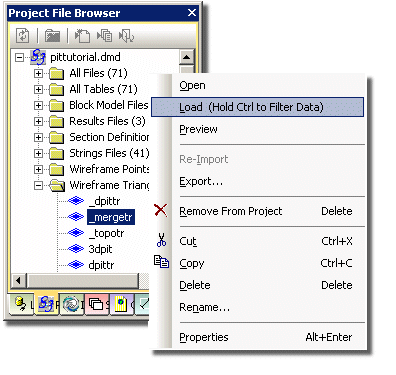

# File Types

Your application has been designed to detect numerous file types. This topic describes their minimum specification.

Often referred to as "system fields", these mandatory attributes found in a particular combination allows your product to recognise what type of data they represent. This data context is useful when presenting data objects and files via the various control bars of your application. For example, the data types segregated by the **Sheets** menu use the logic outlined below to work out what type of data is being displayed, for example:

Similarly, the **Project Files** control bar also detects files at the point of adding them to the project. This can help you find them, and it helps Studio process them in the right context, for example:

**Tip** : use the quick help menu to jump to a particular file type.

## Attribute Validation File

Validation files are used when defining and editing data using commands such as [**new-string**](<../command_help/new-string.md>) and [**edit-attributes**](<../command_help/edit-attributes.md>).

Validation files are used to control the values which a user can enter for attributes. For example, the value of the attribute **LITHO** could be constrained to be entered as only _LIME_ , _QUARTZ_ , and _GRANITE_. 

This would be done by having three lines in the validation file for ATTNAME "LITHO" and specifying LIME, QUARTZ, and GRANITE as three values.

Validation files are opened using the [open-validation-file](<../command_help/open-validation-file.md>) command.

Field |  Numeric or Alphanumeric |  Implicit or Explicit |  Description  
---|---|---|---  
ATTTYPE |  A |  E |  Attribute type:  
N = Numeric, A = Alphanumeric.  
ATTNAME |  A - 8 |  E |  Attribute (or Field) name to be validated.  
VALUE |  A |  E |  Possible value for this attribute. Used if ATTTYPE is A.  
MIN |  N |  E |  Minimum value for this attribute. Ignored if ATTYPE is N.  
MAX |  N |  E |  Maximum value for this attribute. Ignored if ATTYPE is N.  
DEFAULT |  N |  E |  Default value for this attribute.  
  
## Blast Patterns File

The blast patterns file is used by the presplit-layout and blast-layout commands.

Field| Numeric or Alphanumeric| Implicit or Explicit| Description  
---|---|---|---  
PATTERN| N| E| Pattern number - same for all rows in pattern.  
DESC| A| E| Description of Pattern - same for all rows in pattern.  
SPACING| N| E| Distance between holes on this row.  
BURDEN| N| E| Burden \- distance between rows.  
ROFFSET| N| E| Row offset.  
ROW| N| E| Row number.  
DIP| N| E| Dip of hole in degrees (Downwards is positive).  
RNFIRST| N| E| First row number.  
RNINC| N| E| Row number increment.  
RNREPEAT| N| E| Number of times row is repeated.  
HNFIRST| N| E| First hole number.  
HNINC| N| E| Hole number increment.  
SNFIRST| N| E| First sample number.  
SNINC| N| E| Sample number increment.  
HLENGTH| N| E| Total hole length.  
SAMPLENG| N| E| Sample length.  
STEMMING| N| E| Stemming length at top of hole.  
  
## (Prototype) Block Model File

Field| Numeric or Alphanumeric| Implicit or Explicit| Description  
---|---|---|---  
XMORIG  
YMORIG  
ZMORIG| N| E| The X, Y and Z coordinates of the model origin. Studio sets the origin at the corner not the centroid of the first parent cell.  
XINC  
YINC  
ZINC| N| I/E| The dimensions of the cell in the X, Y and Z directions. If the model will not contain any subcells then these three fields can be implicit (not stored on every record). This will reduce the storage space required by the model.  
NX  
NY  
NZ| N| I| Number of parent cells in the X, Y and Z directions of the model. Studio allows a value of 1 for modelling seams. The number of cells, in combination with the cell dimensions, defines the extent of the model.  
XC  
YC  
ZC| N| E| The X, Y and Z coordinates of the cell center.  
IJK| N| E| Code generated and used by Studio to identify each parent cell position uniquely within the model. Subcells that lie within the same parent cell will have the same IJK value.  
  
In addition to the above, block model files normally contain one or more value fields. They are typically sorted on increasing IJK value.

## Dependency File

The dependency file is used in scheduling to define dependencies between blocks. The block in the PNUM1 field must be mined first before the block in the PNUM2 field.

Field| Numeric or Alphanumeric| Implicit or Explicit| Description  
---|---|---|---  
PNUM1| N| E| Block number of block to be mined first.  
PNUM2| N| E| Block number of block to be mined after PNUM1.  
  
## Desurveyed Drillhole File

See [Drillhole Representation](<Drillhole%20Representation%20in%20Studio.md>).

Field| Numeric or Alphanumeric| Implicit or Explicit| Description  
---|---|---|---  
BHID| N/A| E| The Drillhole Identifier.  
FROM| N| E| The distance down the hole to the top of the sample.  
TO| N| E| The distance down the hole to the bottom of the sample.  
LENGTH| N| E| The length of the sample.  
X  
Y  
Z| N| E| The Sample centre coordinates.  
A0| N| E| The Azimuth of the sample in degrees measured clockwise from north.  
B0| N| E| The dip of the sample in degrees. (90 degrees is vertically downwards, and -90 degrees is vertically upwards).  
  
## Downhole Sample File

Field| Numeric or Alphanumeric| Implicit or Explicit| Description  
---|---|---|---  
BHID| N/A| E| The Drillhole Identifier.  
FROM| N| E| The distance down the hole to the top of the sample.  
TO| N| E| The distance down the hole to the bottom of the sample.  
  
## Downhole Survey File

Field| Numeric or Alphanumeric| Implicit or Explicit| Description  
---|---|---|---  
BHID| N/A| E| The Drillhole Identifier.  
AT| N| E| The distance down the hole to the survey measurement.  
BRG| N| E| The bearing of the survey measurement in degrees measured clockwise from North.  
DIP| N| E| The dip of the survey measurement in degrees. (90 degrees is vertically downwards, and -90 degrees is vertically upwards).  
  
## Drillhole Collars File

Field| Numeric or Alphanumeric| Implicit or Explicit| Description  
---|---|---|---  
BHID| N/A| E| The Drillhole Identifier.  
XCOLLAR| N| E| X coordinate of collar location.  
YCOLLAR| N| E| Y coordinate of collar location.  
ZCOLLAR| N| E| Z coordinate of collar location.  
  
## Ellipsoid (non-wireframe) File

Field| Numeric or Alphanumeric| Implicit or Explicit| Description  
---|---|---|---  
AZI| N| E| The azimuth of the ellipsoid.  
DIP| N| E| The dip of the ellipsoid.  
ROLL| N| E| The roll of the ellipsoid  
RAD1| N| E| The length of the first (major) axis  
RAD2| N| E| The length of the second (semi-major) axis  
RAD3| N| E| The length of the third (minor) axis  
  
## Estimation Parameters File

The grade estimation parameter file defines a set of grade estimation parameters to be used by grade estimation processes such as [ESTIMA](<../Process_Help_XML/estima.md>) and [XVALID](<../Process_Help_XML/xvalid.md>). It can be created using standard database processes such as [INPUTD](<../Process_Help_XML/inputd.md>) and [AED](<../Process_Help_XML/aed.md>), or using [ESTIMATE](<../Process_Help_XML/estimate.md>).

Alternatively it can be created using the **Table Editor**. The file contains up to 29 fields of which onlyVALUE_INandSREFNUMare compulsory. 

Field| Numeric or Alphanumeric| Implicit or Explicit| Description  
---|---|---|---  
VALUE_IN| A - 8| E| Name of field to be estimated.  
VALUE_OU| A - 8| E| Name of field to be created.  
SREFNUM| N| E| Search volume reference number.  
{ZONE1_F}| A/N| E| First field controlling estimation by zone.  
{ZONE2_F}| A/N| E| Second field controlling estimation by zone.  
NUMSAM_F| A - 8| E| Field to contain number of samples used.  
SVOL_F| A - 8| E| Field to contain dynamic search volume.  
VAR_F| A - 8| E| Field to contain variance.  
MINDIS_F| A - 8| E| Field to contain transformed distance to nearest sample.  
IMETHOD| N| E| Estimation method:  
1=Nearest Neighbour, 2=Inverse Power of Distance, 3=Ordinary Kriging, 4=Simple Kriging, 5=Sichel's t-Estimator.  
ANISO| N| E| Anisotropy method for IMETHOD=1 or 2:  
0=isotropic, 1=use search volume, 2=use ANANGLE1, etc.  
ANANGLE1| N| E| First rotation angle, defining anisotropy ellipsoid for IMETHOD=1 or 2.  
ANANGLE2| N| E| Second rotation angle, defining anisotropy ellipsoid for IMETHOD=1 or 2.  
ANANGLE3| N| E| Third rotation angle, defining anisotropy ellipsoid for IMETHOD=1 or 2.  
ANDIST1| N| E| Length of anisotropy axis 1, initially in X direction prior to rotation, for IMETHOD=1 or 2.  
ANDIST2| N| E| Length of anisotropy axis 2, initially in Y direction prior to rotation, for IMETHOD=1 or 2.  
ANDIST3| N| E| Length of anisotropy axis 3, initially in Z direction prior to rotation, for IMETHOD=1 or 2.  
POWER| N| E| Power of distance for Inverse Power of Distance (IPD) weighting.  
ADDCON| N| E| IPD \- constant added to distance.   
Sichels t - additive constant for lognormal distribution.  
VREFNUM| N| E| Variogram model reference number  
LOG| N| E| Lognormal kriging flag:  
0=linear, 1=log.  
GENCASE| N| E| Lognormal kriging method:0=Rendu, 1=General Case.  
DEPMEAN| N| E| Mean for lognormal variance calculation.  
TOL| N| E| Convergence tolerance for log kriging.  
MAXITER| N| E| Maximum number of iterations for log kriging.  
KRIGNEGW| N| E| Treatment of negative kriging weights:   
0=keep and use, 1=ignore samples with negative weights.  
KRIGVARS| N| E| Treatment of kriging variance > sill:  
0=keep KV>sill, 1=set KV=sill.  
LOCALMNP| N| E| Method for calculation of local mean for simple kriging:   
1=field from PROTO file, 2=calculate mean.  
LOCALM_F| N| E| Name of local mean field in PROTO for simple kriging.  
  
## Histogram

A data table containing a rows representing histogram intervals, and as exported by the HISTOG process:

Field| Numeric or Alphanumeric| Implicit or Explicit| Description  
---|---|---|---  
LOWER| N| E| The lower limit for the histogram bin  
MIDDLE| N| E| The middle (target) for the histogram bin  
UPPER| N| E| The upper limit for the histogram bin  
FREQENCY| N| E| The actual frequency recorded for the bin record  
CUMFREQ| N| E| For cumulative histograms, the cumulative value for the bin.  
AVIVAL| N| E| These are the same as DIP and AZI, except that they are measured in the world coordinate system. If all rotation angles are zero, then the values are the same as DIP and AZI and so the two fields WDIP and WAZI are not output.  
FREQ-%| N| E| The % frequency value attributed to the current bin  
CUMF-%| N| E| The % cumulative frequency value attributed to the current bin  
TOTVA| N| E| The variance of bin values from the target (mean) for the bin.  
  
## Pictures File

Similar to a points object, the pictures file contains a reference to a separate image file, including location and georeference data. All images loaded into Studio will trigger the creation of a Pictures data object.

Field| Numeric or Alphanumeric| Implicit or Explicit| Description  
---|---|---|---  
XP| N| E| X coordinate of data point.  
YP| N| E| Y coordinate of data point.  
ZP| N| E| Z coordinate of data point.  
HSIZE| N| E| The horizontal dimension of the image  
VSIZE| N| E| The verttical dimension of the image  
DIPDIRN| N| E| The dip direction of the image, anchored as XP/YP/ZP  
DIP| N| E| The dip of the image, anchored as XP/YP/ZP  
ROLL| N| E| The roll of the image, anchored as XP/YP/ZP  
IMAGE| N| E| A fully-qualified path to an image file  
  
## Planes File

The planes file is used to store the parameters describing planes that is, flat surfaces. It is typically used to store mapped geological or geotechnical planar features, for example a fault or joint surfaces. It is typically used when creating [Stereonet Charts](<../Stereonet/Stereonet%20Introduction.md>) or using the [calculate-geotechnical-attributes](<../command_help/calculate-geotechnical-attributes.md>) command.

Field| Numeric or Alphanumeric| Implicit or Explicit| Description  
---|---|---|---  
XP| N| E| X coordinate of the center of the plane.  
YP| N| E| Y coordinate of the center of the plane.  
ZP| N| E| Z coordinate of the center of the plane.  
SDIP| N| E| Dip of the section.  
DIPDIRN| N| E| Dip direction of the plane.  
HSIZE| N| E| Horizontal size of the plane.  
VSIZE| N| E| Vertical size of the plane.  
SYMBOL| N| E| Display symbol.  
COLOUR| N| E| Default plane and symbol colour.  
VARIANCE| N| E| Where a plane has been generated from another process, this value describes a measure of how closely point data in the original object relates to the position of the plane (best fit analysis).  
BLOCKID| N| E| A mining block identifier.  
  
See [Planes Data](<data%20properties%20control%20bar%20overview.md>).

## Plot File

Field| Numeric or Alphanumeric| Implicit or Explicit| Description  
---|---|---|---  
X  
Y| N| E| Plot element location.  
S1  
S2| N| E| The plot element definition.  
CODE| N| E| The plot element code.  
| N| E| The plot element color.  
XMIN  
XMAX  
YMIN  
YMAX| N| I| The plot limits.  
XSCALE  
YSCALE| N| I| The plot scale.  
XORIG  
YORIG| N| I| The plot origin.  
CHARSIZE| N| E| The plot element character size.  
ASPRATIO| N| E| The plot element character aspect ratio.  
  
## Plot File Prototype

A plot file prototype is used to define the scaling, size and position of the plot file to be created. The prototype file may contain data. If it does this will sometimes be appended to the file being created.

Often the data from the prototype is appended to the new plot file depending upon the setting of the [APPEND](<../Process_Help_XML/append.md>) parameter.

A new plot file prototype can be generated using the [PROTOP](<../Process_Help_XML/protop.md>) process.

## Plotter Filter File

The plotter filter file is used by the [PDRIVE](<../Process_Help_XML/pdrive.md>) process to replace data values in the plot file, for example with values more appropriate to the plotter.

Field| Numeric or Alphanumeric| Implicit or Explicit| Description  
---|---|---|---  
FIELD| A| E| Name of field whose value is to be reset temporarily.  
TEST| A| E| Logical operator eg EQ, GE, GT, LE, LT.  
IN| N| E| The value to be reset.  
OUT| N| E| The new value.  
  
An example of a plotter filter file:
    
    
    ==============================  
    FIELD  TEST     IN       OUT  
    ==============================  
    EQ      9.0     1.0  
    EQ     10.0     2.0  
    EQ     11.0     3.0  
    GE     12.0     4.0

In this case, all records in the plot file with the field value equal to 9 are reset temporarily to have a field value of 1 prior to plotting; records with the field value equal to 10 are reset to have a field value of 2 and so on.

## Plotter Pen File

Field| Numeric or Alphanumeric| Implicit or Explicit| Description  
---|---|---|---  
COLOR| N| E| Colour field in plot file.  
PEN| N| E| Equivalent pen number.  
  
During plotting, the field in the plotfile will be translated into the **PEN** number of the plotter. The field may also contain the code 1126-1140 and will cause any fill codes in the plotfile to be plotted by the **PEN** number in the **PENFILE**. Optional fields : **SPEED** , **ACCEL** , **FORCE** (all numeric).

## Point Data File

A points file is recognized by the presence of the following system fields, although other fields may cause them to be recognized as other types.

Field| Numeric or Alphanumeric| Implicit or Explicit| Description  
---|---|---|---  
XPT| N| E| X coordinate of data point.  
YPT| N| E| Y coordinate of data point.  
ZPT| N| E| Z coordinate of data point.  
  
## Results File

The results file is created when an evaluation is performed.

Field| Numeric or Alphanumeric| Implicit or Explicit| Description  
---|---|---|---  
MODEL| A| I| he name of the model file which has been evaluated.  
BLOCKID| N| E| The mining block identifier.  
DENSITY| N| E| The average density within the block.  
VOLUME| N| E| The volume of the block.  
TONNES| N| E| The tonnage of the block.  
  
The results file may contain additional fields such as grades and a classification category.

## Rosettes File

Rosettes are used in the 3D window for controlling wall angles and berm widths during open pit design; projection angles and offset distances when projecting and offsetting strings. Each rosette has a numeric identifier and a 3D position in space. 

A rosette controls the design parameters for a specified minimum and maximum elevation range. For further details refer to the Open Pit Design User Guide.

Field| Numeric or Alphanumeric| Implicit or Explicit| Description  
---|---|---|---  
ROSNUM| N| E| Rosette number or identifier.  
ROSXPOS| N| E| X location of rosette.  
ROSYPOS| N| E| Y location of rosette.  
ROSZMIN| N| E| Minimum Z value for influence of rosette.  
ROSZMAX| N| E| Maximum Z value for influence of rosette.  
ROSAZIM| N| E| Azimuth to which the face angle (ROSFANG) and berm width (ROSBWID) apply.  
ROSFANG| N| E| Face angle for azimuth ROSAZIM.  
ROSBWID| N| E| Berm width for azimuth ROSAZIM.  
  
An example of a rosette file:
    
    
    ================================================================  
    ROSNUM ROSXPOS  ROSYPOS ROSZMIN ROSZMAX  ROSAZIM ROSFANG ROSBWID  
    ================================================================  
    1.0   424.0886 478.5107     0.0   100.0      0.0    45.0 10.0  
    1.0   424.0886 478.5107     0.0   100.0     90.0    48.0 12.0	
    
    
    1.0   424.0886 478.5107     0.0   100.0    135.0    50.0 15.0

## Sample Pairs

A sample pairs output file contains one record for each sample pair used to calculate a variogram or cross variogram.

Field| Numeric or Alphanumeric| Implicit or Explicit| Description  
---|---|---|---  
VLAGDIST| N| E| Variogram lag value.  
VDIP, VAZI| N| E| The dip and azimuth direction 'bin' for the current pair of samples in the rotated coordinate system. If a pair contributes to more than one variogram 'bin' then a record is output for each bin. The two angles are measured in the rotated coordinate system.  
WVDIP, WVAZI| N| E| The same as VDIP and VAZI except in the world coordinate system. If all rotation angles are zero, then the values are the same as VDIP and VAZI and so the two fields WVDIP and WVAZI are not output.  
DISTANCE| N| E| Actual distance between samples.  
DIP, AZI| N| E| Actual angles between samples in the rotated coordinate system.  
WDIP, WAZI| N| E| These are the same as DIP and AZI, except that they are measured in the world coordinate system. If all rotation angles are zero, then the values are the same as DIP and AZI and so the two fields WDIP and WAZI are not output.  
X1, Y1, Z1| N| E| Coordinates of 1st sample point. If Z is not specified then only X and Y are included.  
X2, Y2, Z2| N| E| Coordinates of 2nd sample point. If Z is not specified then only X and Y are included.  
GRADE1| N| E| Grade field for variogram or first grade field for cross variogram.  
GRADE2| N| E| Second grade field for cross variogram. Not used for a variogram.  
VALUE11| N| E| Value of the 1st sample GRADE1.  
VALUE12| N| E| Value of the 1st sample GRADE2.  
VALUE21| N| E| Value of the 2nd sample GRADE1.  
VALUE22| N| E| Value of the 2nd sample GRADE2.  
  
## Schedule File

A Schedule file is created during interactive scheduling in the 3D window. 

Field| Numeric or Alphanumeric| Implicit or Explicit| Description  
---|---|---|---  
BLOCKID| N| E| Block identifier.  
VOLUME| N| E| Volume of block.  
TONNES| N| E| Tonnage of block.  
DENSITY| N| E| Density of block.  
SLOT| A| E| Slot description.  
PERCENT| N| E| Percent mined from mining block.  
DRAW| N| E| Percentage of tonnage zone which has been scheduled. If block is not a tonnage zone then it is set to "-".  
START| N| E| Start period for mining.  
END| N| E| End period for mining.  
LENGTH| N| E| Used in Face Advance. The distance advanced of the mined panel.  
AREA| N| E| Used in Face Advance. The area of the mined panel.  
  
## Search Volume Parameters File (Advanced Estimation)

This variation of the Search Volume Parameter file is created by (and potentially imported into) Studio RM's **Advanced Estimation** wizard. All 24 fields are required for the system to be considered an advanced estimation file. These files are stored within the Project Files control bar's Search Parameters (Adv. Est.) folder.

Field| Numeric or Alphanumeric| Implicit or Explicit| Description  
---|---|---|---  
SREFNUM| N| E| Search volume reference number. This is a numeric identifier to allow one or more search volumes to be selected from the file.  
SMETHOD| N| E| Search volume method (1 = 3D rectangle, 2 = ellipsoid).  
SDIST1| N| E| Length of axis 1, initially in X direction prior to rotation.  
SDIST2| N| E| Length of axis 2, initially in Y direction prior to rotation.  
SDIST3| N| E| Length of axis 3, initially in Z direction prior to rotation.  
SANGLE1| A| E| First rotation angle, defining orientation of search ellipsoid.  
SANGLE2| N| E| Second rotation angle, defining orientation of search ellipsoid.  
SANGLE3| N| E| Third rotation angle, defining orientation of search ellipsoid.  
SAXIS1| N| E| First rotation axis:  
1=X axis, 2=Y axis, 3=Z axis.  
SAXIS2| N| E| Second rotation axis  
1=X axis, 2=Y axis, 3=Z axis.  
SAXIS3| N| E| Third rotation axis  
1=X axis, 2=Y axis, 3=Z axis.  
OPTKEY| N| E| The optimum number of samples per KEY value. If initial samples are found on the first pass but OPTKEY has not yet been reached, additional samples will be used up to this value.  
NSECTORS| N| E| The number of vertical sectors (like orange segments) which the search volume is to be split into.  
SPLITSEC| N| E| An option to split the sectors horizontally. (1 = split, 0 = no split)  
MAXEMPSC| N| E| The maximum number of empty adjacent sectors.  
MVSEARCH| N| E| The multivariate search level. 0 = off. 1 = Each sector must contain at least one sample of each variable for a block to be estimated. 2 = Samples will only be considered if they contain information for each variable.  
MINNUM1| N| E| Minimum number of samples for first dynamic search volume.  
MAXNUM1| N| E| Maximum number of samples for first dynamic search volume.  
SVOLFAC2| N| E| Axis multiplying factor for second dynamic search volume.  
MINNUM2| N| E| Minimum number of samples for second dynamic search volume.  
MAXNUM2| N| E| Maximum number of samples for second dynamic search volume.  
SVOLFAC3| N| E| Axis multiplying factor for third dynamic search volume.  
MINNUM3| A| E| Minimum number of samples for third dynamic search volume.  
MAXNUM3| N| E| Maximum number of samples for third dynamic search volume.  
MAXKEY| N| E| Maximum number of samples with same key field value.  
  
## Search Volume Parameters File (Used by ESTIMA)

The search volume parameter file defines a set of search volumes to be used by grade interpolation processes such as ESTIMA and XVALID. It can be created using standard database processes such as INPUTD and AED, or using ESTIMATE. Alternatively it can be created using the **Table Editor**. The file contains 24 fields all of which are compulsory. A more detailed description of the fields is given in the Grade Estimation User Guide.

Field| Numeric or Alphanumeric| Implicit or Explicit| Description  
---|---|---|---  
SREFNUM| N| E| Search volume reference number. This is a numeric identifier to allow one or more search volumes to be selected from the file.  
SMETHOD| N| E| Search volume method (1 = 3D rectangle, 2 = ellipsoid).  
SDIST1| N| E| Length of axis 1, initially in X direction prior to rotation.  
SDIST2| N| E| Length of axis 2, initially in Y direction prior to rotation.  
SDIST3| N| E| Length of axis 3, initially in Z direction prior to rotation.  
SANGLE1| A| E| First rotation angle, defining orientation of search ellipsoid.  
SANGLE2| N| E| Second rotation angle, defining orientation of search ellipsoid.  
SANGLE3| N| E| Third rotation angle, defining orientation of search ellipsoid.  
SAXIS1| N| E| First rotation axis:  
1=X axis, 2=Y axis, 3=Z axis.  
SAXIS2| N| E| Second rotation axis  
1=X axis, 2=Y axis, 3=Z axis.  
SAXIS3| N| E| Third rotation axis  
1=X axis, 2=Y axis, 3=Z axis.  
MINNUM1| N| E| Minimum number of samples for first dynamic search volume.  
MAXNUM1| N| E| Maximum number of samples for first dynamic search volume.  
SVOLFAC2| N| E| Axis multiplying factor for second dynamic search volume.  
MINNUM2| N| E| Minimum number of samples for second dynamic search volume.  
MAXNUM2| N| E| Maximum number of samples for second dynamic search volume.  
SVOLFAC3| N| E| Axis multiplying factor for third dynamic search volume.  
MINNUM3| A| E| Minimum number of samples for third dynamic search volume.  
MAXNUM3| N| E| Maximum number of samples for third dynamic search volume.  
OCTMETH| N| E| Octant definition method   
0 = do not use octants, 1 = use octants.  
MINOCT| N| E| Minimum number of octants to be filled.  
MINPEROC| N| E| Minimum number of samples in an octant.  
MAXPEROC| N| E| Maximum number of samples in an octant.  
MAXKEY| N| E| Maximum number of samples with the same key value within an octant   
  
## Section File

The section definition file is used to store the coordinates and orientation of a view plane for use in the 3D and Plots windows.

Field| Numeric or Alphanumeric| Implicit or Explicit| Description  
---|---|---|---  
XCENTRE| N| E| X coordinate of the center of the section.  
YCENTRE| N| E| Y coordinate of the center of the section.  
ZCENTRE| N| E| Z coordinate of the center of the section.  
SDIP| N| E| Dip of the section.  
SAZI| N| E| Azimuth of the section.  
HSIZE| N| E| Horizontal size of the section.  
VSIZE| N| E| Vertical size of the section.  
  
If the file is created automatically from a 3D window it will also include the following fields:

Field| Numeric or Alphanumeric| Implicit or Explicit| Description  
---|---|---|---  
SVALUE| A| E| A section identifier of up to 24 characters.  
DPLUS| N| E| Distance of influence of the section measured forwards from the displayed section towards the viewer.  
DMINUS| N| E| Distance of influence of the section measured backwards from the displayed section away from the viewer.  
TEXT| A| E| A description of up to 20 characters.  
  
## STATS output

A data table representing summary information, based on the input to the **[STATS](<../Process_Help_XML/stats.md>)** process.

Field| Numeric or Alphanumeric| Implicit or Explicit| Description  
---|---|---|---  
FIELD| N| A8| The lower limit for the histogram bin  
NRECORDS| N| E| Total number of records in the file.  
NSAMPLES| N| E| Number of samples (excluding absent data).  
NMISVALS| N| E| The number of absent values  
MINIMUM| N| E| Minimum sample data value encountered  
MAXIMUM| N| E| Maximum sample data value encountered  
RANGE| N| E| Range value for data  
TOTAL| N| E| Sum total for input data  
MEAN| N| E| Mean value for input data  
  
## String File

Field| Numeric or Alphanumeric| Implicit or Explicit| Description  
---|---|---|---  
XP  
YP  
ZP| N| E| The coordinates of the String vertex.  
PTN| N| E| The String vertex number.  
PVALUE| N| E| The String number  
  
## Variogram File - Experimental

The experimental variogram will normally be created by the [VGRAM](<../Process_Help_XML/vgram.md>) process. An experimental variogram is required as input to the interactive variogram fitting process [VARFIT](<../Process_Help_XML/varfit.md>).

Field| Numeric or Alphanumeric| Implicit or Explicit| Description  
---|---|---|---  
GRADE| A| E| Name of the grade field whose variogram has been calculated. This will always be an alpha (character) field with a maximum size of 24 characters.  
AZI| N| E| Azimuth of the variogram, measured clockwise in degrees from north.  
DIP| N| E| Dip of the variogram, measured in degrees from the horizontal plane. (Downwards is positive).  
LAG| N| E| Lag distance.  
AVE.DIST| N| E| Average distance between sample pairs for that lag.  
NO.PAIRS| N| E| Number of sample pairs for that lag.  
COVAR| N| E| Covariance between sample pairs for that lag.  
VGRAM| N| E| Variogram value between sample pairs for that lag.  
PWRVGRAM| N| E| Pairwise relative variogram value for that lag.  
LOGVGRAM| N| E| Log variogram value for that lag.  
  
## Variogram Model File

Field| Numeric or Alphanumeric| Implicit or Explicit| Description  
---|---|---|---  
VREFNUM| N| E| Variogram reference number. This is a numeric identifier to enable one or more variograms to be selected from the file.  
VANGLE1| N| E| First rotation angle, defining orientation of range ellipsoid.  
VANGLE2| N| E| Second rotation angle, defining orientation of range ellipsoid.  
VANGLE3| N| E| Third rotation angle, defining orientation of range ellipsoid.  
VAXIS1| N| E| First rotation axis (1=X axis, 2=Y axis, 3=Z axis).  
VAXIS2| N| E| Second rotation axis (1=X axis, 2=Y axis, 3=Z axis).  
VAXIS3| N| E| Third rotation axis (1=X axis, 2=Y axis, 3=Z axis).  
NUGGET| N| E| Nugget variance (Co).  
ST1| N| E| Variogram model type for structure 1:  
1=spherical, 2=power, 3=exponential, 4=gaussian, 5=De Wijsian.  
ST1PAR1| N| E| Structure 1, parameter 1 (Range in X direction for spherical model).  
ST1PAR2| N| E| Structure 1, parameter 2 (Range in Y direction for spherical model).  
ST1PAR3| N| E| Structure 1, parameter 3 (Range in Z direction for spherical model).  
ST1PAR4| N| E| Structure 1, parameter 4 (Spatial variance for spherical model \- C value).  
  
A variogram model consists of a nugget variance, Co , and up to 9 individual structures, Gi(h). The combined model, V(h), is of the form:
    
    
    V(h) = Co + G1(h) + G2(h) + G3(h) + ..... + G9(h)

The individual models Gi(h) can be spherical, power, exponential, gaussian or De Wijsian.

The fields shown in the above table are the minimum required for a single structure variogram model. If the model variogram includes two or more structures then an additional four fields are required for each structure - **STi** , **STiPAR1** , **STiPAR2** , **STiPAR3** , **STiPAR4** for each structure i.

## Wireframe Points File

Field| Numeric or Alphanumeric| Implicit or Explicit| Description  
---|---|---|---  
PID| N| E| Sequential Point Identifier, starting from 1.The Point Identifier is equal to the file record number.  
XP  
YP  
ZP| N| E| The X Y and Z coordinates of the Point.  
  
## Wireframe Triangle File

Field| Numeric or Alphanumeric| Implicit or Explicit| Description  
---|---|---|---  
TRIANGLE| N| E| The triangle number.  
PID1  
PID2  
PID3| N| E| The Point Identifier (PID) numbers from the wireframe points file which make up this triangle.  
  
Related topics and activities

  * [Datamine Data Types](<Data.md>)